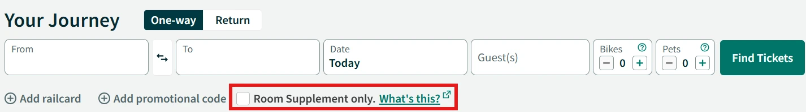

{}

## Reservierungen

Auf der Website des Caledonian Sleeper können Room Supplements (Reservierungen mit Aufschlägen für Schlafwagen) erworben werden. Zusätzlich zur Reservierung ist ein gültiger FIP Freifahrtschein für National Rail für den Tag der Ankunft erforderlich. Dazu muss bei der Verbindungssuche die Option _Room Supplement only_ ausgewählt sein.

{}
