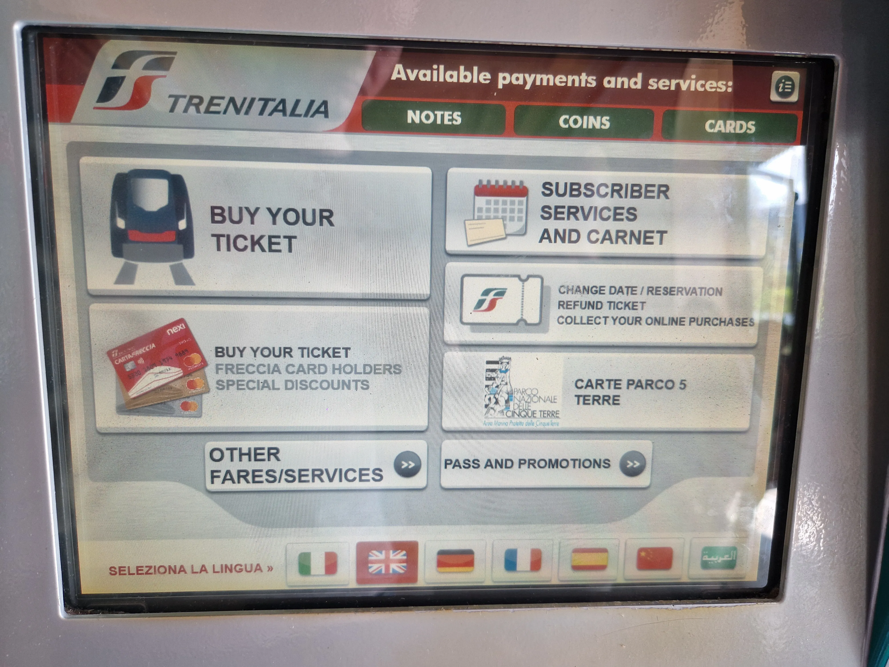
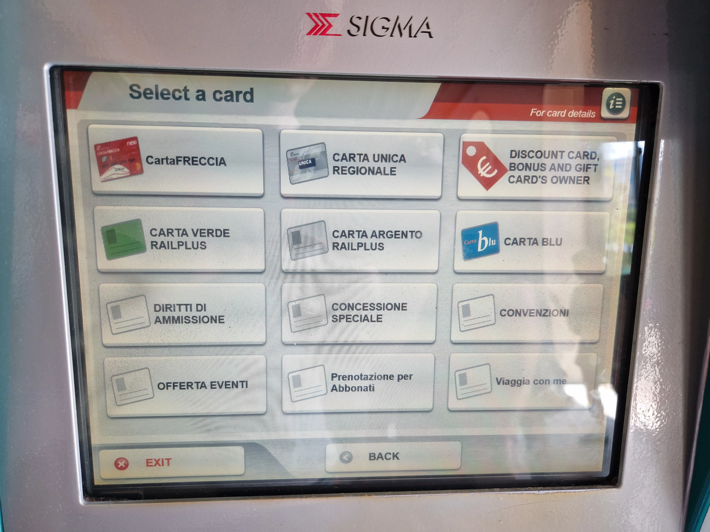
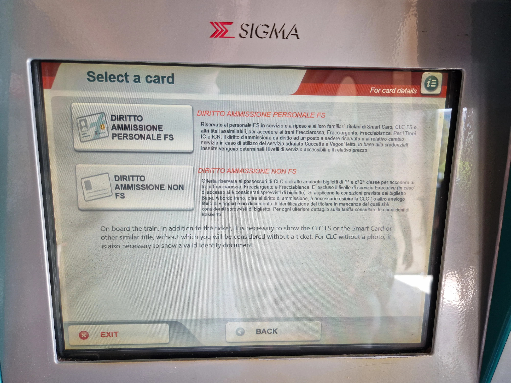

{}

## Reservations

At Trenitalia ticket machines, you can purchase reservations including surcharges for FIP Coupons for Le Frecce and other long-distance trains.

The _DIRITTO AMMISSIONE_ fare can be used for this. Although it does not explicitly refer to FIP, it is accepted. You will also need a FIP Coupon to use it. Business and Executive classes are not permitted with FIP. The correct fare would be _Biglietti Gratuiti FS 1/2 Classe_, which covers the price difference between regional and long-distance travel. This fare is usually more expensive than _DIRITTO AMMISSIONE_, but cannot be purchased at the ticket machine.

**Prices for _DIRITTO AMMISSIONE_:**

Le Frecce: 25€ (1st/2nd class) \
InterCity: 3€ (1st/2nd class) \
Different prices for long-distance trains to Switzerland/Austria: e.g. 20€ Chiasso – Milano (`ECE`/`EC`)

On the machine's start screen, select "Buy your tickets / Special Discounts". Then choose the fare via "Diritti di Ammissione" &#10132; "Diritto Ammissione Non FS".

{.o-section--columns-flex}

{}

{}
For short distances on Le Frecce, the regular fare may be cheaper than FIP reduced tickets.

Additionally, surcharges for Le Frecce and other long-distance trains can sometimes be more expensive than a FIP 50 Ticket.
{}
