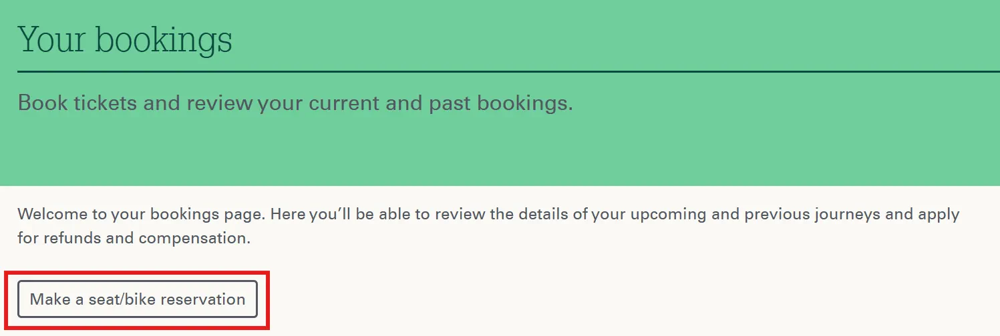

{}

## Reservierungen

Auf der Website von GWR können kostenlose Sitzplatzreservierungen für alle nationalen Zugverbindungen vorgenommen werden.

Um einen Sitzplatz zu reservieren, muss ein Nutzerkonto angelegt werden. Nach erfolgreicher Anmeldung kann im Menü im Bereich _Bookings_ über den Button _Make a seat/bike reservation_ eine Verbindung ausgesucht und reserviert werden. Bei der Ticketauswahl lässt sich ein beliebiges Ticket entsprechend der gewünschten Klasse wählen.

{}
