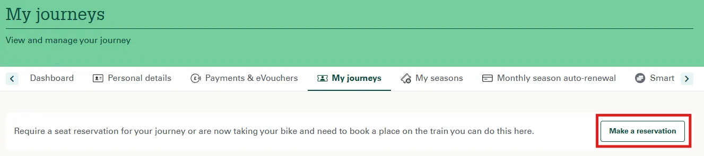

{}

## Reservierungen

Auf der Website von GWR können kostenlose Sitzplatzreservierungen für alle nationalen Zugverbindungen, bei denen Reservierungen möglich sind, vorgenommen werden.

Um einen Sitzplatz zu reservieren, muss ein Nutzerkonto angelegt werden. Nach erfolgreicher Anmeldung kann im Menü im Bereich _My journeys_ über den Button _Make a reservation_ eine Verbindung ausgesucht und reserviert werden.

{}
