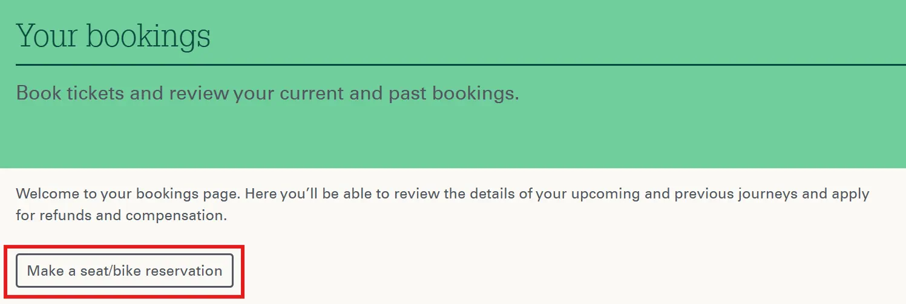

{}

## Réservations

Sur le site web de GWR, il est possible de réserver gratuitement des places assises pour toutes les liaisons nationales où la réservation est possible.

Pour réserver une place, il faut créer un compte utilisateur. Après connexion, vous pouvez choisir une liaison et la réserver via le menu _Bookings_ en utilisant le bouton _Make a seat/bike reservation_. Lors du choix du billet, il est possible de sélectionner n’importe quel billet selon la classe souhaitée.

{}
