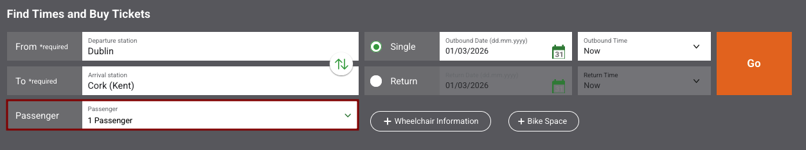
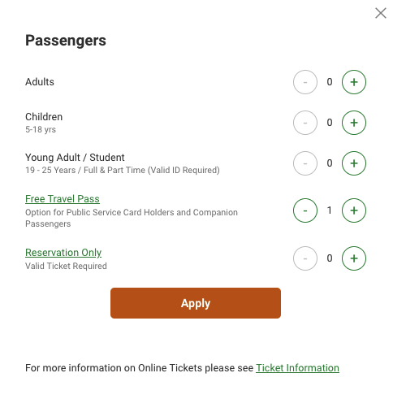

{}

## Reservierungen

Online können Reservierungen für die 2. Klasse erworben werden. Hierzu muss zunächst die Passagieroption ausgewählt werden:

Im Anschluss kann die Auswahl "Adults" abgewählt und die Option "Free Travel Pass" ausgewählt werden:

Reservierungen für die 2. Klasse werden kostenfrei ausgegeben. Lediglich auf einigen stark ausgelasteten Verbindungen werden Reservierungsgebühren von 2,50€ erhoben.

Die angezeigten Preise für die Premier Class enthalten die Preisdifferenz zwischen der 1. und 2. Klasse, sodass diese Reservierungen gebucht werden können, um mit einem FIP Ausweis der 2. Klasse in der Premier Class zu reisen.

Reservierungen für FIP Freifahrtscheine der 1. Klasse können nicht online gebucht werden.

In Irland wird grundsätzlich der Name der Passagiere an den Reservierungsanzeigen in den Zügen angezeigt. Wenn das nicht gewünscht wird, kann bei der Buchung angegeben werden, dass stattdessen die Ticketnummer angezeigt wird.

{}
