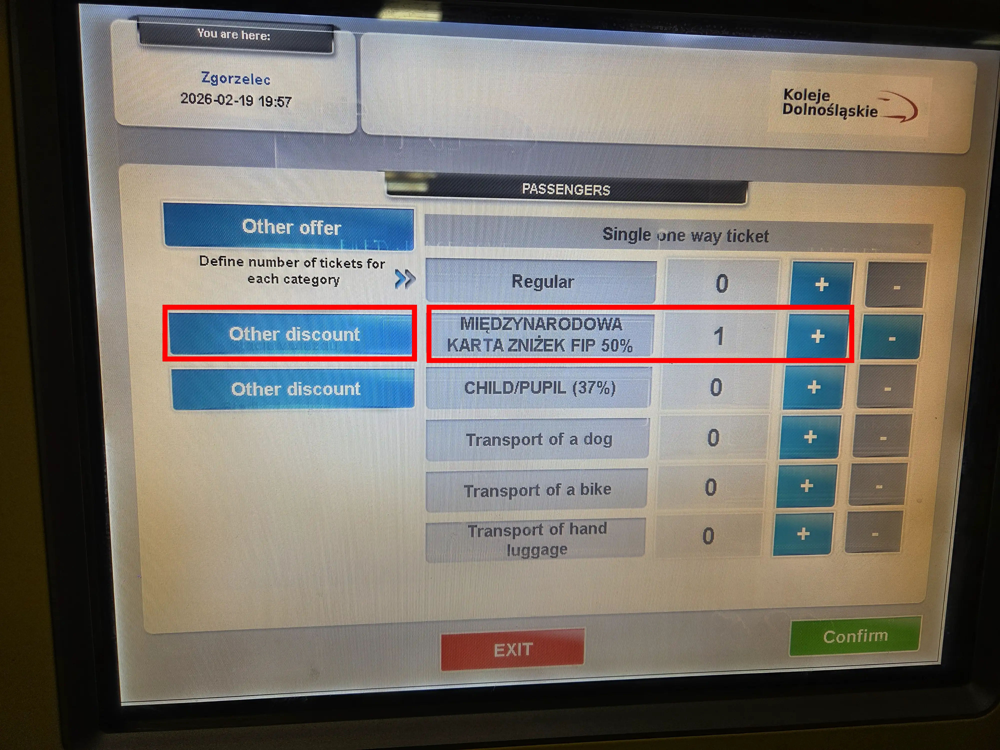
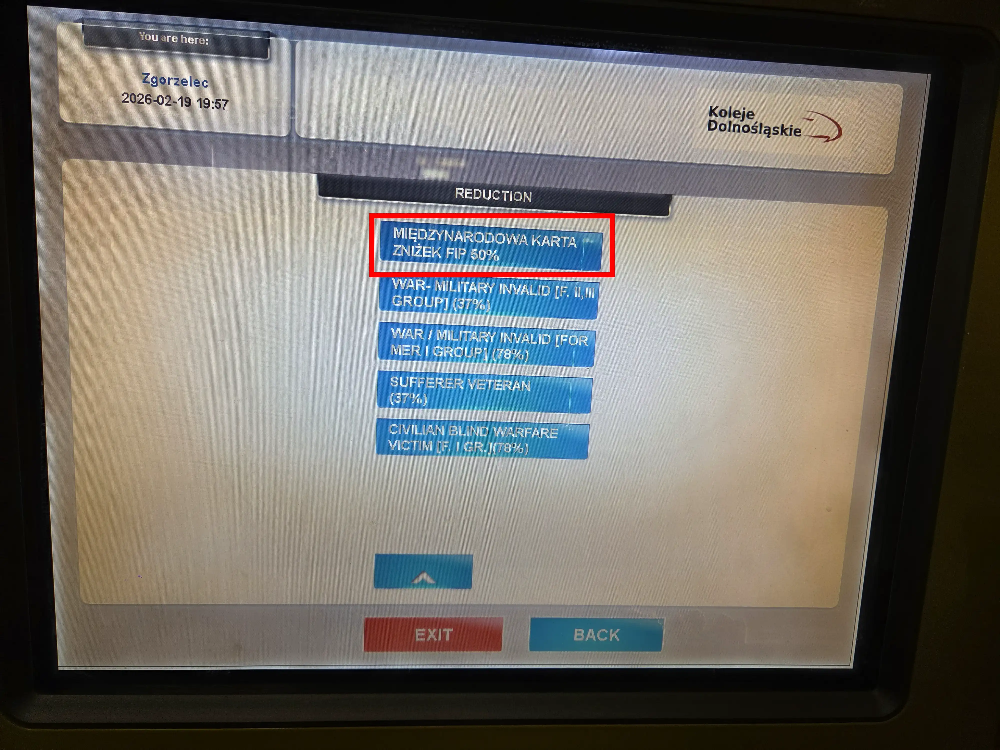

Dans certaines gares, des distributeurs de billets Koleje Dolnośląskie sont disponibles. Toutes les gares équipées de distributeurs de billets sont répertoriées sur le site Web de KD.

{}

## Billets FIP 50

Des Billets FIP 50 à tarif réduit peuvent être achetés aux distributeurs de billets. Sous « Weitere Rabatte » (réductions supplémentaires), la réduction « Międzynarodowej Karty Zniżek FIP 50% » doit être sélectionnée. Toutes les options de réduction sont réparties sur plusieurs pages. Ensuite, l’option d’ajouter des passagers avec la réduction apparaît dans le menu précédent.

{}
