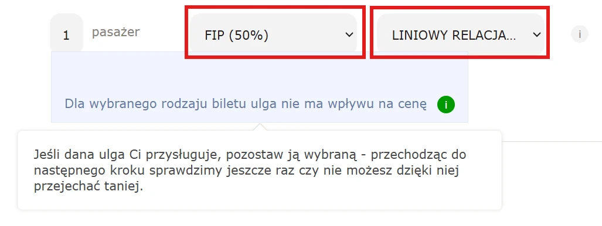

Die Website ist theoretisch auf Polnisch und Englisch verfügbar, allerdings funktioniert die Verbindungsauskunft aktuell nur auf Polnisch.

{}

## FIP 50 Fahrkarten

Auf der Website der Koleje Śląskie können online Fahrkarten mit FIP 50 Rabatt für Fahrten der KŚ gekauft werden.

Dafür muss zunächst eine Verbindung ausgewählt werden und dann beim Ticketkauf als Rabattoption "FIP (50%)" angegeben werden. Der Rabatt wird nur auf Normaltarife (_LINIOWY RELACJA_) gewährt. Die Tarifart kann im Feld neben der Rabattoption ausgewählt werden. Bei anderen Tarifen wird eine Warnung angezeigt und im Folgeschritt des Bestellungsprozesses geprüft, welches Ticket am günstigsten ist.

{}
