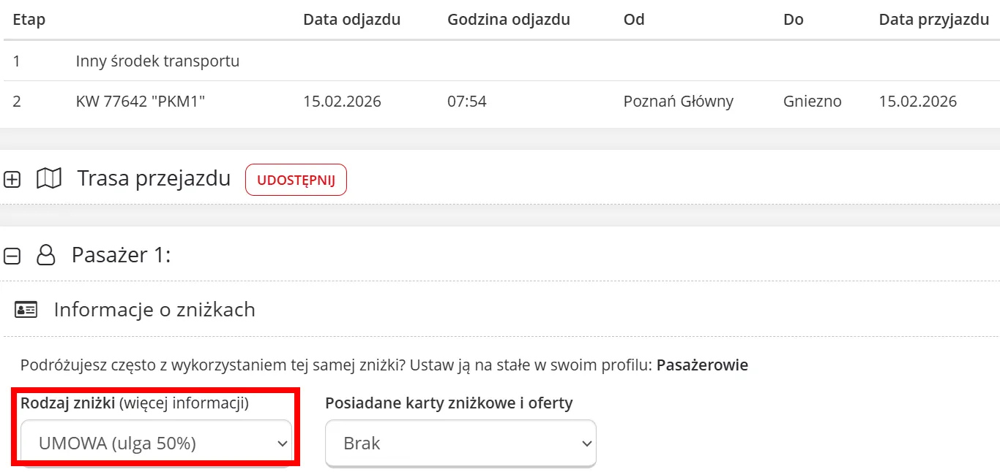

{}

## FIP 50 Fahrkarten

Auf der Website der Koleje Wielkopolskie, die nur auf Polnisch verfügbar ist, können online Fahrkarten mit FIP 50 Rabatt für Fahrten der KW gekauft werden. Dafür muss zunächst eine Verbindung ausgewählt werden und dann beim Ticketkauf als Rabattoption “UMOWA (ulga 50%)” angegeben werden.

{}
In der Vergangenheit war “UMOWA” nicht immer korrekt für FIP-Fahrkarten, bei der KW gibt es jedoch keine andere Auswahlmöglichkeit. Im Zweifelsfall sollte aber vor Ort nachgefragt werden, ob dies auch wirklich der korrekte Tarif für FIP-Fahrkarten ist.
{}

{}
