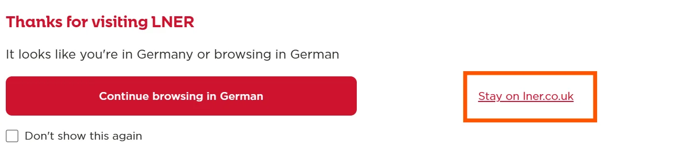

LNER also offers an [app](https://www.lner.co.uk/tickets/lner-app/) that can be used to book reservations.

{}

## Reservations – Booking via the website

Reservations can only be made on the British version of the LNER website (www.lner.co.uk). When visiting the site, make sure to select the option "Stay on lner.co.uk" in the pop-up window.

On the LNER website, free seat reservations can be made for LNER services. To do so, select _Reserve Spaces_ on the main homepage and enter your itinerary. After selecting a train, the website asks for a booking confirmation. Select _My booking is not listed_ and then _Other_. The form also requires a booking reference, but any value can be entered. We recommend entering "FIP Coupon" under _additional details_.

After selecting _Reserve a seat_ and/or _Reserve a bike space_, the reservation is issued as an e-ticket that can be viewed in the app and added to a mobile wallet. A seat is automatically assigned but can be changed afterward.

## Reservations – Booking via the app

After downloading the app, select _Reserve a seat_ on the main page. The booking process then follows the same steps as on the website.
{}
