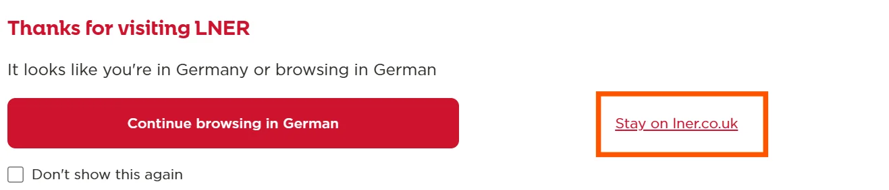

{}

## Réservations

Les réservations ne peuvent être effectuées que sur la version britannique du site LNER (www.lner.co.uk). Lors de la visite du site, il faut impérativement sélectionner l'option « Stay on lner.co.uk » dans la fenêtre pop-up.

Sur le site web de LNER, il est possible de réserver gratuitement des places assises pour les services LNER. Pour cela, sélectionnez _Reserve Spaces_ sur la page d'accueil et entrez votre itinéraire. Après avoir sélectionné un train, le site demande une confirmation de réservation. Sélectionnez _My booking is not listed_ puis _Other_. Le formulaire demande également une référence de réservation, mais n'importe quelle valeur peut être saisie. Nous recommandons d'indiquer « FIP Coupon » dans le champ _additional details_.

Après avoir sélectionné _Reserve a seat_ et/ou _Reserve a bike space_, la réservation est émise sous forme de billet électronique, consultable dans l'application et ajoutée au portefeuille mobile. Une place est automatiquement attribuée, mais peut être modifiée par la suite.

{}
