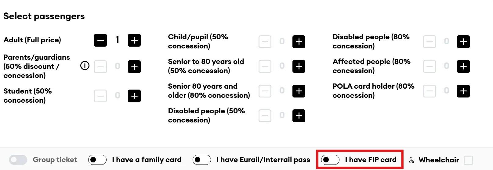
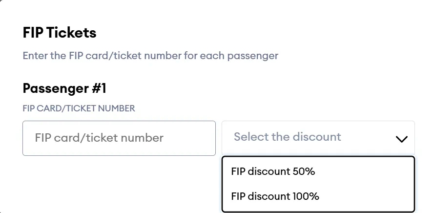

On the LTG-Link booking website, FIP 50 Tickets, reservations, and zero-fare tickets for LTG-Link connections in Lithuania and Latvia are sold. Booking is also possible via the LTG-Link app.

Tickets for domestic journeys can be booked 30 days in advance, and for international journeys 60 days in advance.

{}

## FIP 50 Tickets

On the LTG-Link booking website, FIP 50 Tickets for LTG-Link connections in Lithuania and Latvia are sold. To add the FIP 50 discount, select the _I have FIP card_ option in the passenger/discounts overview. Then, enter the FIP Card number and select the _FIP discount 50%_ option.
{}

{}

## Reservations

On the LTG-Link booking website, reservations and zero-fare tickets for LTG-Link connections in Lithuania and Latvia are sold. To do this, select the _I have FIP card_ option in the passenger/discounts overview. Then, enter the FIP Card number and select the _FIP discount 100%_ option.

The FIP discount is also granted online for cross-border journeys to Poland and Latvia. For journeys between Poland and Lithuania with a 100% discount, both a Lithuanian and a Polish PKP FIP Coupon are required.
{}
