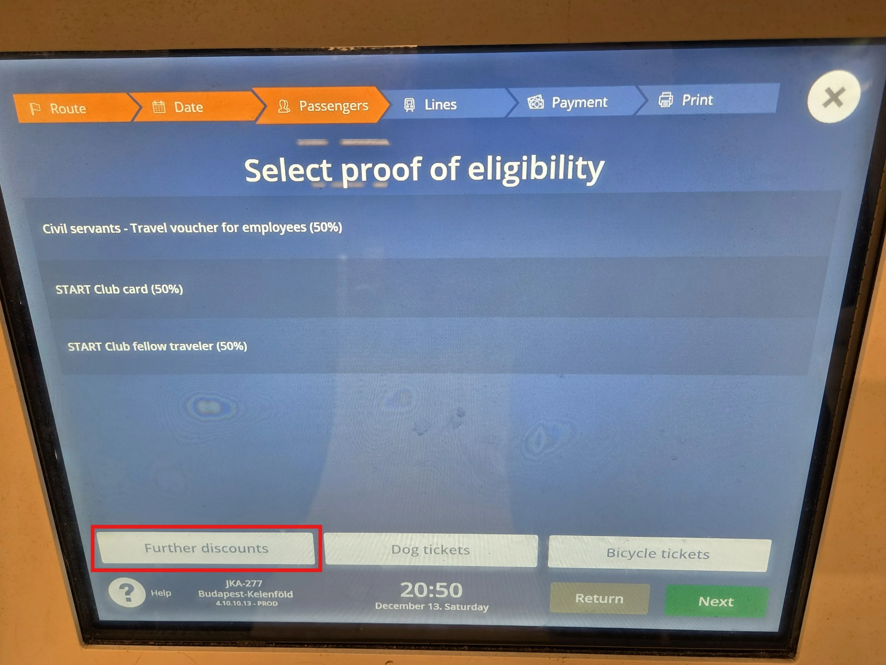
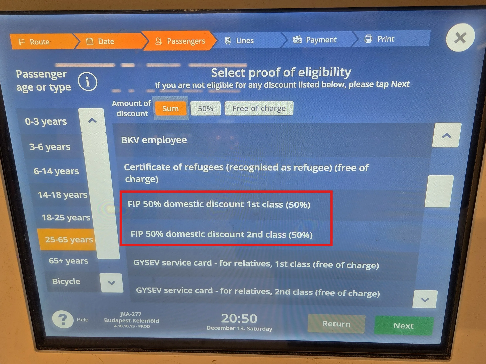
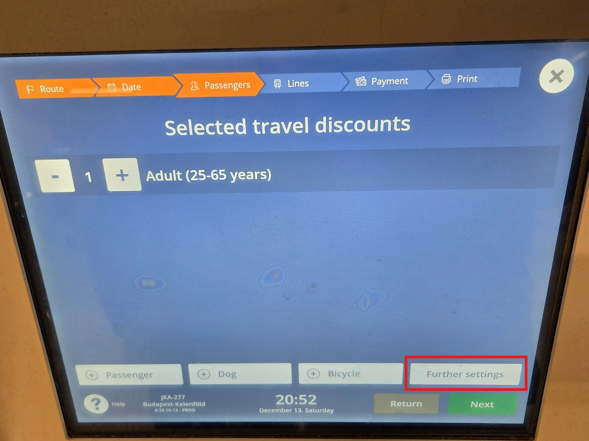
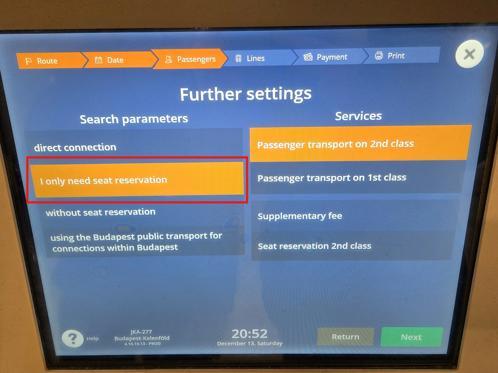

Ticket machines from MÁV are available at many major train stations. FIP 50 Tickets and reservations for MÁV and GySEV are sold here.

{}

## FIP 50 Tickets

FIP 50 Tickets can be purchased at MÁV ticket machines for travel within Hungary for MÁV and GySEV as well as for cross-border connections.

To book FIP 50 Tickets, select the option _Further Discounts_ in the passenger discounts section. You can then choose _FIP 50% domestic discount 1st class (50%)_ or _FIP 50% domestic discount 2nd class (50%)_. The class refers to eligibility, not the desired class of the ticket.

{}

{}

## Reservations

Reservations for MÁV and GySEV trains can be purchased on-site for 990 HUF.

To book reservations without a ticket, select _Further settings_ in the passenger overview. You can then select the option _I only need a seat reservation_.

{}
