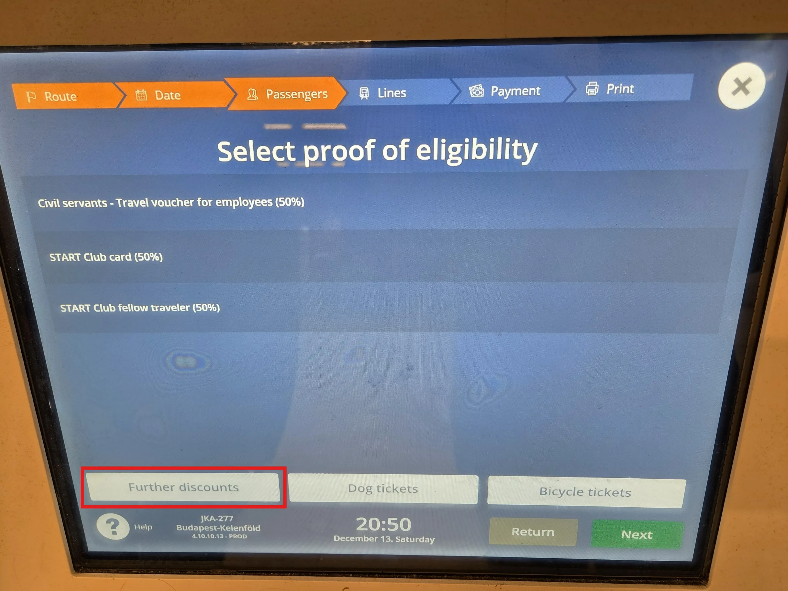
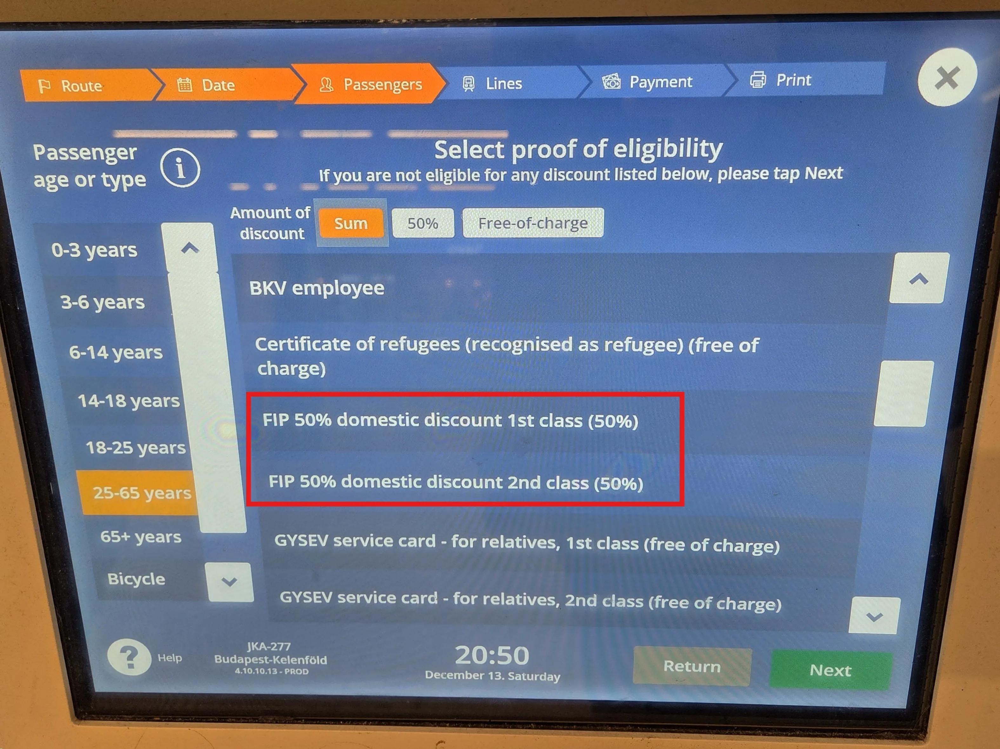
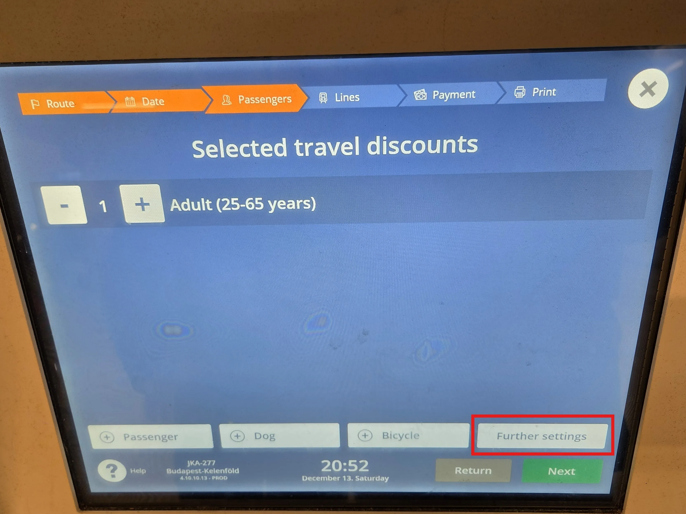
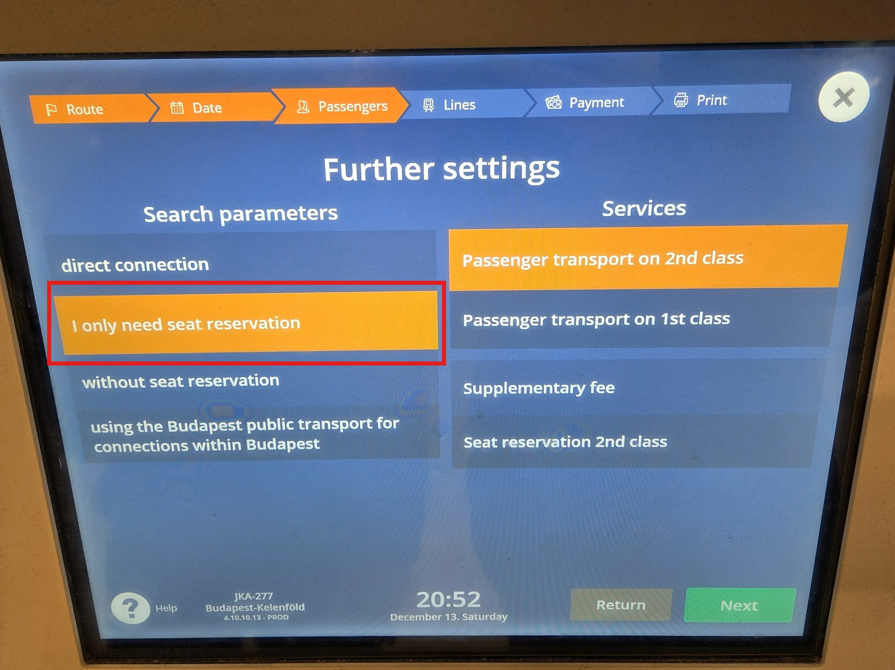

Les distributeurs de billets MÁV-START sont disponibles dans de nombreuses gares principales. Les Billets FIP 50 et les réservations pour MÁV-START et GySEV y sont vendus.

{}

## Billets FIP 50

Les Billets FIP 50 peuvent être achetés aux distributeurs de billets MÁV-START pour les voyages en Hongrie pour MÁV-START et GySEV ainsi que pour les connexions transfrontalières.

Pour réserver des Billets FIP 50, sélectionnez l’option _Further Discounts_ dans la section des réductions pour passagers. Vous pouvez ensuite choisir _FIP 50% domestic discount 1st class (50%)_ ou _FIP 50% domestic discount 2nd class (50%)_. La classe se réfère à l’admissibilité, non pas à la classe souhaitée du billet.

{}

{}

## Réservations

Les réservations pour les trains MÁV-START et GySEV peuvent être achetées sur place pour 990 HUF.

Pour réserver des réservations sans billet, sélectionnez _Further settings_ dans l’aperçu des passagers. Vous pouvez ensuite sélectionner l’option _I only need a seat reservation_.

{}
