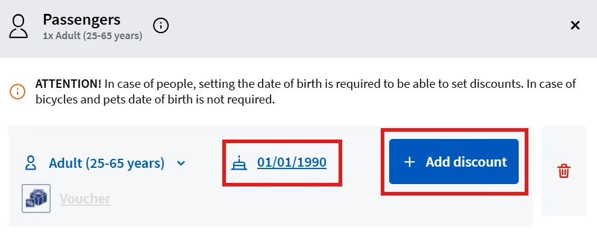
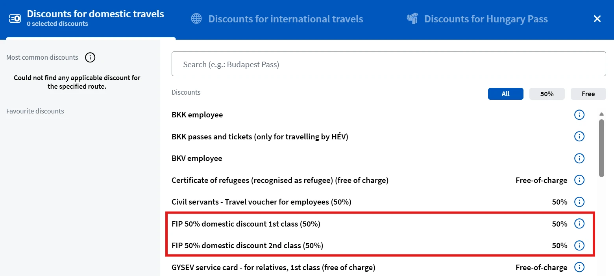

Auf der Buchungswebsite der MÁV werden FIP 50 Tickets und Reservierungen für Verbindungen der MÁV und GySEV verkauft.

Die MÁV bietet auch eine [App](https://www.mavcsoport.hu/mav-szemelyszallitas/belfoldi-utazas/mav-applikacio) an, über welche FIP 50 Tickets und Reservierungen gekauft werden können.

{}

## FIP 50 Fahrkarten

Auf der Buchungswebsite der MÁV werden FIP 50 Tickets für Verbindungen der MÁV und GySEV verkauft. Um den FIP 50 Rabatt hinzuzufügen, muss auf der Startseite der Verbindungssuche unter _Passengers and Discounts_ die Übersicht der Reisenden geöffnet werden. Erst nachdem das Geburtsdatum eingegeben wurde, kann mit _Add Discounts_ die FIP 50 Ermäßigung hinzugefügt werden. Welche Rabattoption ausgewählt werden soll, kann der untenstehenden Tabelle entnommen werden.

| Fahrt         | Klassenberechtigung gem. FIP Ausweis | 2. Klasse                                   | 1. / 1+ Klasse                                 |
| ------------- | ------------------------------------ | ------------------------------------------- | ---------------------------------------------- |
| National      | 1. Klasse                            | „FIP 50% domestic discount 1st class (50%)" | „FIP 50% domestic discount 1st class (50%)"    |
| National      | 2. Klasse                            | „FIP 50% domestic discount 2nd class (50%)" | „FIP 50% domestic discount 2nd class (50%)" \* |
| International | 1. Klasse                            | „FIP 50% domestic discount (50%)" †         | „FIP 50% domestic discount (50%)" †            |
| International | 2. Klasse                            | „FIP 50% domestic discount (50%)" †         | nicht online verfügbar                         |

† Bei internationalen Fahrten wird der FIP-50-Rabatt nur für den ungarischen Abschnitt angewendet.\
\* Der Klassenzuschlag (_különbözeti díj_) wird automatisch zum Preis hinzugerechnet — es muss keine separate Option ausgewählt werden.

{}
{{% column width="50%" %}}

{}
{{% column width="50%" %}}

{}
{}
{}

{}

## Reservierungen

Reservierungen für Züge der MÁV sowie GySEV können Online zu einem Preis von 990 HUF erworben werden. Die Option „I only need seat reservation" ist in den Verbindungsinformationen zu finden. Bei FIP 50 Tickets werden sie bei reservierungspflichtigen Zügen automatisch ergänzt und mit berechnet.

Die richtige Rabattoption kann der folgenden Tabelle entnommen werden:

| Fahrt         | Freifahrtscheinklasse | 2. Klasse                           | 1. / 1+ Klasse                                             |
| ------------- | --------------------- | ----------------------------------- | ---------------------------------------------------------- |
| National      | 1. Klasse             | „I only need seat reservation"      | „International ticket or pass, 1st class (free-of-charge)" |
| National      | 2. Klasse             | „I only need seat reservation"      | „I only need seat reservation" \*                          |
| International | 1. Klasse             | „FIP free ticket (leisure journey)" | „FIP free ticket (leisure journey)"                        |
| International | 2. Klasse             | „FIP free ticket (leisure journey)" | nicht online verfügbar                                     |

\* Der Klassenzuschlag (_különbözeti díj_) wird automatisch zum Preis hinzugerechnet — es muss keine separate Option ausgewählt werden.

Für internationale Fahrten mit FIP Freifahrtscheinen müssen Freifahrtscheine für alle Betreiber entlang der Route vorliegen (z. B. für Budapest–Wien sowohl ein MÁV- als auch ein ÖBB-Freifahrtschein).

{}

Die Option „FIP egyországos szabadjegy" wird möglicherweise noch im MÁV-System angezeigt. Es handelt sich um einen veralteten Eintrag, der **nicht verwendet werden darf**, auch wenn eine Info-Box behauptet, dass er für internationale Fahrten nicht gültig ist. Die MÁV arbeitet an der Entfernung.

{}

{}
