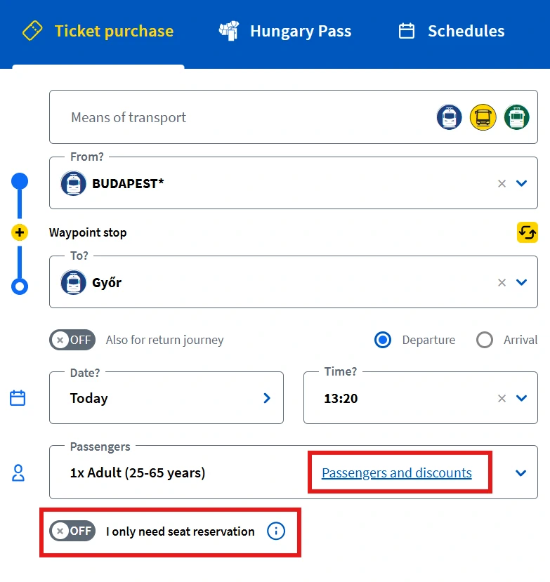
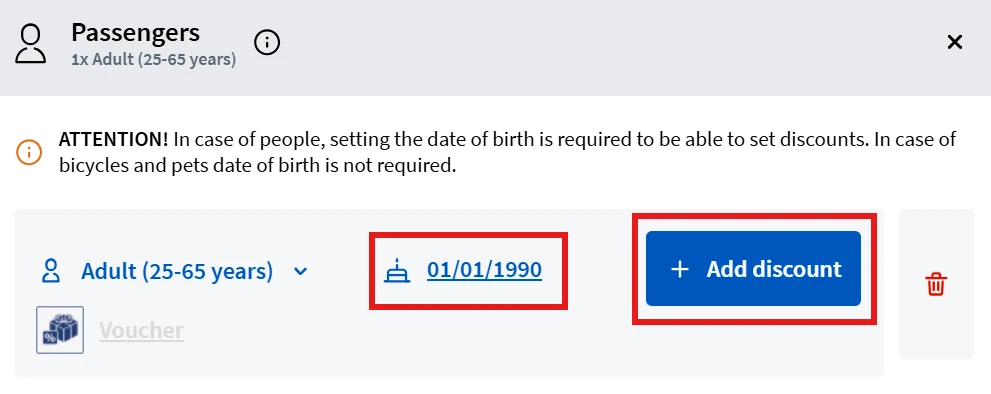
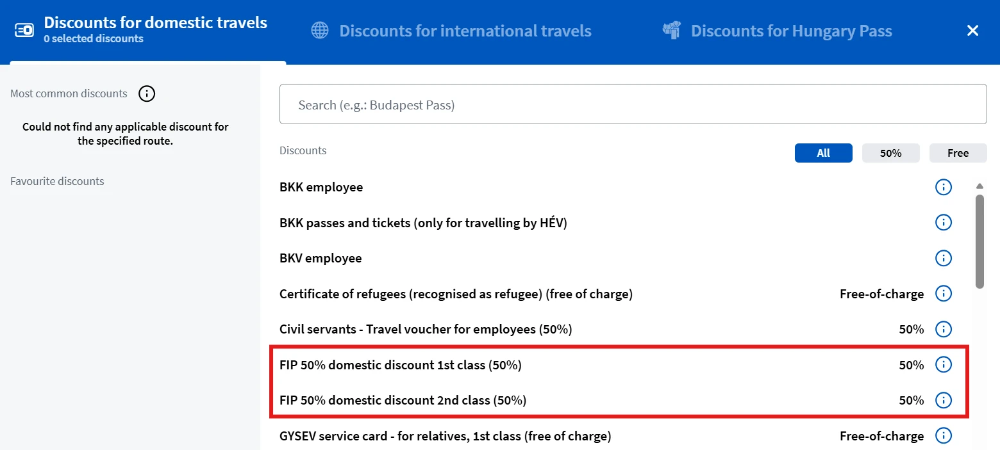

FIP 50 Tickets and reservations for MÁV and GySEV connections are sold on the MÁV booking website.

{}

## FIP 50 Tickets

FIP 50 Tickets for MÁV and GySEV connections are sold on the MÁV booking website. To add the FIP 50 discount, on the connection search page under _Passengers and Discounts_, the passenger overview must be opened. Only after entering the date of birth can the FIP 50 discount be added with _Add Discounts_. A distinction is made between FIP 50 1st class and 2nd class. The class refers to the eligibility, not the desired class of the ticket.

{}

{}

## Reservations

Reservations for MÁV and GySEV trains can be purchased online for 990 HUF. To do this, the option _I only need seat reservation_ must be selected in the connection search.
{}
