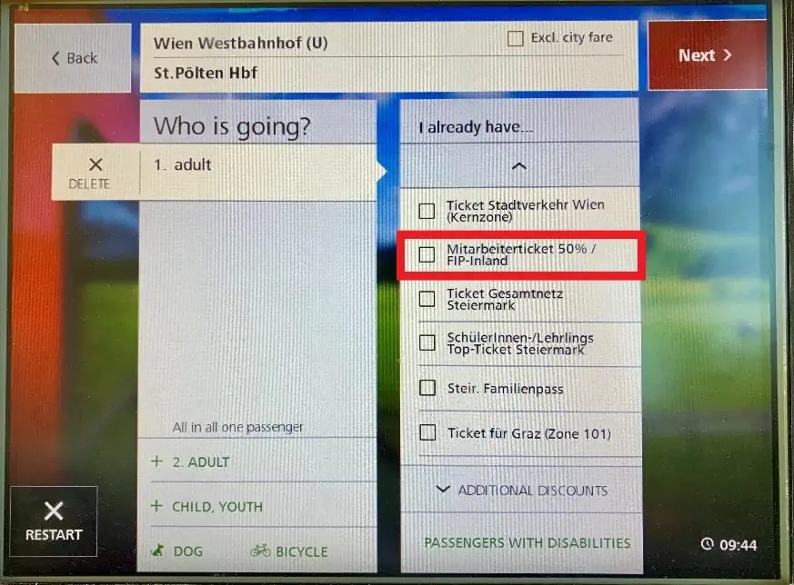

{}
**FIP 50 Fahrkarten**

Fahrkarten (inkl. FIP 50 Tickets) sind billiger im Vorverkauf (1 Tag vor der Fahrt oder 15 Tage vor der Fahrt)

Für Inlandsreisen innerhalb Österreichs können Fahrkarten am Fahrkartenautomaten gekauft werden. Dazu muss „Fahrkarte Inland mit Zielwahl“ ausgewählt werden. Anschließend die Schaltflächen „Ermäßigung“ und „Ändern“ auswählen. Als Vergünstigung kann dann „Mitarbeiterticket 50% / FIP-Inland“ bzw. „at. Fbg /FIP Inland“ (ganz unten) genutzt werden.

{}
