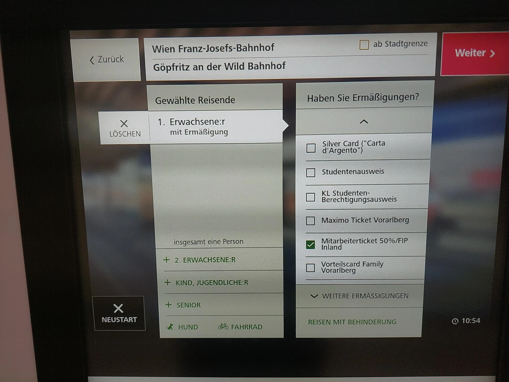

{}

## FIP 50 Tickets

Tickets (including FIP 50 Tickets) are cheaper if purchased in advance (1 day before travel or 15 days before travel).

For domestic journeys within Austria, tickets can be purchased at the ticket machine. Select “Domestic ticket with destination selection.” Then choose the „Ermäßigung“ and „Ändern“ buttons. As a discount, you can select „Mitarbeiterticket 50% / FIP-Inland“ or „at. Fbg /FIP Inland“ (at the very bottom).

{}
