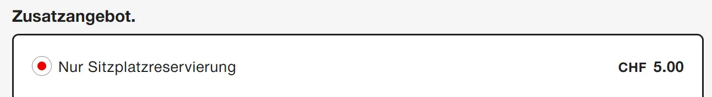

{}

## FIP 50 Tickets

On the SBB website, FIP 50 Tickets can be purchased with the "50% Halbtax" discount, provided they are not a saver ticket, saver day pass, or a special ticket.[^1] This option is actually intended for passengers with a Halbtax subscription (SBB discount card), but is also accepted as a straightforward solution for FIP 50 Tickets. The Halbtax price is usually preselected by default on the SBB website.

{}
In urban areas, a ticket with Halbtax discount may also include transport operated by companies that do not accept FIP (e.g., trams or buses). These sections cannot be used with FIP, and the purchased ticket is not valid there without a Halbtax subscription.
{}

{}

{}

## Reservations

Individual national reservations can be purchased online at SBB. To do so, search for the connection using the regular journey planner. Then select the desired connection ("Choose ticket") and you can then select the additional option "Seat reservation only".

{}

## Sources

[^1]: [SBB Community](https://community.sbb.ch/d/2251-kann-man-als-fip-beg%C3%BCnstigter-tickets-weiterhin-online-mittels-halbtax-kaufen)
