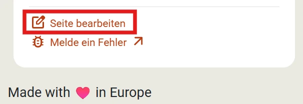
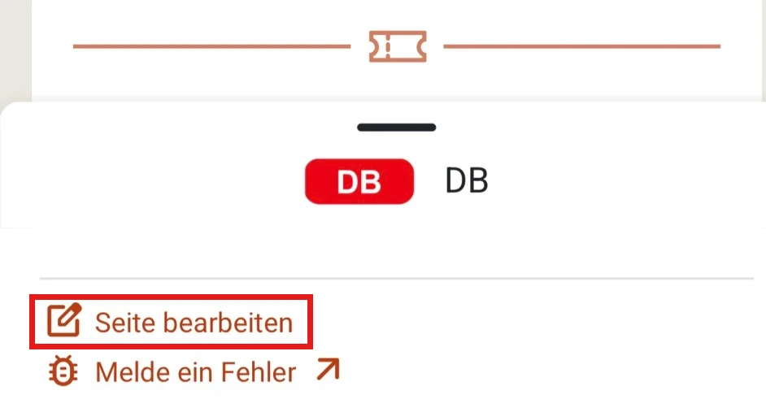

Der _FIP Guide_ ist ein Open-Source und Community-Projekt. Wenn du Informationen aktualisieren oder hinzufügen möchtest, kannst du dies selbständig tun. Um die Richtigkeit der Informationen sicherzustellen, werden alle Änderungen vom FIP Guide Team überprüft, bevor sie veröffentlicht werden.

Seiten können direkt im FIP Guide über das [Content-Management-System (CMS)](https://www.fipguide.org/admin) angepasst werden. Mehr dazu im Abschnitt [Direkte Bearbeitung](#direkte-bearbeitung). Wenn du schon technisches Hintergrundwissen hast, kannst du Änderungen direkt über GitHub vornehmen, mehr dazu unter [GitHub Contribution](#github-contribution).

## Direkte Bearbeitung

Über das Content-Management-System (CMS) kannst du direkt die Inhalte der Seiten bearbeiten. Diese ist unter [fipguide.org/admin](https://www.fipguide.org/admin) erreichbar.

Bitte beachte folgende Punkte bei der Bearbeitung:

### Anmeldung

{{% float-image
    src="login.webp"
    alt="FIP Guide CMS Login"
    width="40%"
    position="left"
%}}
Um dich im FIP Guide CMS anzumelden, benötigst du einen kostenlosen [GitHub](https://github.com/) Account. GitHub gehört zu Microsoft und ist eine Plattform zur Kollaboration in Open-Source-Projekten. Den GitHub Account kannst du einfach auf der [GitHub Website](https://github.com/) erstellen.

Im CMS kann sich mit diesem GitHub Account angemeldet werden. Während der Anmeldung muss die Nutzung mit "Authorize fipguide" bestätigt werden.
{}

{}
{{% float-image
    src="fork_repository.webp"
    alt="Repository im FIP Guide CMS forken"
    width="40%"
    position="right"
%}}
Bei der erstmaligen Anmeldung wird gefragt, ob ein sogenannter _Fork_ erstellt werden soll. Dadurch wird automatisch eine eigene Kopie der Seite erstellt. Dies ist notwendig, damit Änderungen im CMS gespeichert werden können. Bitte bestätige dies mit dem Button "Fork".
{}
{}

### Seiten öffnen

Auf der [Startseite](https://www.fipguide.org/admin) des FIP Guide CMS kann im linken Menü die Seitenkategorie ausgewählt und anschließend in der Mitte die gewünschte Seite geöffnet oder eine neue Seite erstellt werden.

Alternativ kann auch über den FIP Guide die zu bearbeitende Seite geöffnet werden und anschließend über das Menü "Seite bearbeiten" über das CMS modifiziert werden.

{}
{{% column width="50%" %}}

{}

{{% column width="50%" %}}

{}
{}

### Seite bearbeiten

In der Bearbeitungsansicht kann die entsprechende Seite aktualisiert werden. Der FIP Guide ist in verschiedenen Sprachen verfügbar. Standardmäßig werden zwei Sprachen nebeneinander angezeigt. Über eine Auswahlmöglichkeit kannst du die Sprache ändern. Bitte beachte, dass die primäre Sprache Englisch ist und ausgewählte Metadaten nur auf der englischen Seite angepasst werden können, dann aber automatisch für alle Sprachen übernommen werden.

{}
Wenn du möchtest, kannst du selbstständig alle Sprachen der Seite aktualisieren. Das ist jedoch nicht unbedingt notwendig. Du kannst auch Informationen nur in einer Sprache aktualisieren. Das FIP Guide Team wird die Änderungen überprüfen und anschließend die Informationen in allen Sprachen aktualisieren.
{}

### Änderungen speichern und veröffentlichen

{{% float-image
    src="send_for_review.webp"
    alt="Änderungen im FIP Guide CMS speichern"
    width="50%"
    position="right"
%}}
Wenn du deine Arbeiten unterbrechen und speichern möchtest, kannst du dies über den _Save_ Button (oben rechts) tun. Die Änderungen werden dann auf dem Server gespeichert, damit du sie später weiter bearbeiten kannst, jedoch noch nicht veröffentlicht. Nach dem Klick auf _Save_ wirst du gefragt, ob deine Änderungen bereits bereit für ein Review sind. Erst, sobald der Status auf _In Review_ geändert ist, ist die Änderung für das FIP Guide Team sichtbar.

Die Seite kann auch noch weiter bearbeitet werden, wenn sie im Status Review ist. Du kannst den Status zudem zu einem späteren Zeitpunkt jederzeit ändern, sofern die Änderung noch nicht final veröffentlicht ist, siehe auch [Arbeit fortsetzen](#arbeit-fortsetzen--überblick-über-änderungen).
{}

Jede Änderung, die in den Status _Review_ gesetzt wurde, ist auf GitHub sichtbar: [FIP Guide GitHub Änderungen (Pull Requests)](https://github.com/fipguide/fipguide.github.io/pulls). Hier ist auch deine Anpassung sichtbar und es können Kommentare zur Änderung hinterlassen werden. Das FIP Guide Team prüft die Änderungen und stellt bei Bedarf über die Kommentarfunktion Rückfragen. Über alle Änderungen wirst du auch per E-Mail informiert.

### Arbeit fortsetzen / Überblick über Änderungen

Wenn du deine Arbeit an einer Seite gespeichert hast und fortsetzen willst oder einen Überblick über den Status all deiner Änderungen haben möchtest, kannst du dies über den Menüpunkt _Workflow_ tun.

- **Draft:** Änderungen, an denen noch gearbeitet wird und noch nicht bereit zum Review sind.
- **Review:** Änderungen, die vom FIP Guide Team überprüft werden.

Sobald alle Kommentare geklärt werden konnten, wir das FIP Guide Team die Änderungen selbstständig veröffentlichen. Nach der Veröffentlichung verschwindet die Änderung aus der Workflow-Sicht.

## GitHub Contribution

Der FIP Guide nutzt den Static Website Generator [_Hugo_](https://gohugo.io/) zum Erstellen der Website. Die Seite kann direkt in [GitHub](https://github.com/fipguide/fipguide.github.io/) über die Web-IDE oder deine lokale Entwicklungsumgebung bearbeitet werden. Weitere Informationen und Hilfe sind im [GitHub Wiki](https://github.com/fipguide/fipguide.github.io/wiki) und [Contribution-Guide](https://github.com/fipguide/fipguide.github.io/blob/main/CONTRIBUTING.md) verfügbar.

## Unterstützung

Wenn du Hilfe bei der Bearbeitung benötigst, kannst du dich jederzeit per Mail oder über die FIP Guide Community bei uns melden. Weitere Informationen dazu findest du auf der [Kontakt-Seite](/contact).
