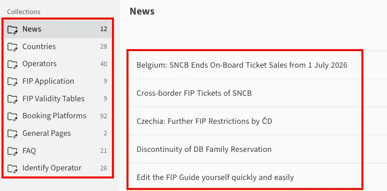
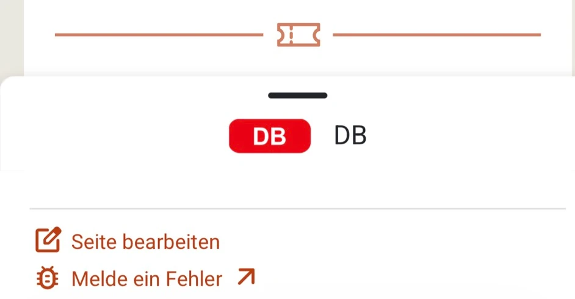

Der _FIP Guide_ ist ein Open-Source und ein Community-Projekt. Wenn du Informationen aktualisieren oder hinzufügen möchtest, kannst du dies selbständig tun. Um die Richtigkeit der Informationen sicherzustellen, werden alle Änderungen vom FIP Guide Team überprüft, bevor sie veröffentlicht werden.

Seiten können direkt im FIP Guide, über das <a href="https://www.fipguide.org/admin">Content-Management-System (CMS)</a> angepasst werden. Mehr dazu im Abschnitt [Direkt Bearbeiten](#direkt-bearbeiten). Wenn du schon technisches Hintergrundwissen hast, kannst du Änderungen direkt über Github vornehmen, mehr dazu unter [Github Contribution](#github-contribution).

## Direkte Bearbeitung

Über das Content-Management-System (CMS) kannst du direkt die Inhalte der Seiten bearbeiten. Diese ist unter <a href="https://www.fipguide.org/admin">https://www.fipguide.org/admin</a> erreichbar.

Bitte beachte folgende Punkte bei der Bearbeitung:

### Anmeldung

{{% float-image
  src="login.webp"
  alt="FIP Guide CMS Login"
  width="30%"
  position="left"
%}}
Um dich im FIP Guide CMS anzumelden, benötigst du einen kostenlosen [Github](https://github.com/) Account. GitHub gehört zu Microsoft und ist eine Plattform zur Collaboration in Open-Source-Projekten. Den Github Account kannst du einfach auf der [Github Website](https://github.com/) erstellen.

Im CMS kann sich mit diesem Github Account angemeldet werden. Während der Anmeldung muss die Nutzung mit "Authorize" bestätigt werden.
{}

{}
Bei der erstmaligen Anmeldung wird gefragt, ob ein sogenannter _Fork_ erstellt werden soll. Dadurch wird automatisch eine eigene Kopie der Seite erstellt. Dies ist notwendig, damit Änderungen im CMS gespeichert werden können. Bitte bestätige dies mit "Create Fork".
{}

### Seiten öffnen

Auf der <a href="https://www.fipguide.org/admin">Startseite</a> des FIP Guide CMS kann im linken Menü die Seitenkategorie ausgewählt werden und anschließend in der Mitte die gewünschte Seite geöffnet oder eine neue Seite erstellt werden.

Alternativ kann auch über den FIP Guide die zu bearbeitende Seite geöffnet werden und anschließend über das Menü "Seite bearbeiten" über das CMS modifiziert werden.

{}
{{% column width="50%" %}}

{}
{{% column width="50%" %}}

{}
{}

### Seite bearbeiten

{{% float-image
  src="language.webp"
  alt="FIP Guide CMS Sprache auswählen"
  width="40%"
  position="right"
%}}
In der Bearbeitungsansicht kann die entsprechende Seite aktualisiert werden. Der FIP Guide ist in verschiedenen Sprachen verfügbar. Diese können über das entsprechende Drop-Down-Menü ausgewählt werden.
{}

{}
Wenn du möchtest kannst selbstständig alle Sprachen der Seite aktualisieren. Das ist jedoch nicht unbedingt notwendig. Du kannst auch Informationen nur in einer Sprache aktualisiere. Das FIP Guide Team wird die Änderungen überprüfen und anschließend die Informationen in allen Sprachen aktualisieren.
{}

{{% float-image
  src="language-view.webp"
  alt="FIP Guide CMS Sprach-Ansicht umstellen"
  width="15%"
  position="left"
%}}
Über das Seiten-Symbol auf der rechten Seite kann die Ansicht zwischen _mehrsprachig_ und _einsprachig_ umgestellt werden.
{}

### Änderungen speichern und veröffentlichen

{{% float-image
  src="save.webp"
  alt="FIP Guide CMS Änderungen speichern"
  width="50%"
  position="right"
%}}
Wenn du deine Arbeiten unterbrechen und speichern möchtest, kannst du dies über den _Save_ Button tun. Die Änderungen werden dann im CMS gespeichert damit du sie später weiter bearbeiten kannst, jedoch noch nicht veröffentlicht.
{}

{{% float-image
  src="status-review.webp"
  alt="FIP Guide CMS Status auf Review setzen"
  width="40%"
  position="left"
%}}
Wenn du deine Änderungen veröffentlichen möchtest, kannst du den Status der Seite auf _Review_ setzen. Das FIP Guide Team wird die Änderungen überprüfen und anschließend veröffentlichen. Solange die Änderungen nicht veröffentlich wurden, können die Seiten jederzeit bearbeitet werden.
{}

Jede Änderung die im Status _Review_ gesetzt wurde, ist auf Github sichtbar: [FIP Guide Github Änderung (Pull Requests)](https://github.com/fipguide/fipguide.github.io/pulls). Hier ist auch deine Änderung sichtbar und es können Kommentare zur Änderung hinterlassen werden. Das FIP Guide Team prüft die Änderungen und stellt bei Bedarf über die Kommentarfunktion Rückfragen.

### Arbeit fortsetzen / Überblick über Änderungen

{{% float-image
  src="workflow.webp"
  alt="FIP Guide CMS Workflow"
  width="60%"
  position="right"
%}}
Wenn du deine Arbeit an einer Seite gespeichert hast und fortsetzen willst oder einen Überblick über den Status all deiner Änderungen haben möchtest, kannst du dies über den Menüpunkt _Workflow_ tun.

- **Draft:** Änderungen an denen noch gearbeitet wird, die noch nicht bereit zum Review sind.
- **Review:** Änderungen die vom FIP Guide Team überprüft werden.
- **Ready:** Änderungen die vom FIP Guide Team überprüft wurden und in Kürze veröffentlicht werden.
  {}

### Preview

{{% float-image
  src="preview.webp"
  alt="FIP Guide CMS Preview"
  width="50%"
  position="right"
%}}
Nachdem Änderungen im CMS gespeichert wurden, kann eine Preview der Seite angesehen werden, auf der die eigenen Änderungen bereits sichtbar sind.
{}

{}
Das Erzeugen der Preview kann 5-10 Minuten in Anspruch nehmen!
{}

Über _Check for Preview_ kann geprüft werden, ob die Preview bereits erzeugt wurde. Die Preview wird bei jeder Anpassung neu erzeugt, bleibt aber bestehen, wenn die Änderungen zu einem späteren Zeitpunkt fortgesetzt werden.

## Github Contribution

Der FIP Guide nutzt den Static Website Generator [_Hugo_](https://gohugo.io/) zum Erstellen der Website. Die Seite kann direkt in [Github](https://github.com/fipguide/fipguide.github.io/) über die Web-IDE oder deine lokale Entwicklungsumgebung bearbeitet werden. Weitere Informationen und Hilfe sind im [Github Wiki](https://github.com/fipguide/fipguide.github.io/wiki) und [Contribution-Guide](https://github.com/fipguide/fipguide.github.io/blob/main/CONTRIBUTING.md) verfügbar.

## Unterstützung

Wenn du Hilfe bei der Bearbeitung benötigst kannst du dich jederzeit per Mail oder oder über die FIP Guide Community bei uns melden. Weite Informationen dazu findest du auf der [Kontakt-Seite](/contact)
