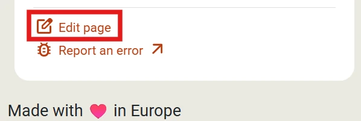
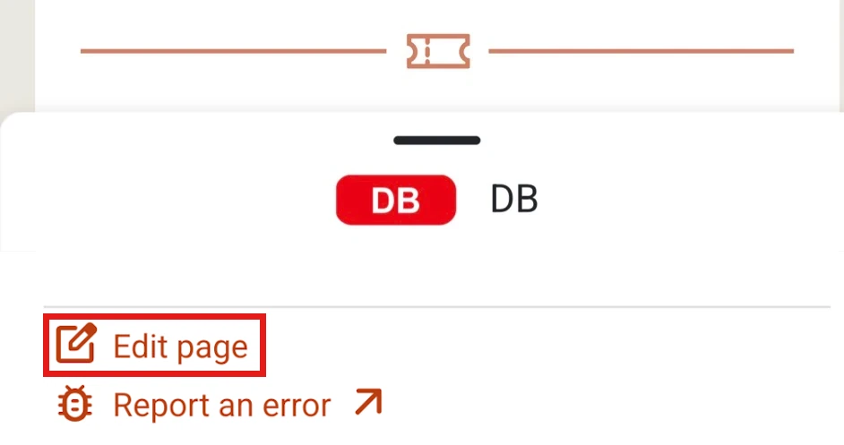

The _FIP Guide_ is an open-source and community project. If you would like to update or add information, you can do this independently. To ensure the accuracy of the information, all changes are reviewed by the FIP Guide team before they are published.

Pages can be adjusted directly in the FIP Guide via the [Content Management System (CMS)](https://www.fipguide.org/admin). More about this in the section [Direct Editing](#direct-editing). If you already have technical background knowledge, you can make changes directly via GitHub, more about this under [GitHub Contribution](#github-contribution).

## Direct Editing

You can edit the content of the pages directly via the Content Management System (CMS). It is available at [fipguide.org/admin](https://www.fipguide.org/admin).

Please note the following points when editing:

### Login

{{% float-image
    src="login.webp"
    alt="FIP Guide CMS login"
    width="40%"
    position="left"
%}}
To log in to the FIP Guide CMS, you need a free [GitHub](https://github.com/) account. GitHub belongs to Microsoft and is a platform for collaboration in open-source projects. You can easily create the GitHub account on the [GitHub website](https://github.com/).

You can log in to the CMS with this GitHub account. During the login, the use must be confirmed with "Authorize fipguide".
{}

{}
{{% float-image
    src="fork-repository.webp"
    alt="Fork repository in FIP Guide CMS"
    width="40%"
    position="right"
%}}
When you log in for the first time, you will be asked whether a so-called _Fork_ should be created. This automatically creates your own copy of the page. This is necessary so that changes can be saved in the CMS. Please confirm this with the "Fork" button.
{}
{}

### Open Pages

On the [homepage](https://www.fipguide.org/admin) of the FIP Guide CMS, the page category can be selected in the left menu and then the desired page can be opened in the center or a new page can be created.

Alternatively, the page to be edited can also be opened via the FIP Guide and then modified via the CMS using the "Edit page" menu.

{}
{{% column width="60.5%" %}}

{}

{{% column width="39.5%" %}}

{}
{}

### Edit Page

In the editing view, the corresponding page can be updated. The FIP Guide is available in different languages. You can change the language using a selection option.

{{% float-image
    src="show-second-pane.webp"
    alt="Deactivate the parallel view with multiple languages"
    width="30%"
    position="right"
%}}
By default, two languages are displayed side by side. If you want to focus on one language, you can deactivate the parallel view of multiple languages via the global menu.

Please note that the primary language is English and some information can only be adjusted on the English page, but is then automatically applied to all languages.
{}

{}
If you want, you can independently update all languages of the page. However, this is not absolutely necessary. You can also update information in only one language. The FIP Guide team will review the changes and then update the information in all languages.
{}

### Save and Publish Changes

{{% float-image
    src="send-for-review.webp"
    alt="Save changes in FIP Guide CMS"
    width="50%"
    position="right"
%}}
If you want to pause your work and save it, you can do this via the _Save_ button (top right). The changes are then saved on the server so that you can continue editing them later, but they are not yet published. After clicking _Save_, you will be asked whether your changes are already ready for review. Only once the status is changed to _In Review_ will the change be visible to the FIP Guide team.

The page can still be edited further even if it is in the Review status. You can also change the status again at any later point, as long as the change has not yet been finally published, see also [Continue Working](#continue-working--overview-of-changes).
{}

Every change that has been set to the _Review_ status is visible on GitHub: [FIP Guide GitHub changes (pull requests)](https://github.com/fipguide/fipguide.github.io/pulls). Your change is also visible there and comments can be left on the change. The FIP Guide team reviews the changes and, if necessary, asks questions via the comment function. You will also be informed by email about all changes.

### Continue Working / Overview of Changes

If you have saved your work on a page and want to continue, or if you want an overview of the status of all your changes, you can do this via the _Workflow_ menu item.

- **Draft:** Changes that are still being worked on and are not yet ready for review.
- **Review:** Changes that are being reviewed by the FIP Guide team.

Once all comments have been resolved, the FIP Guide team will publish the changes independently. After publication, the change disappears from the workflow view.

## GitHub Contribution

The FIP Guide uses the static website generator [_Hugo_](https://gohugo.io/) to create the website. The page can be edited directly in [GitHub](https://github.com/fipguide/fipguide.github.io/) via the web IDE or your local development environment. Further information and help are available in the [GitHub wiki](https://github.com/fipguide/fipguide.github.io/wiki) and [contribution guide](https://github.com/fipguide/fipguide.github.io/blob/main/CONTRIBUTING.md).

## Support

If you need help with editing, you can contact us at any time by email or via the FIP Guide Community. Further information can be found on the [contact page](/contact).
