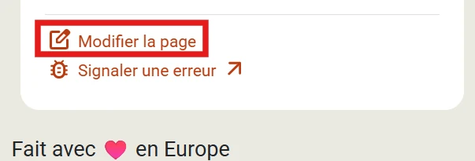
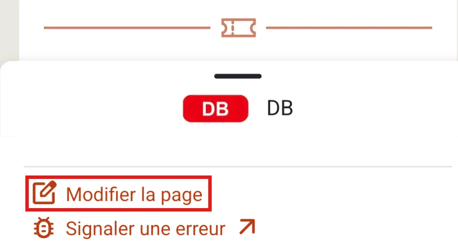
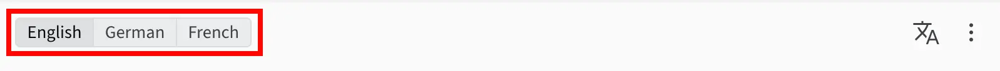
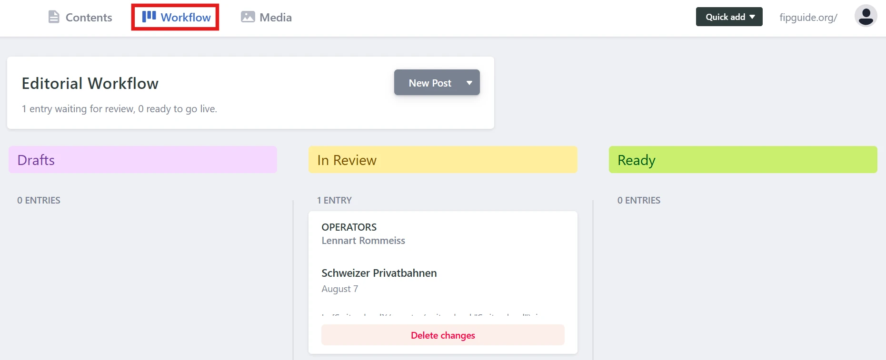

Le _FIP Guide_ est un projet open source et communautaire. Si vous souhaitez mettre à jour ou ajouter des informations, vous pouvez le faire de manière autonome. Afin de garantir l’exactitude des informations, toutes les modifications sont vérifiées par l’équipe du FIP Guide avant d’être publiées.

Les pages peuvent être modifiées directement dans le FIP Guide via le [système de gestion de contenu (CMS)](https://www.fipguide.org/admin). Vous trouverez plus d’informations à ce sujet dans la section [Modifier directement](#modifier-directement). Si vous avez déjà des connaissances techniques, vous pouvez effectuer les modifications directement via GitHub, plus d’informations à ce sujet sous [Contribution GitHub](#contribution-github).

## Modifier directement

Via le système de gestion de contenu (CMS), vous pouvez modifier directement le contenu des pages. Il est accessible à l’adresse [fipguide.org/admin](https://www.fipguide.org/admin).

Veuillez tenir compte des points suivants lors de la modification :

### Connexion

{{% float-image
    src="login.webp"
    alt="Connexion au CMS du FIP Guide"
    width="40%"
    position="left"
%}}
Pour vous connecter au CMS du FIP Guide, vous avez besoin d’un compte [GitHub](https://github.com/) gratuit. GitHub appartient à Microsoft et est une plateforme de collaboration pour les projets open source. Vous pouvez facilement créer le compte GitHub sur le [site web de GitHub](https://github.com/).

Il est possible de se connecter au CMS avec ce compte GitHub. Pendant la connexion, l’utilisation doit être confirmée avec « Authorize fipguide ».
{}

{}
{{% float-image
    src="fork_repository.webp"
    alt="Forker le dépôt dans le CMS du FIP Guide"
    width="40%"
    position="right"
%}}
Lors de la première connexion, il vous sera demandé si un _Fork_ doit être créé. Cela crée automatiquement votre propre copie de la page. Cela est nécessaire pour que les modifications puissent être enregistrées dans le CMS. Veuillez confirmer cela avec le bouton « Fork ».
{}
{}

### Ouvrir des pages

Sur la [page d’accueil](https://www.fipguide.org/admin) du CMS du FIP Guide, la catégorie de page peut être sélectionnée dans le menu de gauche, puis la page souhaitée peut être ouverte au centre ou une nouvelle page peut être créée.

Il est également possible d’ouvrir la page à modifier via le FIP Guide, puis de la modifier via le CMS au moyen du menu « Modifier la page ».

{}
{{% column width="50%" %}}

{}

{{% column width="50%" %}}

{}
{}

### Modifier la page

Dans la vue de modification, la page correspondante peut être mise à jour. Le FIP Guide est disponible en différentes langues. Par défaut, deux langues sont affichées côte à côte. Veuillez noter que la langue principale est l’anglais et que certaines informations ne peuvent être modifiées que sur la page anglaise, mais sont ensuite automatiquement reprises pour toutes les langues.

{}
Si vous le souhaitez, vous pouvez mettre à jour de manière autonome toutes les langues de la page. Cela n’est toutefois pas absolument nécessaire. Vous pouvez également mettre à jour des informations dans une seule langue. L’équipe du FIP Guide vérifiera les modifications et mettra ensuite les informations à jour dans toutes les langues.
{}

### Enregistrer et publier les modifications

{{% float-image
    src="send_for_review.webp"
    alt="Enregistrer les modifications dans le CMS du FIP Guide"
    width="50%"
    position="right"
%}}
Si vous souhaitez interrompre votre travail et l’enregistrer, vous pouvez le faire via le bouton _Save_ (en haut à droite). Les modifications sont alors enregistrées sur le serveur afin que vous puissiez les reprendre plus tard, mais elles ne sont pas encore publiées. Après avoir cliqué sur _Save_, il vous sera demandé si vos modifications sont déjà prêtes pour une review. Ce n’est qu’une fois le statut passé à _In Review_ que la modification devient visible pour l’équipe du FIP Guide.

La page peut encore être modifiée même si elle est au statut Review. Vous pouvez également changer le statut à tout moment ultérieur, tant que la modification n’a pas encore été publiée définitivement, voir aussi [Reprendre le travail](#reprendre-le-travail--vue-densemble-des-modifications).
{}

Chaque modification qui a été définie avec le statut _Review_ est visible sur GitHub : [Modifications GitHub du FIP Guide (pull requests)](https://github.com/fipguide/fipguide.github.io/pulls). Votre modification y est également visible et des commentaires peuvent être laissés sur la modification. L’équipe du FIP Guide vérifie les modifications et pose des questions si nécessaire via la fonction de commentaire. Vous serez également informé par e-mail de toutes les modifications.

### Reprendre le travail / Vue d’ensemble des modifications

Si vous avez enregistré votre travail sur une page et souhaitez le reprendre, ou si vous souhaitez avoir une vue d’ensemble du statut de toutes vos modifications, vous pouvez le faire via l’entrée de menu _Workflow_.

- **Draft:** Modifications sur lesquelles le travail se poursuit et qui ne sont pas encore prêtes pour la review.
- **Review:** Modifications qui sont vérifiées par l’équipe du FIP Guide.

Une fois que tous les commentaires ont pu être résolus, l’équipe du FIP Guide publiera les modifications de manière autonome. Après la publication, la modification disparaît de la vue Workflow.

## Contribution GitHub

Le FIP Guide utilise le générateur de sites statiques [_Hugo_](https://gohugo.io/) pour créer le site web. La page peut être modifiée directement dans [GitHub](https://github.com/fipguide/fipguide.github.io/) via l’IDE web ou votre environnement de développement local. Vous trouverez plus d’informations et d’aide dans le [wiki GitHub](https://github.com/fipguide/fipguide.github.io/wiki) et le [guide de contribution](https://github.com/fipguide/fipguide.github.io/blob/main/CONTRIBUTING.md).

## Assistance

Si vous avez besoin d’aide pour la modification, vous pouvez nous contacter à tout moment par e-mail ou via la communauté FIP Guide. Vous trouverez plus d’informations sur la [page de contact](/contact).
