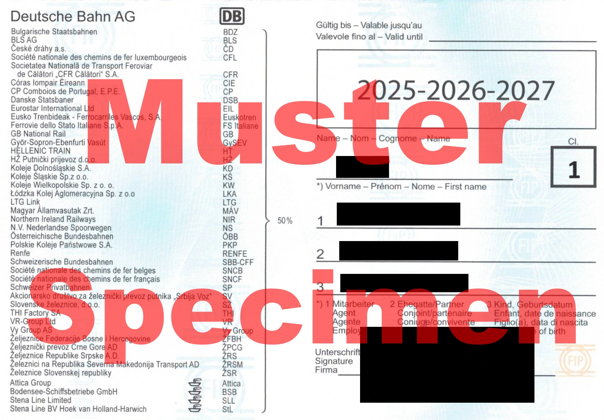
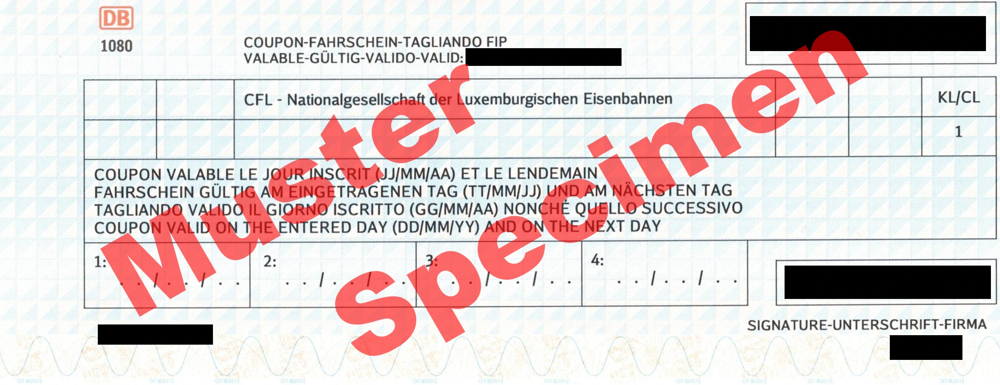
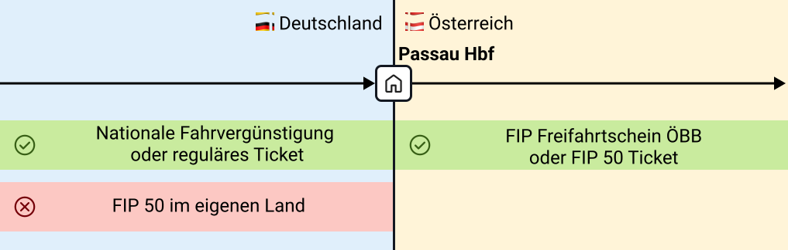
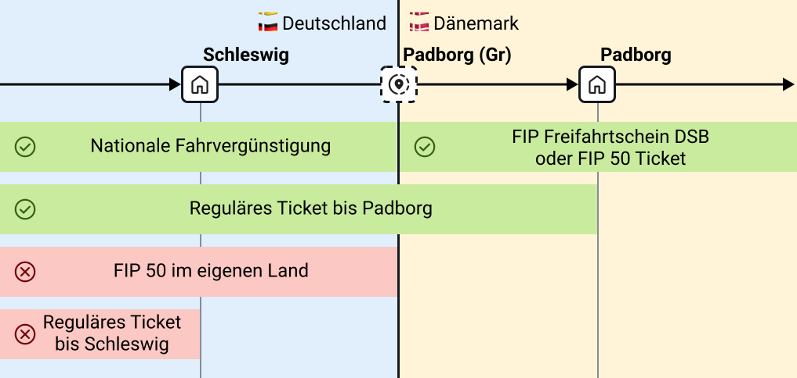

## Allgemein

FIP steht für _Groupement pour les facilités de circulation internationales du personnel des chemins de fer_. Es ist die Vereinigung für die internationalen Fahrvergünstigungen des Eisenbahnpersonals. Mit FIP können Internationale Fahrvergünstigungen im europäischen Ausland in Anspruch genommen werden.

Damit FIP Fahrvergünstigungen genutzt werden können, muss die Berechtigung für die Nutzung von FIP vorliegen. Im Regelfall ist dies nach einem Jahr Firmenzugehörigkeit gegeben, jedoch sind abweichende Regeln je nach Arbeitgeber möglich.

{}
Im Folgenden erklären wir die allgemeinen FIP Grundlagen. Abweichende Informationen können je nach Land oder Bahngesellschaft auftreten. Vor einer Reise solltest du dich immer mit den Regeln des jeweiligen Eisenbahnverkehrsunternehmens in dem Land vertraut machen. Dabei hilft der FIP Guide:

- [Übersicht der Bahngesellschaften](/operator "Übersicht Bahngesellschaften")
- [Übersicht der Länder](/country "Übersicht Länder")
  {}

FIP Vergünstigungen gelten häufig nur für im Eisenbahnverkehr und nicht für Busse, U-Bahnen oder Straßenbahnen. Hierbei kann es jedoch Ausnahmen geben, die auf den jeweiligen Betreiberseiten beschrieben sind.

Für die Nutzung von FIP Vergünstigungen ist es relevant, von welcher Bahngesellschaft ein Zug betrieben wird. Es gibt grenzüberschreitende Kooperationszüge, die in zwei Ländern von unterschiedlichen Bahngesellschaften betrieben werden (z. B. viele `EC` Verbindungen). Auf den [Länderseiten im FIP Guide](/country "Länderseiten im FIP Guide") wird beschrieben, wie im jeweiligen Land herausgefunden werden kann, wer der Betreiber eines Zuges ist. Allgemein sind dabei auch die Websites der Betreiber hilfreich. Die [Website der Deutschen Bahn](https://bahn.de) zeigt viele europäischen Verbindungen und ihre Betreiber an.

{}
Tariflich ist im Regelfall nicht relevant, in welchem Land ein Zug unterwegs ist, sondern von welcher Bahngesellschaft der Zug in welchem Abschnitt betrieben wird. Jedoch findet an Landesgrenzen häufig ein Betreiberwechsel statt. Auf den jeweiligen Länderseiten sind die Grenzpunkte, an denen der Betreiberwechsel stattfindet, beschrieben.
Auch hier gibt es Ausnahmen, so werden einige Nightjets auf der gesamten Laufstrecke von der ÖBB betrieben, allerdings werden Freifahrtscheine für alle durchquerten Länder benötigt.
{}

## FIP Ausweis

Für die Nutzung von FIP-Vergünstigungen ist eine aktuelle Internationale Ermäßigungskarte für Eisenbahnpersonal, umgangssprachlich _FIP Ausweis_ genannt, erforderlich. Der FIP Ausweis ist immer für eine feste Periode von drei Jahren gültig. Die aktuelle Periode ist 2025-2026-2027. Der FIP Ausweis wird als Legitimation für FIP 50 Tickets benötigt. Er wird entweder für die 1. oder 2. Klasse ausgestellt. Mit einem 1. Klasse Ausweis können Freifahrtscheine und FIP 50 Tickets für die 1. und 2. Klasse erworben werden, mit einem 2. Klasse Ausweis nur für die 2. Klasse. Er kann über die jeweilige Bahngesellschaft, bei der man arbeitet, bestellt werden. Der genaue Bestellweg unterscheidet sich pro Unternehmen.

Bei einigen Bahngesellschaften können Mitarbeitende auch für ihre Angehörigen FIP Ausweise erhalten und so FIP 50 Tickets erwerben.

## Vergünstigungen

FIP Vergünstigungen bestehen in verschiedenen Formen, für die Nutzung wird immer ein FIP-Ausweis benötigt.

### FIP Freifahrtscheine

FIP Freifahrtscheine (umgangssprachlich Auslandsfreifahrt) berechtigen zur Fahrt mit Zügen des auf dem Freifahrtschein angegebenen Betreibers. Ein _FIP Freifahrtschein_ besteht aus verschiedenen _Feldern_. Jedes Feld ist für zwei aufeinanderfolgende Tage gültig. Auf dem Ticket muss jeweils der erste Gültigkeitstag eingetragen werden. Das Ticket ist dann am eingetragenen und folgenden Tag gültig. Die unterschiedlichen Felder selbst müssen nicht an aufeinanderfolgenden Tagen ausgefüllt werden, die Daten müssen nur im aufgedruckenden Gültigkeitszeitraum liegen.

FIP Freifahrtscheine werden im Englischen auch als _FIP Coupons_ bezeichnet. Pro Kalenderjahr ist die Beantragung eines FIP Freifahrtscheins je Betreiber möglich. Einige Bahngesellschaften können für ihre eigenen Mitarbeitenden abweichende Regelungen haben. Das bedeutet, es können in jedem Jahr von beliebig vielen Betreibern je ein FIP Freifahrtschein mit ein bis zu vier Feldern, bestellt werden. Entscheidend für das Kalenderjahr ist das Datum, an dem die Gültigkeit beginnt. Der Antrag der internationalen Freifahrt erfolgt in der Regel über den Personalservice oder das Reisezentrum deines Eisenbahnverkehrsunternehmens. Manche Unternehmen bieten auch Online-Portale an.

Teilweise sind FIP Freifahrtscheine auch für Angehörige verfügbar. Die Verfügbarkeit ist abhängig von bilateralen Vereinbarungen zwischen der ausstellenden Bahngesellschaft und der Bahngesellschaft, bei der FIP Vergünstigungen genutzt werden sollen.

{}
Nach Rückkehr ins Bahnnetz des Heimatlandes ist innerhalb der Geltungsdauer des Freifahrscheines eine weitere Nutzung nicht zulässig, wenn das Land des Freifahrscheines direkt an das Streckennetz des Heimatlandes angrenzt.
{}

{}
Offiziell wird der _FIP Ausweis_ für die Nutzung von _FIP Freifahrtsscheinen_ nur für die Bestellung und nicht vor Ort bei der Nutzung benötigt. Jedoch fordern Zugbegleiter ihn in der Praxis trotzdem teilweise ein. Um Probleme zu vermeiden, sollte er also auch bei der Nutzung von _FIP Freifahrtscheinen_ vorgezeigt werden können.
{}

{}
Ich möchte als Mitarbeitender bei einer europäischen Bahngesellschaft (z. B. Deutsche Bahn) an insgesamt acht Tagen mit verschiedenen Zügen innerhalb von Österreich fahren. Dafür muss ich einen FIP Freifahrtschein für die Österreichische Bundesbahn (ÖBB) mit vier Feldern (4 Felder = bis zu 8 Tage Freifahrten bei dem Betreiber) bestellen.

Der FIP Freifahrtschein hat eine Gültigkeit von drei Monaten, ich darf nur in dieser Zeit reisen (Beispiel-Gültigkeit: 10.02.2026–09.05.2026). Ich reise am 01.03.2026 in das Land ein und trage vor der Fahrt im ersten in Österreich genutzten Zug den 01.03.2026 im ersten Feld ein. Damit kann ich nun die Züge der ÖBB am 01.03. und 02.03.2026 nutzen (Ausnahmen und spezielle Regelungen sind auf der jeweiligen [Betreiberseite](/operator "Betreiberseite") zu finden).

Am 03.03.2026 fahre ich nicht mit dem Zug, dafür wieder am 04.03. Also trage ich den 04.03.2026 im zweiten Feld ein, damit kann ich auch noch am 05.03. fahren. So geht es weiter, bis ich alle vier Felder verbraucht habe. Das letzte Feld nutze ich beispielsweise am 10.03.2026 und fahre damit am 11.03.2026 wieder aus Österreich zurück.
{}

{}
Um länger als acht Tage in einem Land bzw. bei einem Betreiber Zug fahren zu können, kann auch zwischendrin ein Tag kein Freifahrtschein benutzt werden und z. B. ein FIP 50 Ticket für die Fahrt an diesem Tag gekauft werden. Diese können unabhängig von einem Freifahrtschein jederzeit erworben werden.
{}

### FIP 50 Tickets

FIP Berechtigte können reduzierte Tickets erwerben. Diese kosten im Regelfall 50% des flexiblen Preises. Daher sind diese Tickets nicht zuggebunden und flexibel auf der Strecke nutzbar, außer es handelt sich um reservierungspflichtige Züge. Einige Bahngesellschaften haben bilaterale Abkommen und gewähren gegenseitig einen höheren Rabatt z. B. 75%.

FIP 50 Tickets können jederzeit in beliebiger Anzahl gekauft werden. Mit FIP 50 besteht einfach eine Art Rabattkarte für viele Verbindungen. Ein FIP 50 Ticket kann dabei auch mehrere Betreiber abdecken.

Die Bestellung unterscheidet sich von FIP Freifahrtscheinen: während letztere von der eigenen Bahngesellschaft ausgestellt werden, können FIP 50 Tickets über unterschiedliche Wege erworben werden. Für eine Fahrt innerhalb eines Landes ist ein lokaler Ticketschalter bzw. Reisezentrum meist eine gute Anlaufstelle. Bei einigen Betreibern ist die Buchung auch online oder am Automaten möglich. Die Preise für FIP 50 Tickets können sich je nach Verkaufsstelle unterscheiden. Auf den jeweiligen Länder- und Betrieberseiten des FIP Guides versuchen wir, die Informationen zum Kauf der Tickets bestmöglich zusammenzufassen.

{}
FIP Vergünstigungen gelten nicht im eigenen Land. Auch wenn auf FIP 50 Tickets ein Ticketabschnitt im eigenen Land eingetragen ist, gilt das Ticket dort nicht. Für diesen Ticketabschnitt muss eine separate Fahrkarte oder nationale Vergünstigung genutzt werden. Ausgenommen hiervon sind nur FIP Globalpreise.
{}

{}
Da FIP 50 Tickets nur flexible Tickets rabattieren, können sie teurer als reguläre Tickets wie unflexible Tickets (z. B. Sparpreise oder Advance Tickets) und andere Rabattangebote (z. B. Deutschlandticket) sein.
{}

{}
Ich bin FIP-Berechtigter bei der Deutschen Bahn und möchte am 01.03.2026 von Frankfurt am Main nach Amsterdam fahren. Dafür buche ich mir im DB Reisezentrum (in dem Fall wäre es auch online über eine spezielle Seite der DB möglich) ein FIP 50 Ticket von Frankfurt Hbf nach Amsterdam Centraal. Wenn die Fahrkarte nicht mit einer Reservierung verbunden ist, ist sie flexibel auf jeder Verbindung des gleichen Betreibers und gleicher Zugkategorie (z. B. ICE) an dem Tag gültig. Dieses Ticket ist jedoch nur für den niederländischen Teilabschnitt gültig, da im Land des eigenen Betreibers das Ticket keine Gültigkeit hat. Ich brauche also dazu noch ein Ticket für den deutschen Teilabschnitt, zum Beispiel eine Fahrvergünstigung für DB-Mitarbeitende.

Anders sieht es beispielsweise aus, wenn ich ein Ticket von Wien nach Budapest buche, hier bekomme ich ein auf der ganzen Strecke gültiges FIP 50 Ticket.
{}

### FIP Globalpreise

Für einige Züge existieren spezielle Preise und Sonderregeln. Diese sind weder mit FIP 50 Tickets noch mit FIP Freifahrtschein fahrbar. Stattdessen muss ein spezieller FIP Globalpreis für die konkrete Zugverbindung erworben werden. Die ausgestellten Tickets sind zuggebunden. FIP Globalpreise sind z. B. für den Eurostar, TGV/AVE-Verkehr zwischen Barcelona und Frankreich und diverse Nachtzüge erforderlich.

### Nationale Vergünstigungen (kein FIP)

FIP Vergünstigungen gelten nie in Zügen der eigenen Bahngesellschaft. Daher wird innerhalb des Heimatlandes ein anderes Ticket benötigt. Für die Mitarbeitenden folgender Bahngesellschaften stehen uns diese Informationen zur Verfügung:

{}

Mitarbeitende der Deutschen Bahn können für die Fahrt bis zum [Grenztarifpunkt](#grenzpunkte) nationale Vergünstigungen nutzen. Dafür kann ein Tagesticket M Fern oder eine Netzcard genutzt werden. Diese gelten im gesamten Netz und somit bis zum Grenztarifpunkt zu den Nachbarländern.

Teilweise sind andere Tickets, die auf dem gesamten Abschnitt gelten, günstigere Alternativen zu FIP. Dazu gehören (Super) Sparpreise Europa DB-PEP (Nur in Verbindung mit einem Reisenden mit FIP, siehe Nutzungsbestimmungen) oder auch normale (Super) Sparpreise. Weitere Informationen dazu sind im DB Reisemarkt und DB Personalportal zu finden.

{}

## Grenzpunkte

FIP Freifahrtscheine gelten im Regelfall nur im Land/Netz der jeweiligen Bahngesellschaft. Die Gültigkeit des FIP Freifahrtscheins ist offiziell bis zum sogenannten _Grenztarifpunkt_.

{}
Es wird immer ein Ticket bis zur Grenze benötigt. FIP Freifahrtscheine sind nur im Land/Netz der jeweiligen Bahngesellschaft gültig. Die Grenze ist dabei nicht immer der letzte Bahnhof im Land. Es reicht also unter Umständen nicht aus, ein Ticket bis zum letzten Bahnhof zu kaufen. Das ist insbesondere dann relevant, wenn das eigene Heimatland verlassen wird, da in diesem keine FIP Tickets gelten.
{}

Im Detail unterscheidet man zwischen zwei Arten von _Grenztarifpunkten_:

- **Grenzbahnhof**: Dies ist ein echter physischer Bahnhof. Bis zu diesem Halt kann man von beiden angrenzenden Ländern mit einem Zugticket fahren. Beispiele dafür sind Salzburg Hbf, Basel Badischer Bahnhof oder Konstanz.
- **Grenztarifpunkt**: Dies ist ein "virtueller" Bahnhof, der nur in der Theorie existiert, um die Gültigkeit von Fahrkarten zu bestimmen. Sie befinden sich auf der freien Strecke. Hierbei wird daher sowohl ein Ticket vor als auch hinter diesen Grenztarifpunkt benötigt. Grenztarifpunkte sind in der Übersicht im Regelfall mit "(Gr)" oder "(fr)" für Grenze / frontière gekennzeichnet.

Weitere Informationen zu Grenztarifpunkten sind auf [Wikipedia](https://de.wikipedia.org/wiki/Grenztarifpunkt) zu finden.

Während ein FIP Freifahrtschein immer für nur genau eine Bahngesellschaft ausgestellt wird, kann ein FIP 50 Ticket für mehrere Bahngesellschaften ausgestellt werden. Bei welchen Bahngesellschaften das Ticket akzeptiert wird, ist am CIV-Code ablesbar (weitere Informationen dazu auf [Wikipedia](https://de.wikipedia.org/wiki/Gemeinsamer_Internationaler_Tarif_f%C3%BCr_die_Bef%C3%B6rderung_von_Personen)).

Welche Grenzbahnhöfe und Grenztarifpunkte zwischen zwei Ländern bzw. Bahngesellschaften bestehen, sind im FIP Guide auf der jeweiligen Länderseite aufgeführt.

{}
Ich bin FIP-Berechtigter bei der Deutschen Bahn und möchte am 01.03.2026 von Frankfurt am Main nach Wien fahren. Ich habe die Möglichkeit, entweder einen FIP Freifahrtschein für die ÖBB zu bestellen oder ein FIP 50 Ticket von Frankfurt Hbf nach Wien Hbf zu buchen. Beide gelten nur für den österreichischen Abschnitt, da ich in Deutschland kein FIP nutzen kann. Üblicherweise erfolgt die Fahrt hier über Passau Hbf, welcher Grenzbahnhof für Deutschland und Österreich ist.

Ich brauche also ein zusätzliches Ticket für die Fahrt zwischen Frankfurt Hbf und Passau Hbf, z. B. ein regulär gekauftes Ticket oder eine Fahrvergünstigung für DB Mitarbeitende innerhalb Deutschlands. Ab Passau Hbf gilt sowohl der ÖBB Freifahrtschein als auch das FIP 50 Ticket.

{}

{}
Ich bin FIP-Berechtigter bei der Deutschen Bahn und möchte am 01.03.2026 von Frankfurt am Main nach Kopenhagen fahren. Ich habe die Möglichkeit, entweder einen FIP Freifahrtschein für die DSB zu bestellen oder ein FIP 50 Ticket von Frankfurt Hbf nach Kobenhavn H zu buchen. Beide gelten nur für den dänischen Abschnitt, da ich in Deutschland kein FIP nutzen kann. Üblicherweise erfolgt die Fahrt hier über die Grenze Padborg (Gr), was nur ein virtueller Grenzpunkt zwischen Flensburg und Padborg ist, jedoch kein echter Bahnhof.

Ich brauche also ein zusätzliches Ticket für die Fahrt zwischen Frankfurt Hbf und diesem Grenzpunkt, z. B. ein regulär gekauftes Ticket bis zum ersten dänischen Bahnhof Padborg oder eine Fahrvergünstigung für DB Mitarbeitende innerhalb Deutschlands, die bis zur Grenze gültig sein muss. Ein Ticket beispielsweise bis zum letzten Bahnhof in Deutschland (Schleswig), an dem der Zug hält, oder bis Flensburg reicht nicht aus. Ab dem Grenzpunkt gilt dann sowohl der DSB Freifahrtschein als auch das FIP 50 Ticket.

{}

## Versteuerung

Für Mitarbeitende einiger Länder ist eine zusätzliche Versteuerung von FIP Vergünstigungen notwendig, die zusätzliche Kosten verursacht. Für die folgenden Ländern stehen uns Informationen zur Verfügung:

{}

FIP Freifahrtscheine von Mitarbeitenden in Deutschland gelten als _Geldwerter Vorteil_ und unterliegen § 8 des Einkommensteuergesetzes (EStG). Die FIP Freifahrtscheine sind somit steuer- und sozialversicherungspflichtig.

Der angerechnete Wert unterscheidet sich je nach Streckennetzlänge die mit dem jeweiligen Freifahrtschein gefahren werden kann und wird jährlich aktualisiert. Eine Liste der genauen aktuellen Beträge ist im DB Reisemarkt oder DB Personalportal verfügbar.

Monatlich werden alle Sachbezugswerte zusammengerechnet (auch andere geldwerte Vorteile wie nationale Freifahrten). Wenn die Summe einen gewissen Grenzwert übersteigt (50 € in 2025) wird der gesamte Betrag (nicht nur, was über dem Grenzwert liegt, sondern alles) auf das zu versteuernde Einkommen (üblicherweise das Bruttogehalt) aufgeschlagen. Dementsprechend höher fallen in diesem Monat dann Steuer- und Sozialabgaben aus.

FIP Freifahrtscheine und nationale Fahrvergünstigungen von Angehörigen werden dem Mitarbeitenden angerechnet.

{}

## FAQ

{}

FIP steht für _Groupement pour les facilités de circulation internationales du personnel des chemins de fer_. Es ist die Vereinigung für die internationalen Fahrvergünstigungen des Eisenbahnpersonals.
Hierbei sind Eisenbahn- und Schifffahrtunternehmen der UIC (Internationaler Eisenbahnverband) angeschlossen.

Als Berechtigungsausweis gilt die Internationale Ermäßigungskarte für Eisenbahnpersonal, kurz FIP-Ausweis oder FIP-Card.

{}

{}

Anspruchsberechtigt sind in der Regel aktive und pensionierte Mitarbeitende von FIP-Mitgliedern. Auch Familienangehörige können unter bestimmten Bedingungen berechtigt sein.
Nach zwölf Monaten Betriebszugehörigkeit können Mitarbeitende den Berechtigungsausweis beantragen.
Bitte wende dich für die Beantragung und Inanspruchnahme an deine Personalabteilung.

{}

{}

Abhängig der Vereinbarung zwischen den FIP-Mitgliedern können auch Familienangehörige (Kinder, Lebenspartner) FIP-Vergünstigungen nutzen. Dies wird immer auf den jeweiligen [Betreiberseiten](operator) mit genannt. Auch Ermäßigungen für Kinder sind hier zu finden.

{}

{}
Der FIP-Ausweis ist der Berechtigungsausweis für vergünstigte Fahrten bei FIP-Mitgliedern im Ausland.
Er ermöglicht kostenlose oder vergünstigte Reisen bei den teilnehmenden Bahnen und Schifffahrtsgesellschaften.
{}

{}

Wende dich hierzu an deine Personalabteilung.
Beachte, dass du in der Regel erst ab zwölf Monaten Betriebszugehörigkeit einen Anspruch auf internationale Fahrvergünstigungen hast.

{}

{}

Mit dem FIP-Ausweis bist du berechtigt, zu vergünstigten Konditionen die Verkehrsmittel des jeweiligen FIP-Mitglieds zu nutzen.
Es gelten unterschiedliche Regelungen je Betreibergesellschaft. Details erfährst du auf den [Unterseiten der Betreiber](operator).

Es gibt verschiedene Arten an Vergünstigungen:

1. **Ermäßigte Fahrkarten:** Mit dem FIP-Ausweis erhältst du stark vergünstigte Tickets (in der Regel 50% Rabatt auf den Flexpreis bzw. Globalpreis). Es gibt keine Mengenbeschränkung und Beantragungsfristen.
2. **Kostenlose Fahrten mit FIP Freifahrtscheinen:** Bei vielen FIP-Mitgliedern kannst du mit einem FIP Freifahrtschein kostenlos reisen. Pro Betreibergesellschaft ist in einem Kalenderjahr einmal die Bestellung eines Freifahrtscheins mit ein bis vier Feldern möglich.

{}
Nicht immer ist eine Fahrt mit FIP die günstigste Option. In manchen Ländern sind Sparpreise verfügbar, welche günstiger sind.
{}
{}

{}
Die Bestellung unterscheidet sich je nach Betreiber, zum Beispiel online, telefonisch oder im Reisezentrum.
Eine genaue Übersicht getrennt nach FIP-Mitgliedern findest du [hier](operator).
{}

{}

In einem Kalenderjahr kannst du pro FIP-Mitglied einen FIP Freifahrtschein mit ein bis vier Feldern beantragen.

In der Regel ist eine Bearbeitungsfrist bei der Beantragung zu beachten.

{}

{}
Die Beantragung von internationalen Freifahrten erfolgt in der Regel über den Personalservice oder das Reisezentrum deines Eisenbahnverkehrsunternehmens. Manche Unternehmen bieten auch Online-Portale an.
{}

{}
Je nach individuellem Bedarf können FIP Freifahrtscheine mit 1 bis 4 Feldern pro FIP-Mitglied beantragt werden.
Jedes Feld berechtigt zu einer unbegrenzten Anzahl von Fahrten auf dem Streckennetz des jeweiligen Bahn- oder Schifffahrtsunternehmens an einem Tag und dem darauffolgenden Tag.
{}

{}
Ein Feld berechtigt zu unbegrenzt vielen Fahrten auf dem Netz der jeweiligen Bahn oder Schifffahrtsgesellschaft innerhalb der Gültigkeitsdauer an dem eingetragenen und dem darauffolgenden Tag.
{}

{}
Ein FIP Freifahrtschein ist ab Ausstellungsdatum drei Monate lang gültig. Innerhalb dieses Zeitraums können die enthaltenen Felder genutzt werden.
{}

{}
Die Gültigkeit eines Feldes beginnt mit dem eingetragenen Datum und endet am folgenden Tag um Mitternacht (24:00 Uhr).
Somit ist jedes Feld für einen Zeitraum von zwei Tagen gültig.
Bei der Maximalanzahl von vier Feldern kannst du somit acht Tage unterwegs sein.
{}

{}

Über 30 europäische Bahngesellschaften sowie einige Schifffahrtsunternehmen nehmen am FIP-System teil. Eine Liste, welche Unternehmen dabei sind, findest du im FIP Guide in der [Liste der Betreibergesellschaften](operator).
Informationen für dein Reiseziel findest du auf unserer [Länderseite](country).

{}

{}
Ja. Bei einigen Unternehmen sind keine FIP Freifahrtscheine nutzbar, bei anderen gelten diese nur für bestimmte Zugkategorien.

Details zu den Regelungen der FIP-Mitglieder findest du auf den [Unterseiten der Betreiber](operator).

{}

{}

Für viele Züge, meist Hochgeschwindigkeits- und Nachtzüge, ist eine Reservierung erforderlich. Eine Übersicht erhältst du auf der jeweiligen Seite des [Betreibers](operator).

{}

## Wer steckt hinter dem FIP Guide?

Wir sind ein engagiertes Team von Bahn-Mitarbeitenden, welche selbst regelmäßig FIP nutzen.
Unser Ziel ist, eine schnell und einfach nutzbare Übersicht zur Nutzung von FIP bereitzustellen.
Unser Fokus liegt auf der Bereitstellung von nützlichen Informationen für die Nutzerinnen und Nutzer.

## Zusätzliche nützliche Ressourcen

Die [Rail Delivery Group](https://www.raildeliverygroup.com/rst/europe-and-fip.html) bietet eine ausführliche Übersicht zu FIP in verschiedenen Ländern.
