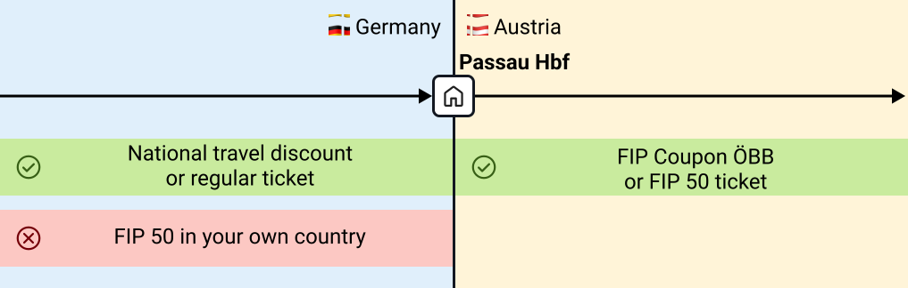
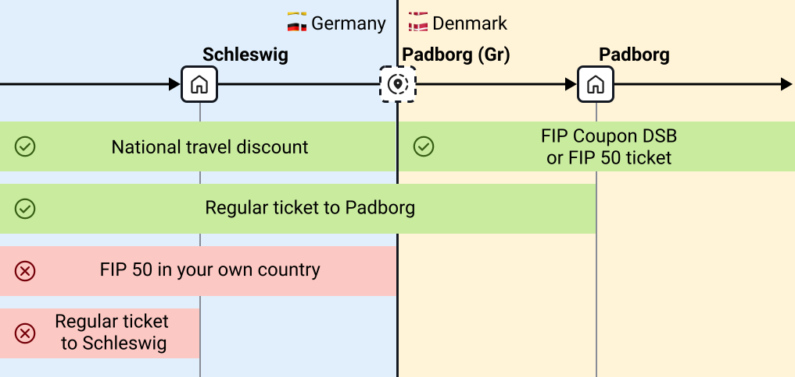

## General

FIP stands for _Groupement pour les facilités de circulation internationales du personnel des chemins de fer_. It is the association for international railway staff travel discounts. Through FIP, travel discounts are available abroad throughout Europe.

To use FIP travel discounts, you must be entitled to use FIP. This is usually granted after one year of employment, although different rules may apply depending on your employer.

{}
Below we explain the general FIP basics. However, specific information may vary depending on the country or railway company. Before traveling, you should always familiarize yourself with the rules of the specific railway operator in the country you are visiting. The FIP Guide can help:

* [Overview of Railway Operators]({} "Overview of Railway Operators" )
* [Overview of Countries]({} "Overview of Countries" )
{}

FIP discounts often apply only to rail travel and not to buses, subways, or trams. However, there may be exceptions, which are described on the relevant operator pages.

When using FIP discounts, it matters which railway company operates the train. There are cross-border cooperative trains that are operated by different railway companies in two countries (e.g., many `EC` connections). The [country pages in the FIP Guide]({} "Country pages in the FIP Guide" ) explain how to find out who operates a train in each country. In general, the operators' websites are also helpful. The [Deutsche Bahn website](https://bahn.de) shows many European connections and their operators.

{}
For tariff purposes, what usually matters is not which country a train is traveling through, but which railway company operates the train on which segment. However, operator changes often occur at national borders. The relevant country pages describe the border points where operator changes occur.
There are exceptions here too: for example, some Nightjet trains are operated by ÖBB for their entire route, but you will need FIP Coupon for all countries you pass through.
{}

## FIP Card

To use FIP discounts, you need a current _FIP Card_. It is always valid for a fixed period of three years. The current period is 2025-2026-2027. The FIP Card serves as proof of eligibility for FIP 50 Tickets. It is issued for either 1st or 2nd class. With a 1st class card, you can order FIP Coupons and buy FIP 50 Tickets for both 1st and 2nd class; with a 2nd class card, only for 2nd class. It can be ordered through the railway company you work for. The exact ordering process differs by company.

Some railway companies also allow employees to obtain FIP Cards for their dependents, allowing them to purchase FIP 50 Tickets.

## Discounts

FIP discounts come in various forms; a FIP Card is always required to use them.

### FIP Coupons

These entitle you to travel on trains operated by the operator specified on the coupon. An _FIP Coupon_ consists of multiple _fields_. Each field is valid for two consecutive days. The first day of validity must be entered on the ticket. The ticket is then valid on that day and the following day. The different fields themselves do not need to be filled in on consecutive days; the dates only need to fall within the printed validity period. One FIP Coupon per operator can be ordered per calendar year (some railway companies may have different rules for their own employees). This means you can order one FIP Coupon with one to four fields from any number of operators each year. The date on which validity begins determines the calendar year.

FIP Coupons are sometimes also available for dependents. Availability depends on bilateral agreements between the issuing railway company and the railway company where you wish to use FIP discounts.

{}
Once you return to the rail network of your home country, you may not use the FIP Coupon again within its validity period if the country of the coupon borders directly on your home country's rail network.
{}

{}
Officially, the _FIP Card_ is only required for ordering _FIP Coupons_, not for use at the point of travel. However, in practice, train staff sometimes request it anyway. To avoid problems, you should be able to present it when using _FIP Coupons_.
{}

{}
Suppose I'm an employee of a European railway company (e.g., Deutsche Bahn) and want to travel for a total of eight days on various trains within Austria. To do this, I need to order an FIP Coupon for the Austrian Federal Railways (ÖBB) with four fields (4 fields = up to 8 days of free travel with that operator).

The FIP Coupon is valid for three months; I can only travel during this time (example validity: 10.02.2026 - 09.05.2026). I enter the country on 01.03.2026 and, before my first train journey in Austria, I fill in 01.03.2026 in the first field. Now I can use ÖBB trains on 01.03 and 02.03.2026 (exceptions and special rules are found on the respective [operator page]({} "operator page")).

On 03.03.2026 I don't travel by train, but I do on 04.03. So I fill in 04.03.2026 in the second field, allowing me to travel on 05.03 as well. This continues until I've used all four fields. I use the last field, for example, on 10.03.2026 and travel back out of Austria on 11.03.2026.
{}

{}
To travel by train for longer than eight days in one country or with one operator, you can skip a day without using a coupon and instead purchase an FIP 50 Ticket for that day's journey. These can be purchased at any time independently of a coupon.
{}

### FIP 50 Tickets

FIP-eligible employees can purchase discounted tickets. These typically cost 50% of the flexible price. Therefore, these tickets are not train-specific and can be used flexibly on the route, unless the train requires a mandatory reservation. Some railway companies have bilateral agreements and grant each other higher discounts, for example 75%.

FIP 50 Tickets can be purchased at any time in any quantity. FIP 50 essentially functions as a discount card for many connections. A single FIP 50 Ticket can cover multiple operators.

The purchase process differs from FIP Coupons. While the latter are issued by your own railway company, FIP 50 Tickets can be purchased in various ways. For travel within a country, a local ticket counter or travel center is usually a good starting point. Some operators also allow booking online or via ticket machines. On the respective country and operator pages, we try to summarize the information on ticket purchases as comprehensively as possible. Prices for FIP 50 Tickets can vary depending on the sales outlet.

{}
FIP discounts do not apply in your home country. Even if a FIP 50 Ticket includes a ticket segment in your home country, the ticket is not valid there. You must use a separate ticket or national discount for this segment. The only exception is FIP Global Fares.
{}

{}
Since FIP 50 Tickets only discount flexible tickets, they can be more expensive than regular tickets such as inflexible tickets (e.g., savings fares or advance tickets) and other discount offers (e.g., Deutschland Ticket).
{}

{}
I am FIP-eligible at Deutsche Bahn and want to travel from Frankfurt am Main to Amsterdam on 01.03.2026. I purchase an FIP 50 Ticket from Frankfurt Hbf to Amsterdam Centraal at the DB travel center (in this case, it would also be possible online via a special DB page). If the ticket is not linked to a reservation, it is flexible and valid on any connection of the same operator and train category (e.g., ICE) on that day. However, this ticket is only valid for the Dutch section, since the ticket is not valid in your home operator's country. I therefore need another ticket for the German section, for example an employee discount for DB staff.

The situation is different if, for example, I book a ticket from Vienna to Budapest; in this case I get an FIP 50 Ticket valid for the entire route.
{}

### FIP Global Fares

For some trains, special fares and rules apply. These cannot be used with either FIP 50 Tickets or FIP Coupons. Instead, a special FIP Global Fare for the specific train service must be purchased. The issued tickets are train-specific. FIP Global Fares are required, for example, for Eurostar, TGV/AVE services between Barcelona and France, or various night trains.

### National Discounts (Non-FIP)

FIP discounts never apply on trains operated by your own railway company. Therefore, a different ticket is needed within your home country. For employees of the following railway companies, we have this information available:

{}

Employees of Deutsche Bahn can use national discounts for travel up to the [border tariff point](#border-points). For this, a Tagesticket M Fern (Day Ticket M Long Distance) or a Netzcard (Network Card) can be used. These are valid on the entire network and thus up to the border tariff point to neighboring countries.

In some cases, other tickets valid for the entire segment offer cheaper alternatives to FIP. These include (Super) Sparpreise Europa DB-PEP (only in combination with a traveler with FIP, see terms of use) or regular (Super) Sparpreise (savings fares). More information can be found in the DB Reisemarkt and DB employee portal.

{}

## Border Points

FIP discounts are generally only valid in the country/network of the respective railway company. The validity of the FIP Coupon officially extends to the so-called _border tariff point_.

{}
You always need a ticket up to the border. FIP Coupons are only valid in the country/network of the respective railway company. The border is not always the last station in the country. Therefore, it may not be sufficient to buy a ticket only to the last station. This is particularly important when leaving your home country, as FIP tickets are not valid there.
{}

In detail, two types of _border tariff points_ are distinguished:

- **Border station**: This is a real physical railway station. From both neighboring countries, you can travel to this stop with one train ticket. Examples include Salzburg Hbf, Basel Badischer Bahnhof, or Konstanz.
- **Border tariff point**: This is a "virtual" station that exists only in theory to determine ticket validity. They are located on open track. Therefore, you need a ticket both before and after this border tariff point. Border tariff points are usually marked with "(Gr)" or "(fr)" for Grenze/frontière (border).

Further information on border tariff points can be found on [Wikipedia](https://de.wikipedia.org/wiki/Grenztarifpunkt).

While an FIP Coupon is always issued for exactly one railway company, an FIP 50 Ticket can be issued for multiple railway companies. Which railway companies exactly accept the ticket can be determined from the CIV code (more information on [Wikipedia](https://de.wikipedia.org/wiki/Gemeinsamer_Internationaler_Tarif_f%C3%BCr_die_Bef%C3%B6rderung_von_Personen)).

Which border stations and border tariff points exist between two countries or railway companies are listed in the FIP Guide on the respective country page.

{}
I am FIP-eligible at Deutsche Bahn and want to travel from Frankfurt am Main to Vienna on 01.03.2026. I have two options: either order an FIP Coupon for ÖBB or book an FIP 50 Ticket from Frankfurt Hbf to Vienna Hbf. Both are only valid for the Austrian section since I cannot use FIP in Germany. The journey typically takes place via Passau Hbf, which is the border station between Germany and Austria.

I therefore need an additional ticket for the journey between Frankfurt Hbf and Passau Hbf, such as a regularly purchased ticket or an employee discount for DB staff within Germany. From Passau Hbf onwards, both the ÖBB coupon and the FIP 50 Ticket are valid.

{}

{}
I am FIP-eligible at Deutsche Bahn and want to travel from Frankfurt am Main to Copenhagen on 01.03.2026. I have two options: either order an FIP Coupon for DSB or book an FIP 50 Ticket from Frankfurt Hbf to Kobenhavn H. Both are only valid for the Danish section since I cannot use FIP in Germany. The journey typically goes via the border point Padborg (Gr), which is only a virtual border point between Flensburg and Padborg, not an actual railway station.

I therefore need an additional ticket for the journey between Frankfurt Hbf and this border point, such as a regularly purchased ticket to the first Danish station Padborg or an employee discount for DB staff within Germany that is valid up to the border. A ticket, for example, to the last German station (Schleswig) where the train stops, or to Flensburg is not sufficient. From the border point onwards, both the DSB coupon and the FIP 50 Ticket are valid.

{}

## Taxation

For employees in some countries, additional taxation of FIP discounts is necessary, which incurs additional costs. For the following countries, we have information available:

{}

FIP Coupons for employees in Germany are considered _non-monetary compensation_ subject to § 8 of the German Income Tax Act (EStG). FIP Coupons are therefore subject to income tax and social security contributions.

The assessed value differs depending on the network length that can be covered with the respective coupon and is updated annually. A list of the current amounts is available in the DB Reisemarkt or DB employee portal.

Each month, all taxable benefits are added together (including other non-monetary benefits such as national FIP discounts). If the sum exceeds a certain threshold (€50 in 2025), the entire amount (not just what exceeds the threshold, but everything) is added to taxable income (usually gross salary). Accordingly, taxes and social contributions are higher that month.

FIP Coupons and national travel discounts of dependents are counted toward the employee.

{}

## FAQ

{}

FIP stands for _Groupement pour les facilités de circulation internationales du personnel des chemins de fer_. It is the association for international railway staff travel discounts.
Railway and shipping companies of the UIC (International Union of Railways) are affiliated with it.

The proof of entitlement is the International Discount Card for Railway Staff, in short FIP Card or FIP-Card.

{}

{}

Generally, active and retired employees of FIP members are entitled. Family members can also be entitled under certain conditions.
After twelve months of employment, employees can apply for the FIP Card.
Please contact your HR department for application and use.

{}

{}

Depending on the agreement between FIP members, family members (children, partners) can also use FIP discounts. This is always mentioned on the respective [operator pages](). Discounts for children are also listed there.

{}

{}
The FIP Card is the proof of entitlement for discounted travel with FIP members abroad.
It enables free or discounted travel with participating railway and shipping companies.
{}

{}

Contact your HR department.
Note that you generally only have a right to international travel discounts after twelve months of employment.

{}

{}

With the FIP Card, you are entitled to use the transport services of the respective FIP member at discounted rates.
Different rules apply depending on the operator. You can find details on the [operator pages]().

There are various types of discounts:

1. **Discounted tickets:** With the FIP Card, you receive heavily discounted tickets (usually 50% off the flexible price or global fare). There are no quantity restrictions or application deadlines.
2. **Free travel with FIP Coupons:** With many FIP members, you can travel for free with an FIP Coupon. Per operator, one coupon with one to four fields can be ordered once per calendar year.

{}
FIP travel is not always the cheapest option. In some countries, savings fares are available that are cheaper.
{}
{}

{}
The purchase method differs depending on the operator, for example online, by phone, or at a travel center.
You can find a detailed overview sorted by FIP member [here]().
{}

{}

In one calendar year, you can apply for one FIP Coupon with one to four fields per FIP member.

As a rule, a processing deadline applies when applying.

{}

{}
Application is typically made through the personnel service or travel center of your railway company. Some companies also offer online portals.
{}

{}
Depending on your needs, FIP Coupons with 1 to 4 fields per FIP member can be requested.
Each field entitles you to an unlimited number of journeys on the network of the respective railway or shipping company on the date entered and the following day.
An exception is the Dutch shipping company StL: with one field, only two crossings are possible.
{}

{}
A field entitles you to unlimited journeys on the network of the respective railway or shipping company during the validity period on the date entered and the following day.
{}

{}
An FIP Coupon is valid for three months from the date of issue. The fields contained within it can be used during this period.
{}

{}
A field's validity begins on the date entered by the user and ends the following day at midnight (24:00).
Thus, each field is valid for a period of two days.
With the maximum of four fields, you can travel for eight days.
{}

{}

Over 30 European railway companies and some shipping companies participate in the FIP system. A list of which companies are involved can be found in the FIP Guide in the [list of operators]().
For information about your travel destination, see our [country page]().

{}

{}
Yes. With some companies, no FIP Coupons can be used, while with others they apply only to certain train categories.
The Dutch shipping company StL allows only two crossings per field.

Details on FIP member rules can be found on the [operator pages]().

{}

{}

A reservation is required for many trains, mostly high-speed and night trains. You can find an overview on the respective [operator page]().

{}

## Who is behind the FIP Guide?

We are a dedicated team of railway employees who regularly use FIP ourselves.
Our goal is to provide a quick and easy-to-use overview for using FIP.
Our focus is on providing useful information for our users.

## Additional useful resources

The [Rail Delivery Group](https://www.raildeliverygroup.com/rst/europe-and-fip.html) provides a comprehensive overview of FIP in various countries.
