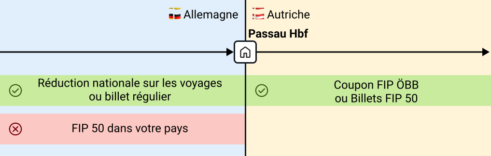
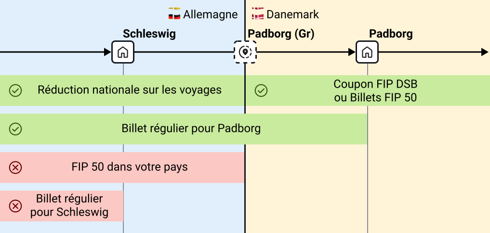

## Généralités

FIP signifie _Groupement pour les facilités de circulation internationales du personnel des chemins de fer_. Il s’agit de l’association pour les facilités de voyage internationales du personnel ferroviaire. Avec FIP, il est possible de bénéficier de réductions de voyage internationales à l’étranger en Europe.

Pour utiliser les réductions FIP, vous devez être autorisé à utiliser le FIP. Ceci est généralement accordé après un an d’emploi, bien que des règles différentes puissent s’appliquer selon votre employeur.

{}
Ci-dessous, nous expliquons les bases générales du FIP. Cependant, des informations spécifiques peuvent varier selon le pays ou l’entreprise ferroviaire. Avant de voyager, vous devez toujours vous familiariser avec les règles du transporteur ferroviaire spécifique du pays que vous visitez. Le Guide FIP peut vous aider :

- [Aperçu des Transporteurs Ferroviaires](/operator "Aperçu des Transporteurs Ferroviaires")
- [Aperçu des Pays](/country "Aperçu des Pays")
  {}

Les réductions FIP s’appliquent souvent uniquement au transport ferroviaire et non aux bus, métros ou tramways. Cependant, il peut y avoir des exceptions, qui sont décrites sur les pages des opérateurs concernés.

Lors de l’utilisation des réductions FIP, il importe de savoir quelle entreprise ferroviaire exploite le train. Il existe des trains coopératifs transfrontaliers exploités par différentes entreprises ferroviaires dans deux pays (par exemple, de nombreuses liaisons `EC`). Les [pages par pays dans le Guide FIP](/country "Pages par pays dans le Guide FIP") expliquent comment découvrir qui exploite un train dans chaque pays. En général, les sites web des opérateurs sont également utiles. Le [site de la Deutsche Bahn](https://bahn.de) affiche de nombreuses liaisons européennes et leurs opérateurs.

{}
À titre tarifaire, ce qui importe généralement n’est pas le pays par lequel circule un train, mais quelle entreprise ferroviaire exploite le train sur quel segment. Cependant, les changements d’opérateur se produisent souvent aux frontières nationales. Les pages nationales concernées décrivent les points frontières où les changements d’opérateur se produisent.
Il y a aussi des exceptions ici : par exemple, certains trains Nightjet sont exploités par ÖBB sur l’ensemble de leur trajet, mais vous aurez besoin de Coupons FIP pour tous les pays que vous traversez.
{}

## Carte FIP

Pour bénéficier des réductions FIP, il est nécessaire de disposer d’une Carte Internationale de Réduction pour le Personnel Ferroviaire en cours de validité, communément appelée _Carte FIP_. La Carte FIP est toujours valable pour une période fixe de trois ans. La période actuelle est 2025-2026-2027. La Carte FIP sert de justificatif pour l’achat des Billets FIP 50. Elle est délivrée soit pour la 1ʳᵉ, soit pour la 2ᵉ classe. Avec une carte de 1ʳᵉ classe, il est possible d’obtenir des Coupons FIP et des Billets FIP 50 pour la 1ʳᵉ et la 2ᵉ classe ; avec une carte de 2ᵉ classe, uniquement pour la 2ᵉ classe. Elle peut être commandée auprès de la compagnie ferroviaire employeuse. La procédure exacte varie selon l’entreprise.

Certaines entreprises ferroviaires permettent également aux employés d’obtenir des Cartes FIP pour leurs ayants droit, leur permettant d’acheter des Billets FIP 50.

## Réductions

Les réductions FIP se présentent sous diverses formes; une Carte FIP est toujours nécessaire pour les utiliser.

### Coupons FIP

Les Coupons FIP (communément appelés « permis FIP ») donnent droit à des voyages sur les trains de l’opérateur indiqué sur le coupon. Un _Coupon FIP_ se compose de plusieurs _cases_. Chaque case est valable pendant deux jours consécutifs. La date du premier jour de validité doit être inscrite sur le coupon ; il est alors valable pour ce jour et le lendemain. Les différents cases n’ont pas besoin d’être utilisés à la suite : les dates choisies doivent simplement se situer dans la période de validité imprimée sur le coupon.

Il est possible de demander un Coupon FIP par opérateur et par année civile. Certaines compagnies ferroviaires peuvent appliquer des règles différentes pour leurs propres employés. Cela signifie qu’il est possible de commander chaque année un Coupon FIP (avec une à quatre cases) auprès de chaque opérateur souhaité. L’année civile prise en compte est celle du début de validité du coupon. La demande de coupon international se fait généralement via le service du personnel ou le centre de voyage de votre entreprise ferroviaire. Certaines entreprises proposent également des portails en ligne.

Les Coupons FIP sont parfois également disponibles pour les ayants droit. La disponibilité dépend des accords bilatéraux entre l’entreprise ferroviaire émettrice et l’entreprise ferroviaire où vous souhaitez utiliser les réductions FIP.

{}
Une fois que vous êtes revenu au réseau ferroviaire de votre pays d’origine, vous ne pouvez plus utiliser le Coupon FIP dans sa période de validité si le pays du coupon borde directement le réseau ferroviaire de votre pays d’origine.
{}

{}
Officiellement, la _Carte FIP_ n’est requise que pour commander des _Coupons FIP_, non pour l’utilisation au point de voyage. Cependant, en pratique, le personnel des trains la demande parfois quand même. Pour éviter les problèmes, vous devriez pouvoir la présenter lors de l’utilisation des _Coupons FIP_.
{}

{}
Supposons que je sois employé d’une entreprise ferroviaire européenne (par exemple, Deutsche Bahn) et que je veuille voyager pendant un total de huit jours sur différents trains en Autriche. Pour ce faire, je dois commander un Coupon FIP pour les Chemins de fer fédéraux autrichiens (ÖBB) avec quatre cases (4 cases = jusqu’à 8 jours de voyage gratuit avec cet opérateur).

Le Coupon FIP est valable trois mois ; je ne peux voyager que pendant cette période (exemple de validité : 10.02.2026 - 09.05.2026). Je rentre dans le pays le 01.03.2026 et, avant mon premier voyage en train en Autriche, je remplis 01.03.2026 dans la premier case. Maintenant je peux utiliser les trains ÖBB le 01.03 et le 02.03.2026 (les exceptions et règles spéciales sont trouvées sur la [page de l’opérateur](/operator "page de l’opérateur") respectif).

Le 03.03.2026, je ne voyage pas en train, mais je le fais le 04.03. Je remplis donc 04.03.2026 dans la deuxième case, me permettant également de voyager le 05.03. Cela continue jusqu’à ce que j’aie utilisé les quatre cases. J’utilise la dernier case, par exemple, le 10.03.2026 et je retourne en dehors de l’Autriche le 11.03.2026.
{}

{}
Pour voyager en train pendant plus de huit jours dans un pays ou avec un opérateur, vous pouvez ignorer un jour sans utiliser de coupon et acheter plutôt un Billet FIP 50 pour le voyage de ce jour. Ceux-ci peuvent être achetés à tout moment indépendamment d’un coupon.
{}

### Billets FIP 50

Les employés éligibles au FIP peuvent acheter des billets réduits. Ceux-ci coûtent généralement 50 % du prix flexible. Par conséquent, ces billets ne sont pas spécifiques à un train et peuvent être utilisés de manière flexible sur l’itinéraire, sauf si le train nécessite une réservation obligatoire. Certaines entreprises ferroviaires ont des accords bilatéraux et s’accordent des réductions plus élevées, par exemple 75 %.

Les Billets FIP 50 peuvent être achetés à tout moment en toute quantité. Le FIP 50 fonctionne essentiellement comme une carte de réduction pour de nombreuses liaisons. Un seul Billet FIP 50 peut couvrir plusieurs opérateurs.

Le processus d’achat diffère des Coupons FIP. Tandis que ces derniers sont émis par votre propre entreprise ferroviaire, les Billets FIP 50 peuvent être achetés de diverses façons. Pour voyager dans un pays, un guichet de billets local ou un centre de voyage est généralement un bon point de départ. Certains opérateurs permettent également de réserver en ligne ou via des distributeurs automatiques. Sur les pages pays et opérateurs respectifs, nous tentons de résumer les informations sur les achats de billets aussi complètement que possible. Les prix des Billets FIP 50 peuvent varier selon le point de vente.

{}
Les réductions FIP ne s’appliquent pas dans votre pays d’origine. Même si un Billet FIP 50 comprend un segment de trajet dans votre pays d’origine, le billet n’est pas valide là. Vous devez utiliser un billet séparé ou une réduction nationale pour ce segment. La seule exception est les Tarifs Globaux FIP.
{}

{}
Comme les Billets FIP 50 ne remisent que les billets flexibles, ils peuvent être plus chers que les billets réguliers tels que les billets inflexibles (par exemple, tarifs de réduction ou billets d’avance) et autres offres de réduction (par exemple, Ticket d’Allemagne).
{}

{}
Je suis éligible au FIP auprès de Deutsche Bahn et je veux voyager de Francfort-sur-le-Main à Amsterdam le 01.03.2026. J’achète un Billet FIP 50 de Francfort Hbf à Amsterdam Centraal au centre de voyage DB (dans ce cas, il serait aussi possible en ligne via une page DB spéciale). Si le billet n’est pas lié à une réservation, il est flexible et valable sur n’importe quelle liaison du même opérateur et de la même catégorie de train (par exemple, ICE) ce jour-là. Cependant, ce billet n’est valable que pour la section néerlandaise, car le billet n’est pas valable dans le pays de votre propre opérateur. J’ai donc besoin d’un autre billet pour la section allemande, par exemple une réduction pour le personnel DB.

La situation est différente si, par exemple, je réserve un billet de Vienne à Budapest ; dans ce cas, j’obtiens un Billet FIP 50 valable sur l’ensemble de l’itinéraire.
{}

### Tarifs Global FIP

Pour certains trains, des tarifs spéciaux et des règles spéciales s’appliquent. Ceux-ci ne peuvent être utilisés ni avec les Billets FIP 50 ni avec les Coupons FIP. Au lieu de cela, un Tarif Global FIP spécial pour le service de train spécifique doit être acheté. Les billets émis sont spécifiques à un train. Les Tarifs Global FIP sont requis, par exemple, pour Eurostar, les services TGV/AVE entre Barcelone et la France, ou divers trains de nuit.

### Réductions nationales (non-FIP)

Les réductions FIP ne s’appliquent jamais sur les trains exploités par votre propre entreprise ferroviaire. Par conséquent, un billet différent est nécessaire dans votre pays d’origine. Pour les employés des entreprises ferroviaires suivantes, nous avons ces informations disponibles :

{}

Les employés de Deutsche Bahn peuvent utiliser les réductions nationales pour voyager jusqu’au [point tarifaire frontière](#points-frontières). Pour cela, un Tagesticket M Fern (Billet Journalier M Longue Distance) ou une Netzcard (Carte Réseau) peuvent être utilisés. Ceux-ci sont valables sur tout le réseau et donc jusqu’au point tarifaire frontière vers les pays voisins.

Dans certains cas, d’autres billets valables pour le segment entier offrent des alternatives moins chères au FIP. Ceux-ci comprennent (Super) Sparpreise Europa DB-PEP (uniquement en combinaison avec un voyageur avec FIP, voir conditions d’utilisation) ou les (Super) Sparpreise réguliers (tarifs de réduction). Plus d’informations peuvent être trouvées sur le DB Reisemarkt et le portail des employés DB.

{}

## Points frontières

Les Coupons FIP ne sont généralement valables que dans le pays/réseau de l’entreprise ferroviaire respective. La validité du Coupon FIP s’étend officiellement au soi-disant _point tarifaire frontière_.

{}
Vous avez toujours besoin d’un billet jusqu’à la frontière. Les Coupons FIP ne sont valables que dans le pays/réseau de l’entreprise ferroviaire respective. La frontière n’est pas toujours la dernière gare du pays. Par conséquent, il peut ne pas être suffisant d’acheter un billet uniquement jusqu’à la dernière gare. Ceci est particulièrement important lorsque vous quittez votre pays d’origine, car les billets FIP ne sont pas valables là-bas.
{}

En détail, deux types de _points tarifaires frontière_ sont distingués :

- **Gare frontière** : C’est une vraie gare ferroviaire physique. Depuis les deux pays voisins, vous pouvez voyager jusqu’à cet arrêt avec un seul billet de train. Les exemples incluent Salzburg Hbf, Basel Badischer Bahnhof ou Konstanz.
- **Point tarifaire frontière** : C’est une gare « virtuelle » qui n’existe qu’en théorie pour déterminer la validité des billets. Elles sont situées sur une voie ouverte. Par conséquent, vous avez besoin d’un billet avant et après ce point tarifaire frontière. Les points tarifaires frontière sont généralement marqués avec « (Gr) » ou « (fr) » pour Grenze/frontière.

Plus d’informations sur les points tarifaires frontière peuvent être trouvées sur [Wikipedia](https://de.wikipedia.org/wiki/Grenztarifpunkt).

Tandis qu’un Coupon FIP est toujours émis pour exactement une entreprise ferroviaire, un Billet FIP 50 peut être émis pour plusieurs entreprises ferroviaires. Quelles entreprises ferroviaires acceptent exactement le billet peut être déterminé à partir du code CIV (plus d’informations sur [Wikipedia](https://de.wikipedia.org/wiki/Gemeinsamer_Internationaler_Tarif_f%C3%BCr_die_Bef%C3%B6rderung_von_Personen)).

Quels gares frontières et points tarifaires frontière existent entre deux pays ou entreprises ferroviaires sont listés dans le Guide FIP sur la page du pays respectif.

{}
Je suis éligible au FIP auprès de Deutsche Bahn et je veux voyager de Francfort-sur-le-Main à Vienne le 01.03.2026. J’ai deux options : soit commander un Coupon FIP pour ÖBB, soit réserver un Billet FIP 50 de Francfort Hbf à Vienne Hbf. Les deux ne sont valables que pour la section autrichienne car je ne peux pas utiliser le FIP en Allemagne. Le voyage se déroule généralement via Passau Hbf, qui est la gare frontière entre l’Allemagne et l’Autriche.

J’ai donc besoin d’un billet supplémentaire pour le voyage entre Francfort Hbf et Passau Hbf, tel qu’un billet acheté régulièrement ou une réduction pour le personnel DB en Allemagne. À partir de Passau Hbf, le coupon ÖBB et le Billet FIP 50 sont valables.

{}

{}
Je suis éligible au FIP auprès de Deutsche Bahn et je veux voyager de Francfort-sur-le-Main à Copenhague le 01.03.2026. J’ai deux options : soit commander un Coupon FIP pour DSB, soit réserver un Billet FIP 50 de Francfort Hbf à Kobenhavn H. Les deux ne sont valables que pour la section danoise car je ne peux pas utiliser le FIP en Allemagne. Le voyage se déroule généralement via le point frontière Padborg (Gr), qui n’est qu’un point frontière virtuel entre Flensbourg et Padborg, pas une vraie gare ferroviaire.

J’ai donc besoin d’un billet supplémentaire pour le voyage entre Francfort Hbf et ce point frontière, tel qu’un billet acheté régulièrement jusqu’à la première gare danoise Padborg ou une réduction pour le personnel DB en Allemagne qui est valable jusqu’à la frontière. Un billet, par exemple, jusqu’à la dernière gare allemande (Schleswig) où le train s’arrête, ou jusqu’à Flensbourg ne suffit pas. À partir du point frontière, le coupon DSB et le Billet FIP 50 sont valables.

{}

## Imposition

Pour les employés dans certains pays, une imposition supplémentaire des réductions FIP est nécessaire, ce qui entraîne des coûts supplémentaires. Pour les pays suivants, nous avons des informations disponibles :

{}

Les Coupons FIP pour les employés en Allemagne sont considérés comme une _réduction non monétaire_ assujettie à l’article 8 de la Loi de l’impôt sur le revenu allemand (EStG). Les Coupons FIP sont donc assujettis à l’impôt sur le revenu et aux cotisations de sécurité sociale.

La valeur évaluée varie selon la longueur du réseau qui peut être couverte avec le coupon respectif et est mise à jour annuellement. Une liste des montants actuels est disponible sur le marché des voyages DB ou le portail des employés DB.

Chaque mois, tous les avantages imposables sont additionnés (y compris les autres avantages non monétaires tels que les réductions FIP de voyage nationales). Si la somme dépasse un certain seuil (50 € en 2025), le montant entier (pas seulement ce qui dépasse le seuil, mais tout) est ajouté au revenu imposable (généralement le salaire brut). En conséquence, les impôts et les cotisations sociales sont plus élevés ce mois-là.

Les Coupons FIP et les réductions FIP de voyage nationales des ayants droit sont comptabilisés auprès de l’employé.

{}

## FAQ



## Qui est derrière le Guide FIP ?

Nous sommes une équipe dévouée d’employés ferroviaires qui utilisent régulièrement le FIP nous-mêmes.
Notre objectif est de fournir un aperçu rapide et facile à utiliser pour l’utilisation du FIP.
Notre objectif est de fournir des informations utiles à nos utilisateurs.

## Ressources utiles supplémentaires

Le [Rail Delivery Group](https://www.raildeliverygroup.com/rst/europe-and-fip.html) fournit un aperçu complet du FIP dans divers pays.
