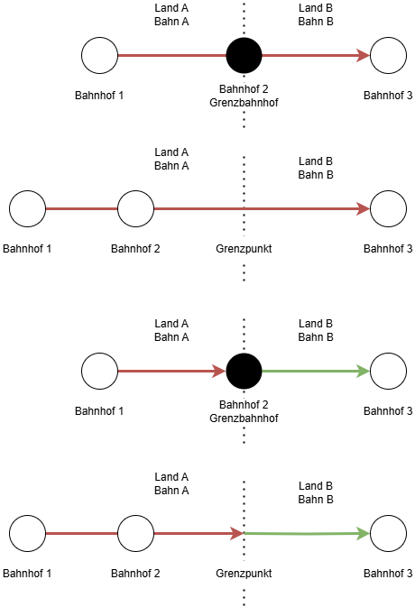

## Allgemein

FIP steht für _Groupement pour les facilités de circulation internationales du personnel des chemins de fer_. Es ist die Vereinigung für die internationalen Fahrvergünstigungen des Eisenbahnpersonals. Mit FIP sind Fahrvergünstigungen für Mitarbeiter im europäischen Ausland verfügbar.

Damit FIP Fahrvergünstigungen genutzt werden können, muss die Berechtigung für die Nutzung von FIP vorliegen. Im Regelfall ist dies nach einem Jahr Firmenzugehörigkeit gegeben, jedoch sind abweichende Regeln je nach Arbeitgeber möglich.

{}
Im Folgenden werden die allgemeinen FIP Grundlagen erklärt. Abweichende Informationen können je nach Land oder Bahngesellschaft auftreten. Vor der Reise sollte sich immer mit den Regeln des jeweiligen Eisenbahnverkehrsunternehmens in dem Land vertraut gemacht werden. Dabei hilft der FIP Guide:

[Übersicht der Bahngesellschaften]({} "Übersicht Bahngesellschaften" )

[Übersicht der Länder]({} "Übersicht Länder" )
{}

## FIP Ausweis

Für die Nutzung von FIP-Vergünstigungen ist ein aktueller _FIP Ausweis_ erforderlich. Dieser ist immer für eine feste Periode von drei Jahren gültig. Die aktuelle Periode ist 2025-2026-2027. Der FIP Ausweis wird als Legitimation für FIP 50 Tickets benötigt. Er wird entweder für die 1. oder 2. Klasse ausgestellt. Mit einem 1. Klasse Ausweis können Freifahrtscheine und FIP 50 Tickets für die 1. und 2. Klasse erworben werden, mit einem 2. Klasse Ausweis nur für die 2. Klasse. Er kann über die jeweilige Bahngesellschaft, bei der man arbeitet, bestellt werden. Der genaue Bestellweg unterscheidet sich pro Unternehmen sehr stark.

## Vergünstigungen

FIP Vergünstigungen bestehen in verschiedenen Formen, für die Nutzung wird immer ein FIP-Ausweis benötigt:

### FIP Freifahrtscheine
Diese berechtigen zur Fahrt mit Zügen des auf dem Freifahrtschein angegebenen Betreibers. Ein _FIP Freifahrtschein_ besteht aus verschiedenen _Feldern_. Jedes Feld ist für zwei aufeinanderfolgende Tage gültig. Auf dem Ticket muss jeweils der erste Gültigkeitstag eingetragen werden. Das Ticket ist dann am eingetragenen und folgenden Tag gültig. Die unterschiedlichen Felder selbst müssen nicht an aufeinanderfolgenden Tage ausgefüllt werden. Die Daten müssen nur im aufgedruckenden Gültigkeitszeitraum liegen. FIP Freifahrtscheine werden teilweise auch als _FIP Coupons_ bezeichnet.

{}
Nach Rückkehr ins Bahnnetz des Heimatlandes ist innerhalb der Geltungsdauer des Freifahrscheines eine erneute Einreise in das Land nicht möglich, das an das Streckennetz des Heimatlandes angrenzt.
{}

{}
Offiziell wird der _FIP Ausweis_ für die Nutzung von _FIP Freifahrtsscheinen_ nur für die Bestellung und nicht vor Ort bei der Nutzung benötigt. Jedoch fordern Zugbegleiter ihn in der Praxis trotzdem teilweise ein. Um Probleme zu vermeiden, sollte er also auch bei der Nutzung von _FIP Freifahrtscheine_ vorgezeigt werden können.
{}

{}
Ich möchte als Mitarbeiter bei einer europäischen Bahngesellschaft (z. B. Deutsche Bahn) insgesamt an acht Tagen mit verschiedenen Zügen innerhalb von Österreich fahren. Dafür muss ich mir einen FIP Freifahrtschein für die Österreichische Bundesbahn (ÖBB) mit vier Feldern (4 Felder = bis zu 8 Tage Freifahrten bei dem Betreiber) bestellen.

Der FIP Freifahrtschein hat eine Gültigkeit von drei Monaten, ich darf nur in dieser Zeit reisen (Beispiel-Gültigkeit: 10.02.2026 - 09.05.2026). Ich reise am 01.03.2026 in das Land ein und trage vor der Fahrt im ersten in Österreich genutzten Zug den 01.03.2026 im ersten Feld ein. Damit kann ich nun die Züge der ÖBB am 01.03. und 02.03.2026 nutzen (Ausnahmen und spezeille Regelungen sind auf der jeweiligen Betreiberseite zu finden, siehe hier ).

Am 03.03.2026 fahre ich nicht mit dem Zug, dafür wieder am 04.03. Also trage ich den 04.03.2026 im zweiten Feld ein, damit kann ich auch noch am 05.03. fahren. So geht es weiter, bis ich alle vier Felder verbraucht habe. Das letzte Feld nutze ich beispielsweise am 10.03.2026 und fahre damit am 11.03.2026 wieder aus Österreich zurück.

!!!! Einfügen: Bild von einem FIP Freifahrtschein !!!!
{}

{}
Um länger als acht Tage in einem Land bzw. bei einem Betreiber Zug fahren zu können, kann auch zwischendrin ein Tag kein Freifahrtschein benutzt werden und z. B. ein FIP 50 Ticket für die Fahrt an diesem Tag gekauft werden. Diese können unabhängig von einem Freifahrtschein jederzeit erworben werden.
{}

### FIP 50 Tickets
FIP Berechtigte können reduzierte Tickets erwerben. Diese kosten im Regelfall 50% des flexiblen Preises. Daher sind diese Tickets nicht zuggebunden und flexibel auf der Strecke nutzbar (ausgenommen reservierungspflichtige Züge). Sie können jederzeit in beliebiger Anzahl gekauft werden. Mit FIP 50 besteht einfach eine Art Rabattkarte für viele Verbindungen. Ein FIP 50 Ticket kann dabei auch mehrere Betreiber abdecken.

Die Bestellung funktioniert hier anders als beim FIP Freifahrtschein. Während letzterer normalerweise bei der eigenen Bahngesellschaft oder einem Dienstleister bestellt werden muss, kann das FIP 50 Ticket an verschiedenen Stellen erworben werden. Für eine Fahrt innerhalb eines Landes ist ein Ticketschalter bzw. Reisezentrum meist eine gute Anlaufstelle. Bei einigen Betreibern bzw. in manchen Ländern ist es auch online oder über den Automaten möglich. Bei internationalen Fahrten muss manchmal auch über einen speziellen Ticketschalter für grenzüberschreitende Verbindungen genutzt werden. Auf den jeweiligen Länder- und Betrieberseiten versuchen wir die Informationen zum Kauf der Tickets bestmöglich zusammenzufassen.

{}
FIP Vergünstigungen gelten nicht im eigenen Land. Auch wenn auf FIP 50 Tickets ein Ticketabschnitt im eigenen Land eingetragen ist, gilt das Ticket dort nicht. Für diesen Ticketabschnitt muss eine separate Fahrkarte oder nationale Vergünstigung genutzt werden. Ausgenommen hiervon sind nur FIP Globalpreise.
{}

{}
Ich bin FIP-Berechtigter bei der Deutschen Bahn und möchte am 01.03.2026 von Frankfurt am Main nach Amsterdam fahren. Dafür buche ich mir im DB Reisezentrum (in dem Fall wäre es auch online über eine spezielle Seite der DB möglich) ein FIP 50 Ticket von Frankfurt Hbf nach Amsterdam Centraal. Wenn die Fahrkarte nicht mit einer Reservierung verbunden ist, ist es flexibel auf jeder Verbindung des gleichen Betreibers und gleicher Zugkategorie (z. B. ICE) an dem Tag gültig. Dieses Ticket ist jedoch nur für den niederländischen Teilabschnitt gültig, da im Land des eigenen Betreibers das Ticket keine Gültigkeit hat. Ich brauche also dazu noch ein Ticket für den deutschen Teilabschnitt, zum Beispiel eine Fahrvergünstigung für DB-Mitarbeiter.

Anders sieht es beispielsweise aus, wenn ich ein Ticket von Wien nach Budapest buche, hier bekomme ich ein auf der ganzen Strecke ein gültiges FIP 50 Ticket.
{}

### FIP Globalpreise
Für einige Züge existieren spezielle Preise und Sonderregeln. Diese sind weder mit FIP 50 Tickets noch mit FIP Freifahrtschein fahrbar. Stattdessen muss ein spezieller FIP Globalpreis für die konkrete Zugverbindung erworben werden (diese Tickets sind also zuggebunden). FIP Globalpreise sind z. B. für den Eurostar, TGV/AVE Verkehr zwischen Barcelona und Frankreich oder diverse Nachtzüge erforderlich.

## Grenzpunkte

FIP Freifahrtscheine gelten im Regelfall nur im Land/Netz der jeweiligen Bahngesellschaft. Die Gültigkeit des FIP Freifahrtscheins ist offiziell bis zum sogenannten _Grenztarifpunkt_.

{}
Es wird immer ein Ticket bis zur Grenze benötigt. FIP Freifahrtscheine sind nur im Land/Netz der jeweiligen Bahngesellschaft gültig. Die Grenze ist dabei nicht immer der letzte Bahnhof im Land. Es reicht also unter Umständen nicht aus, ein Ticket bis zum letzten Bahnhof zu kaufen. Das ist insbesonders dann relevant, wenn das eigene Heimatland verlassen wird, da in diesem wie beschrieben keine FIP Tickets gelten.
{}

Im Detail unterscheidet man zwischen zwei Arten von _Grenztarifpunkten_:

- **Grenzbahnhof**: Dies ist ein echter physischer Bahnhof. Bis zu diesem Halt kann man mit seinem Zugtickt fahren und das von beiden angrenzenden Ländern aus. Beispiele dafür sind Salzburg Hbf, Basel Badischer Bahnhof oder Konstanz.
- **Grenztarifpunkt**: Dies ist ein "virtueller" Bahnhof, der nur in der Theorie existiert, um die Gültigkeit von Fahrkarten zu bestimmen. Sie befinden sich auf der freien Strecke. Hierbei wird daher sowohl ein Ticket vor als auch hinter diesen Grenztarifpunkt benötigt. Grenztarifpunkte sind in der Übersicht im Regelfall mit "(Gr)" oder "(fr)" für Grenze / frontière gekennzeichnet.

Während ein FIP Freifahrtschein immer für nur genau eine Bahngesellschaft benötigt wird, kann ein FIP 50 Ticket für mehrere Bahngesellschaften ausgestellt werden. Welche Bahngesellschaften an der Fahrt dann beteiligt sind, spielt nicht direkt eine Rolle, solange Start und Ziel richtig sind und die Bahngesellschaften FIP allgemein akzeptieren.

Welche Grenzbahnhöfe und Grenztarifpunkte zwischen zwei Ländern/Bahngesellschaften bestehen sind im FIP Guide auf der jeweiligen Länderseite aufgeführt.

{}
Ich bin FIP-Berechtigter bei der Deutschen Bahn und möchte am 01.03.2026 von Frankfurt am Main nach Wien fahren. Dafür gibt es die Möglichkeit entweder einen FIP Freifahrtschein für die ÖBB zu bestellen oder ein FIP 50 Ticket von Frankfurt Hbf nach Wien Hbf zu buchen. Beide gelten nur für den österreichischen Abschnitt, da ich in Deutschland kein FIP nutzen kann. Üblicherweise erfolgt die Fahrt hier über Passau Hbf, welcher Grenzbahnhof für Deutschland und Österreich ist.

Ich brauche also ein zusätzliches Ticket für die Fahrt zwischen Frankfurt Hbf und Passau Hbf, z. B. ein regulär gekauftes Ticket oder eine Fahrvergünstigung für DB Mitarbeiter innerhalb Deutschlands. Ab Passau Hbf gilt sowohl der ÖBB Freifahrtschein als auch das FIP 50 Ticket.
{}

{}
Ich bin FIP-Berechtigter bei der Deutschen Bahn und möchte am 01.03.2026 von Frankfurt am Main nach Kopenhagen fahren. Dafür gibt es die Möglichkeit entweder einen FIP Freifahrtschein für die DSB zu bestellen oder ein FIP 50 Ticket von Frankfurt Hbf nach Kobenhavn H zu buchen. Beide gelten nur für den dänischen Abschnitt, da ich in Deutschland kein FIP nutzen kann. Üblicherweise erfolgt die Fahrt hier über die Grenze Padborg (Gr), was nur ein virtueller Grenzpunkt zwischen Flensburg und Padborg ist, jedoch kein echter Bahnhof.

Ich brauche also ein zusätzliches Ticket für die Fahrt zwischen Frankfurt Hbf und diesem Grenzpunkt, z. B. ein regulär gekauftes Ticket bis zum ersten dänischen Bahnhof Padborg oder eine Fahrvergünstigung für DB Mitarbeiter innerhalb Deutschlands, die bis zur Grenze gültig sein muss. Ein Ticket beispielsweise bis zum letzten Bahnhof in Deutschland, an dem der Zug hält, oder bis Flensburg reicht nicht aus. Ab dem Grenzpunkt gilt dann sowohl der ÖBB Freifahrtschein als auch das FIP 50 Ticket.
{}
Hier noch ein paar Beispiele zur besseren Veranschaulichung:

FIP 50:

Beispiel 1: Eine Person möchte mit einem Zug von Bahnhof 1 nach Bahnhof 3 fahren. Sie kauft dafür ein FIP 50 Ticket von Bahnhof 1 nach Bahnhof 3. Dieses gilt auf dem gesamten Streckenabschnitt. Wichtig, wenn Land A jedoch das Heimatland der Person ist, gilt das FIP 50 Ticket erst ab Bahnhof 2. Für die Fahrt zwischen Bahnhof 1 oder Bahnhof 2 braucht sie ein anderes Ticket. Das kann zum Beispiel ein normales Ticket zum Regulären Preis sein oder auch andere Tickets (Für DB Mitarbeiter in Deutschland z.B. Tagesticket M Fern, Netzcard, Regio Ticket 50 oder Deutschlandticket)

Beispiel 2: Eine Person möchte mit einem Zug von Bahnhof 1 nach Bahnhof 3 fahren. Sie kauft dafür ein FIP 50 Ticket von Bahnhof 1 nach Bahnhof 3. Dieses gilt auf dem gesamten Streckenabschnitt. Wichtig, wenn Land A jedoch das Heimatland der Person ist, gilt das FIP 50 Ticket erst ab dem Grenztarifpunkt. Für die Fahrt bis zum Grenztarifpunkt benötigt sie ein anderes Ticket. Es ist dabei nicht ausreichend nur ein Ticket bis zum letzten Bahnhof im Land zu erwerben (im Beispiel Bahnhof 2). Dies ist besonders relevant in Ländern in denen keine FIP Tickets gelten wie das Heimatland. DB Mitarbeiter können bei der Fahrt aus Deutschland zum Beispiel Tagesticket M Fern, Netzcard, Regio Ticket 50 oder Deutschlandticket nutzen oder müssen alternativ eine reguläre Fahrkarte bis zum ersten Bahnhof im Land B erwerben.

Beispiel 3: Eine Person möchte mit einem Zug von Bahnhof 1 nach Bahnhof 3 fahren. Sie hat einen FIP Freifahrtschein für Bahn A und Bahn B. So besitzt sie auf dem gesamten Abschnitt ein gültiges Ticket. Wenn Land A ihr Heimatland ist, besitzt sie nur einen FIP Freifahrtschein für Land B. In diesem Fall braucht sie eine gültiges Ticket von Bahnhof A nach Bahnhof B. Ab Bahnhof B gilt der FIP Freifahrtschein.

Beispiel 4: Eine Person möchte mit einem Zug von Bahnhof 1 nach Bahnhof 3 fahren. Sie hat einen FIP Freifahrtschein für Bahn A und Bahn B. So besitzt sie auf dem gesamten Abschnitt ein gültiges Ticket. Wenn Land A ihr Heimatland ist, besitzt sie nur einen FIP Freifahrtschein für Land B. Der Freifahrtschein für B gilt also erst ab dem Grenztarifpunkt. Für die Fahrt in Land A bis zum Grenztarifpunkt benötigt sie ein anderes Ticket. Es ist dabei nicht ausreichend nur ein Ticket bis zum letzten Bahnhof im Land zu erwerben (im Beispiel Bahnhof 2). Dies ist besonders relevant in Ländern in denen keine FIP Tickets gelten wie das Heimatland. DB Mitarbeiter können bei der Fahrt aus Deutschland zum Beispiel Tagesticket M Fern, Netzcard, Regio Ticket 50 oder Deutschlandticket nutzen oder müssen alternativ eine reguläre Fahrkarte bis zum ersten Bahnhof im Land B erwerben.

## FAQ

{}

FIP steht für _Groupement pour les facilités de circulation internationales du personnel des chemins de fer_. Es ist die Vereinigung für die internationalen Fahrvergünstigungen des Eisenbahnpersonals.
Hierbei sind Eisenbahn- und Schifffahrtunternehmen der UIC (Internationaler Eisenbahnverband) angeschlossen.

Als Berechtigungsausweis gilt die Internationale Ermäßigungskarte für Eisenbahnpersonal, kurz FIP-Ausweis oder FIP-Card.

{}

{}

Anspruchsberechtigt sind in der Regel aktive und pensionierte Mitarbeitende von FIP-Mitgliedern. Auch Familienangehörige können unter bestimmten Bedingungen berechtigt sein.
Nach zwölf Monaten Betriebszugehörigkeit können Mitarbeitende den Berechtigungsausweis beantragen.
Bitte wende dich für die Beantragung und Inanspruchnahme an deine Personalabteilung.

{}

{}

Abhängig der Vereinbarung zwischen den FIP-Mitgliedern können auch Familienangehörige (Kinder, Lebensparnter) FIP-Vergünstigungen nutzen. Dies wird immer auf den jeweiligen [Betreiberseiten]() mit genannt. Auch Ermäßigungen für Kinder sind hier zu finden.

{}

{}
Der FIP-Ausweis ist der Berechtigungsausweis für vergünstigte Fahrten bei FIP-Mitgliedern im Ausland.
Er ermöglicht kostenlose oder vergünstigte Reisen bei den teilnehmenden Bahnen und Schifffahrtsgesellschaften.

FOTO DES AUSWEISES
{}

{}

Wende dich hierzu an deine Personalabteilung.
Beachte, dass du in der Regel erst ab zwölf Monaten Betriebszugehörigkeit einen Anspruch auf internationale Fahrvergünstigungen hast.

{}

## Nutzungsmöglichkeiten

{}

Mit dem FIP-Ausweis bist du berechtigt, zu vergünstigten Konditionen die Verkehrsmittel des jeweiligen FIP-Mitglieds zu nutzen.
Es gelten unterschiedliche Regelungen je Betreibergesellschaft. Details erfährst du auf den [Unterseiten der Betreiber]().

Es gibt verschiedene Arten an Vergünstigungen:

1. **Ermäßigte Fahrkarten:** mit dem FIP-Ausweis erhältst du stark vergünstigte Tickets (in der Regel 50% Rabatt auf den Flexpreis bzw. Globalpreis). Es gibt keine Mengenbeschränkung und Beantragungsfristen.
2. **Kostenlose Fahrten mit FIP-Coupons:** bei vielen FIP-Mitgliedern kannst du mit einem FIP-Coupon kostenlos reisen.

{}
Nicht immer ist eine Fahrt mit FIP die günstigste Option. In manchen Ländern sind Sparpreise verfügbar, welche günstiger sind.
{}
{}

{}
Die Bestellung unterscheidet sich je nach Betreiber, zum Beispiel online, telefonisch oder im Reisezentrum.
Eine genaue Übersicht getrennt nach FIP-Mitgliedern findest du [hier]().
{}

{}

In einem Kalenderjahr kannst du pro FIP-Mitglied einen FIP-Coupon beantragen.

In der Regel ist eine Bearbeitungsfrist bei der Beantragung zu beachten.

{}

{}
Die Beantragung erfolgt in der Regel über den Personalservice oder das Reisezentrum deines Eisenbahnunternehmens. Manche Unternehmen bieten auch Online-Portale an.
{}

{}
Je nach individuellem Bedarf können FIP Coupons mit 1 bis 4 Feldern pro FIP-Mitglied beantragt werden.
Jedes Feld berechtigt zu einer unbegrenzten Anzahl von Fahrten auf dem Streckennetz des jeweiligen Bahn- oder Schifffahrtsunternehmens.
Eine Ausnahme bildet die niederländische Schifffahrtsgesellschaft StL: Hier sind mit einem Feld lediglich zwei Überfahrten möglich.
{}

{}
Ein Feld berechtigt zu unbegrenzt vielen Fahrten auf dem Netz der jeweiligen Bahn oder Schifffahrtsgesellschaft innerhalb der Gültigkeitsdauer.
{}

{}
Ein FIP-Coupon ist ab Ausstellungsdatum drei Monate lang gültig. Innerhalb dieses Zeitraums können die enthaltenen Felder genutzt werden.
{}

{}
Die Gültigkeit eines Feldes beginnt mit dem vom Nutzer eingetragenen Datum und endet am folgenden Tag um Mitternacht (24:00 Uhr).
Somit ist jedes Feld für einen Zeitraum von zwei Tagen gültig.
Bei der Maximalanzahl von vier Feldern kannst du somit acht Tage unterwegs sein.
{}

{}

Über 30 europäische Bahngesellschaften sowie einige Schifffahrtsunternehmen nehmen am FIP-System teil. Eine Liste, welche Unternehmen dabei sind, findest du im FIP Guide in der [Liste der Betreibergesellschaften]().
Informationen für dein Reiseziel findest du auf unserer [Länderseite]().

{}

{}
Ja. Bei einigen Unternehmen sind keine FIP-Coupons nutzbar, bei anderen gelten diese nur für bestimmte Zugkategorien.
Die niederländische Schifffahrtsgesellschaft StL erlaubt nur zwei Überfahrten pro Feld.

Details zu den Regelungen der FIP-Mitglieder findest du auf den [Unterseiten der Betreiber]().

{}

{}

Für viele Züge, meist Hochgeschwindigkeits- und Nachtzüge, ist eine Reservierung erforderlich. Eine Übersicht erhältst du auf der jeweiligen Seite des [Betreibers]().

{}

## Wer steckt hinter dem FIP Guide?

Wir sind ein engagiertes Team von Bahn-Mitarbeitenden, welche selbst regelmäßig FIP nutzen.
Unser Ziel ist, eine schnell und einfach nutzbare Übersicht zur Nutzung von FIP bereitzustellen.
Unser Fokus liegt auf der Bereitstellung von nützlichen Informationen für die Nutzerinnen und Nutzer.

## Zusätzliche nützliche Ressourcen

Die [Rail Delivery Group](https://www.raildeliverygroup.com/rst/europe-and-fip.html) bietet eine ausführliche Übersicht zu FIP in verschiedenen Ländern.
