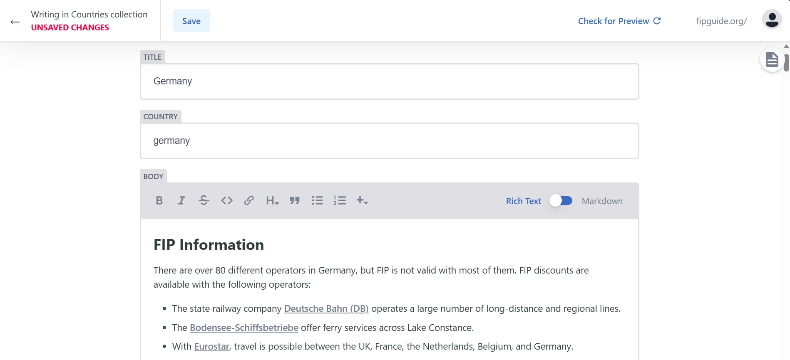

From now on, information can be edited quickly and easily directly on the website without prior technical knowledge. If you find an error on a page or want to update information, you can do this directly on the FIP Guide website. The only requirement is a free GitHub account.

Comprehensive instructions for easy editing of information are available in the [Contribution](/contribution/) section.

If you need help with editing, you can contact us at any time by email or via the FIP Guide Community. Further information can be found on the [contact page](/contact).

