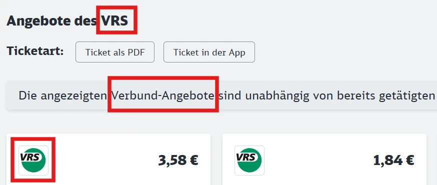

Die Deutsche Bahn (DB) ist das größte Eisenbahnverkehrsunternehmen in [Deutschland](/country/germany "Deutschland") und betreibt den Großteil des Fernverkehrs sowie viele Verbindungen im Regionalverkehr.

## Zusammenfassung

- FIP 50 und FIP Freifahrtscheine werden akzeptiert
- Keine Reservierungspflicht im nationalen Verkehr
- Im Regionalverkehr viele private Betreiber ohne FIP

## Gültigkeit FIP Tickets

<!--
  Die Ticketkategorien können je nach Betreiber abweichen.
-->

FIP Freifahrtschein: ✅ \
FIP Freifahrt Angehörige: unbekannt \
FIP 50 Tickets: ✅

Bei grenzüberschreitenden Fahrten muss entweder ein durchgängiges FIP 50 Ticket oder FIP Freifahrtscheine beider Länder vorhanden sein.

## Zugkategorien und Reservierungen

Es existiert keine Reservierungspflicht, außer bei bestimmten grenzüberschreitenden Verbindungen für Grenzübertritte. Fahrten, die nur in Deutschland stattfinden, benötigen keine Reservierung.

### Fernverkehr

{}
**Beschreibung:**
Der `ICE` ist ein Hochgeschwindigkeitszug und die höchste Zugkategorie der DB. Er verbindet große Städte in Deutschland mit bis zu 300 km/h und verkeht auch in einige Nachbarländer. Besonders schnelle Verbindungen mit wenigen Zwischenhalten werden als `ICE Sprinter` bezeichnet. \
**Reservierung möglich:** Ja \
**Reservierungspflicht:** Bei grenzüberschreitenden Fahrten nach Frankreich ⚠️ \
Für grenzüberschreitende Fahrten in den Sommermonaten nach Österreich und in die Niederlande gab es in der Vergangenheit eine Reservierungspflicht. Diese kann sich jedoch von Jahr zu Jahr ändern. Eine Reservierungspflicht ist in der [Verbindungsauskunft der DB](https://www.bahn.de) gekennzeichnet.
{}

{}
**Beschreibung:**
Grenzüberschreitende Hochgeschwindigkeitszüge der SNCF in Kooperation mit der DB. Diese verkehren von Frankfurt, Mannheim, Karlsruhe, Saarbrücken, Stuttgart und München nach Paris. \
**Reservierung möglich:** Ja \
**Reservierungspflicht:** Bei grenzüberschreitenden Fahrten nach Frankreich ⚠️
{}

{}
**Beschreibung:** \
Internationale Schnellzüge der höchsten Kategorie der ÖBB/ČD in Kooperation mit der DB zwischen Hamburg, Berlin, Dresden und Prag sowie München, Österreich und Italien oder Ungarn. Railjets mit weniger Halten werden als Railjet Xpress vermarktet. Die Züge besitzen ein Bistro.

Es gibt drei Wagenklassen:

- **Economy**: Vergleichbar mit der 2. Klasse. Innerhalb von Deutschland gelten in dieser Klasse Tickets der 2. Klasse
- **First Class**: Vergleichbar mit der 1. Klasse. Ein FIP-Ausweis für die 1. Klasse wird benötigt. Innerhalb von Deutschland gelten in dieser Klasse Tickets der 1. Klasse
- **Business**: 1. Klasse mit Begrüßungsgetränk (erst ab Österreich / Tschechien) und eigenen Abteilen. Mit FIP Freifahrtschein außerhalb von Deutschland nicht nutzbar, auch nicht mit dem dazugehörigen Zuschlag. Innerhalb von Deutschland sind die Bereiche mit einem 1. Klasse Ticket nutzbar.

[Detaillierter Überblick über die Klassen bei der ÖBB](https://www.oebb.at/de/reiseplanung-services/im-zug/abteile-komfortklassen)

Für Railjets nach Italien ist ab der italienischen Grenze ein Zuschlag zu zahlen (siehe [Züge nach Italien bei der ÖBB](/operator/oebb#züge-nach-italien "Züge nach Italien bei der ÖBB")). \
**Reservierung möglich:** ja \
**Reservierungspflicht:** nein
{}

{}
**Beschreibung:**
Intercity-Züge sind eine wichtige Ergänzung zum ICE-Netz. Sie verkehren mit geringerer Geschwindigkeit als ICE-Züge, verbinden zahlreiche Städte und bedienen auch viele Urlaubs- und Ferienregionen. \
**Reservierung möglich:** Ja \
**Reservierungspflicht:** Nein
{}

{}
**Beschreibung:**
Ein internationaler Expresszug zwischen Frankfurt und Mailand sowie zwischen München und Zürich. Seit Dezember 2025 wird die Zugkategorie auch für weitere Verkehre zwischen der Schweiz und Deutschland sowie Zügen auf der Route Hamburg - Kopenhagen genutzt.

⚠️ Die Züge Richtung Italien sind ab der italienischen Grenze aufschlags- und reservierungspflichtig. Günstiger ist die Fahrt Richtung Italien mit Umstieg in Chiasso ([siehe Anreise Italien](/country/switzerland#italien "Anreise Italien")). Der Zuschlag kann am DB oder SBB Ticketschalter oder im Zug erworben werden.

**Aufschlag/Reservierung Italien:**

- 1\. Klasse: 13 €
- 2\. Klasse: 11 €

**Reservierung möglich:** Ja \
**Reservierungspflicht:** Bei grenzüberschreitenden Fahrten nach Italien und der Hochsainson nach Dänemark ⚠️
{}

{}
**Beschreibung:**
Eurocity-Züge sind internationale Fernzüge, die Deutschland mit anderen europäischen Ländern verbinden. Sie ähneln den Intercity-Zügen, bestehen jedoch häufig aus Wagen verschiedener Bahngesellschaften, darunter sowohl Deutsche Bahn als auch ausländische Partner. Teilweise führen sie ausländische Speisewagen, z. B. auf den Verbindungen von Berlin nach Polen. \
**Reservierung möglich:** Ja \
**Reservierungspflicht:** Bei grenzüberschreitenden Fahrten nach Polen ⚠️ \
Für grenzüberschreitende Fahrten in den Sommermonaten nach Tschechien gab es in der Vergangenheit eine Reservierungspflicht. Diese kann sich jedoch von Jahr zu Jahr ändern. Eine Reservierungspflicht ist in der [Verbindungsauskunft der DB](https://www.bahn.de) gekennzeichnet.
{}

{}
**Beschreibung:** \
Nachtzüge der ÖBB in Kooperation mit der DB in verschiedene europäische Länder. Die Züge bieten Schlaf- und Liegewagen sowie Sitzwagen an und werden im Ausland in Kooperation mit anderen Bahngesellschaften betrieben. \
Für Nightjet Züge können Reservierungen/Aufpreise für Schlaf- und Liegewagen gebucht werden. Dafür ist ein FIP Freifahrtschein für die Länder/Bahngesellschaften erforderlich, die auf der Reise durchfahren werden. Wenn kein FIP Freifahrtschein genutzt wird, kann ein Ticket zum FIP Globalpreis für die gesamte Strecke erworben werden. \
⚠️ Nationale Freifahrten für Mitarbeiter der Deutschen Bahn werden in Deutschland nicht anerkannt. Liegt ein Teil der Nightjet Fahrt also in Deutschland (Start, Ende oder Durchreise) müssen Mitarbeiter der Deutschen Bahn für die gesamte Strecke ein Ticket zum FIP Globalpreis erwerben. Für Fahrten außerhalb Deutschlands mit FIP Freifahrtschein ist eine Reservierung/Aufpreis erforderlich. \
_Tipp:_ Für Fahrten von Deutschland nach Italien, die nationalen Freifahrten bis Salzburg nutzen und dort in den Nightjet steigen, um den FIP Globalpreis zu vermeiden. \
**Reservierung möglich:** ja \
**Reservierungspflicht:** ⚠️ ja \
**FIP Globalpreis:** ja \
**Kosten für Reservierung:** \
Abhängig von Strecke und Auslastung sowie Wagenkategorie.
{}

### Nahverkehr

Die Züge im Nahverkehr werden oftmals auch von anderen Betreibern betrieben, die kein FIP akzeptieren. In der [Verbindungsauskunft der DB](https://www.bahn.de) sind die Züge aller Betreiber hinterlegt. Nur Züge mit _DB_ im Betreibernamen in den _Fahrtinformationen_ können mit FIP genutzt werden.

{}
Eine Orientierung bieten [Übersichtskarten](https://www.schienennahverkehr.de/veroeffentlichungen/spnv-karten/), welche Betreiber auf welchen Linien verkehren. Verbindungen der Deutschen Bahn sind auf dieser Karte rot und mit _DB - DB Regio AG_ gekennzeichnet.
{}

{}
**Beschreibung:**
Regionalexpresszüge verbinden Orte und Städte mit Halten an den wichtigsten Stationen. Teilweise verkehren die Züge auch überregional über längere Strecken.

ℹ️ Die Züge der Kategorie `RE` werden oftmals auch von anderen Betreibern betrieben.

**Reservierung möglich:** Teilweise \
**Reservierungspflicht:** Nein
{}

{}
**Beschreibung:**
Regionalbahnzüge verbinden Orte und Städte mit Halten an fast allen Stationen.

ℹ️ Die Züge der Kategorie `RB` werden oftmals auch von anderen Betreibern betrieben.

**Reservierung möglich:** Teilweise \
**Reservierungspflicht:** Nein
{}

{}
**Beschreibung:**
Nahverkehrszüge in großen Städten und Metropolregionen mit Halt an allen Stationen.

ℹ️ Die Züge der Kategorie `S` werden teilweise auch von anderen Betreibern betrieben.

**Reservierung möglich:** Nein \
**Reservierungspflicht:** Nein
{}

{}
**Beschreibung:**
Nahverkehrsexpresszug zwischen Berlin Hauptbahnhof und dem Berliner Flughafen Willy Brandt (BER). \
**Reservierung möglich:** Nein \
**Reservierungspflicht:** Nein
{}

## Ticket- und Reservierungskauf

### Online

{}
Die Reservierung von einzelnen Zügen ohne Umstieg ist über die ÖBB günstiger.
{}

{}
Die Reservierung von einzelnen Zügen ohne Umstieg ist über die ÖBB günstiger.
{}

{}
Die Reservierung von einzelnen Zügen ohne Umstieg ist über die ÖBB günstiger.
{}

### Telefon

{}

### Vor Ort

{}
Die Reservierung von einzelnen Zügen ohne Umstieg ist über die ÖBB günstiger.
{}

### Im Zug

FIP 50 Fahrkarten können nicht im Zug erworben werden.

## Ermäßigungen

Bei öffentlichen Fahrpreisen reisen Kinder bis 6 Jahre kostenlos, Kinder zwischen 6 und 14 Jahren erhalten eine Ermäßigung von 50 % auf den Erwachsenenpreis. Ab 14 Jahren gilt der reguläre Erwachsenenfahrpreis.

### Kostenlos mitreisende Kinder

Begleitende Kinder im Alter von 6 bis 14 Jahren dürfen kostenlos mit einem FIP-Inhaber reisen, sofern

- der FIP-Inhaber mindestens 15 Jahre alt ist und
- über ein gültiges Ticket (z. B. FIP 50 Ticket) oder einen FIP Freifahrtschein verfügt.[^1]

Die kostenlos mitreisenden Kinder müssen nicht mit dem begleitenden Erwachsenen verwandt sein.

In Nahverkehrszügen können bis zu 3 Kinder mitgenommen werden und in Fernverkehszügen bis zu 4 Kinder. Bei FIP 50 Tickets, die einen Abschnitt im Fernverkehr haben, können auch in den angegebenen Nahverkehrszügen bis zu 4 Kinder mitgenommen werden.

Kostenlos mitreisende Kinder müssen nicht auf dem Ticket eingetragen werden. Bei FIP 50 Tickets empfiehlt es sich trotzdem, diese kostenlos mitzubuchen, um Probleme bei der Fahrtkartenkontrolle zu vermeiden.

Kinder, die nicht von einer über 15 Jahre alten Person mit Reiseberechtigung begleitet werden, müssen ein eigenes Ticket kaufen.

Kinder unter 6 Jahren reisen immer kostenlos und benötigen kein eigenes Ticket.

## Tarifliche Besonderheiten

### Nordhessischer Verkehrsverbund (NVV)

Im Nordhessischen Verkehrsverbund (NVV) werden im Regionalverkehr keine Vergünstigungen für Mitarbeitende der DB anerkannt. Somit gelten hier auch keine FIP Vergünstigungen.
Hier gibt es eine [Übersichtskarte](https://www.nvv.de/fileadmin/nvv/data/2._Fahrtinfo/4._Liniennetz/Liniennetz_Nordhessen_Schematisch.pdf) der betroffenen Regionalzug-Linien.

### Fahrten in Verkehrsverbünden

Deutschland ist in sogenannte _Verkehrsverbünde_ (kombinierte Tarifstruktur) gegliedert. Diese sind öffentliche Gesellschaften, die den Nahverkehr in der entsprechenden Region übergreifend für alle Betreiber organisieren. Sie sind auch für die Ausgestaltung von Ticketpreisen und Tarifen zuständig. Die Fahrt mit FIP Vergünstigungen in nur einem Verkehrsverbund ist in der Regel nicht zulässig. Eine Reise muss sich immer mindestens über zwei Verkehrsverbünde erstrecken, da in diesem Fall Tarife und Tickets von Betreibern angeboten werden dürfen. Es kann Ausnahmen geben, die beim jeweiligen Verkehrsverbund oder lokalen Ticketschaltern erfragt werden können. [^1]

Bei FIP 50 Tickets müssen daher Start- und Zielbahnhof in unterschiedlichen Verkehrsverbünden liegen. Dies gilt auch be Reisen mit FIP Freifahrtschein.

{}
Eine Übersicht über alle Verkehrsverbünde ist auf [Wikipedia](https://de.wikipedia.org/wiki/Liste_deutscher_Tarif-_und_Verkehrsverb%C3%BCnde) verfügbar.

Als grobe Orientierung kann auch im DB Navigator oder der [Website der DB](https://bahn.de) geprüft werden, ob für eine Strecke Verbundtickets verkauft werden. Diese sind als _Verbund-Angebote_, mit dem Logo und unter Angebote des \[Verkehsverbundnamen\] gekennzeichnet.
{}

{}
In folgendem Beispiel liegt die gewählte Verbindung im Verkehrsverbund _VRS_:

{}

### Tarifliche Unterscheidung zwischen Nah- und Fernverkehr

Bei FIP 50 Tickets können flexibel Züge auf der gleichen Strecke genutzt werden. Dabei muss aber auf die Zugkategorien geachten werden, da bei der DB wird zwischen Fahrkarten für verschiedene Zugkategorien unterschieden (sogenannte [_Produktklassen_](https://de.wikipedia.org/wiki/Preissystem_der_Deutschen_Bahn#Produktklassen)) wird. Fahrkarten (auch FIP 50 Tickets) gelten nur in der gleichen und niedriegen Produktklassen. Die Produktklasse ist auf Fahrkarten vermerkt (z. B. _ICE Fahrkarte_ oder _IC/EC Fahrkarte_) und richtet sich nach der höchsten Zugkategorie auf der gebuchten Verbindung.

Es gibt folgende Produktklassen:

- Produktklasse ICE (ehemals Produktklasse A): \
  ICE, ICE Sprinter, TGV, RJ, RJX, ECE
- Produktklasse IC/EC (ehemals Produktklasse B): \
  IC, EC, D, EN, NJ
- Produktklasse C: \
  IRE, RE, FEX, MEX, RB, S

### DB Syltshuttle

Die DB betreibt den Autoreisezug _Syltshuttle_, welcher von Niebüll Autoverladung nach Westerland (Sylt) Autoverladung verkehrt. Die Mitfahrt ist nur mit einem Fahrzeug (Auto, Wohnwagen, Wohnmobil) möglich und erfordert einen [separaten Fahrschein](https://ticket.syltshuttle.de/). FIP Vergünstigungen werden nicht anerkannt.

### Schifffahrt und Inselbahn Wangerooge

FIP Freifahrtscheine gelten im Fährverkehr zwischen Harlesiel Anleger und Wangerooge und Inselbahn Wangerooge. FIP 50 Tickets sind nicht buchbar.

### Regionalverkehre Start GmbH

Die Regionalverkehre Start GmbH ist eine Tochtergesellschaft der DB Regio AG, akzeptiert allerdings keine FIP Vergünstigungen.

### Busse und Ersatzverkehr

Busse sind ausgeschlossen von FIP-Vergünstigungen, außer sie ersetzen einen Zug, in dem FIP anerkannt worden wäre (Schienenersatzverkehr).[^1]

## Empfehlungen

Die Deutsche Bahn betreibt eine Vielzahl von Verbindungen, die sehr unterschiedlich sind. Beispielsweise besteht auch die Möglichkeit die Thüringer Bergbahn zu benutzen, die von Obstfelderschmiede nach Cursdorf fährt. Auch Verbindungen durch den Schwarzwald (Schwarzwaldbahn) oder durch das Rheintal an der linken Rheinstrecke sind sehr zu empfehlen. Im Fernverkehr ist ein Highlight, dass es normalerweise in jeder ´ICE´ Verbindung ein Bordrestaurant gibt. Dieses bietet zwar keine frisch gekochten Speisen, die Gerichte sind jedoch trotzdem sehr vielfältig.

<!--
  Persönliche Empfehlungen und besondere persönliche Hinweise für die Fahrt
-->

## Quellen

[^1]: [Rail Delivery Group](https://www.raildeliverygroup.com/rst/europe-and-fip.html)
