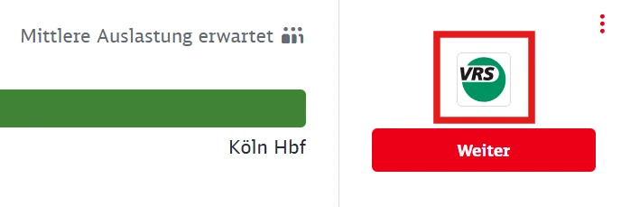
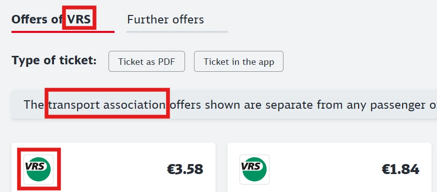

Deutsche Bahn (DB) is the largest railway company in Germany, operating most long-distance services as well as many regional connections.

## Summary

- FIP 50 Tickets and FIP Coupons are accepted
- No reservation required for domestic travel
- Many private operators in regional transport do not accept FIP

## Validity of FIP Tickets

<!--
    Ticket categories may vary depending on the operator.
-->

FIP Coupon: ✅ \
FIP Coupon for relatives: unknown \
FIP 50 Tickets: ✅

For cross-border journeys, either a continuous FIP 50 Ticket or FIP Coupons for both countries are required.

## Train Categories and Reservations

There is no reservation requirement except for certain cross-border connections at border crossings. Journeys within Germany do not require a reservation.

### Long-Distance

{}
**Description:**
The `ICE` is a high-speed train and the highest train category of DB. It connects major cities in Germany at up to 300 km/h and also operates to some neighboring countries. Especially fast connections with few stops are called `ICE Sprinter`. \
**Reservation possible:** Yes \
**Reservation required:** For cross-border journeys to France ⚠️ \
In the past, there was a reservation requirement for cross-border journeys in summer months to Austria and the Netherlands. This may change from year to year. A reservation requirement is indicated in the [DB journey planner](https://www.bahn.de).
{}

{}
**Description:**
Cross-border high-speed trains of SNCF in cooperation with DB. These run from Frankfurt, Mannheim, Karlsruhe, Saarbrücken, Stuttgart, and Munich to Paris. \
**Reservation possible:** Yes \
**Reservation required:** For cross-border journeys to France ⚠️
{}

{}
**Description:** \
International high-speed trains of the highest category of ÖBB/ČD in cooperation with DB between Hamburg, Berlin, Dresden, and Prague as well as Munich, Austria, and Italy or Hungary. Railjets with fewer stops are marketed as Railjet Xpress. The trains have a bistro.

There are three classes:

- **Economy**: Comparable to 2nd class. Within Germany, 2nd class tickets are valid in this class.
- **First Class**: Comparable to 1st class. A FIP Card for 1st class is required. Within Germany, 1st class tickets are valid in this class.
- **Business**: 1st class with welcome drink (only from Austria / Czech Republic) and separate compartments. Not usable with FIP Coupon outside Germany, even with the corresponding surcharge. Within Germany, these areas can be used with a 1st class ticket.

[Detailed overview of classes at ÖBB](https://www.oebb.at/en/reiseplanung-services/im-zug/abteile-komfortklassen)

For Railjets to Italy, a surcharge must be paid from the Italian border (see [Travel to Italy at ÖBB](/operator/oebb#verkehr-nach-italien "Travel to Italy at ÖBB")). \
**Reservation possible:** yes \
**Reservation required:** no
{}

{}
**Description:**
Intercity trains are an important addition to the ICE network. They run at lower speeds than ICE trains, connect many cities, and also serve many holiday and vacation regions. \
**Reservation possible:** Yes \
**Reservation required:** No
{}

{}
**Description:**
An international express train between Frankfurt and Milan as well as between Munich and Zurich. Since December 2025, the train category is also used for further services between Switzerland and Germany and many trains on the Hamburg - Copenhagen route.

⚠️ Trains to Italy require a surcharge and reservation from the Italian border. It is cheaper to travel to Italy by changing trains in Chiasso ([see Arrival Italy](/country/switzerland#italien "Arrival Italy")). The surcharge can be purchased at DB or SBB ticket offices or on the train.

**Surcharge/Reservation Italy:**

- 1st class: €13
- 2nd class: €11

**Reservation possible:** Yes \
**Reservation required:** For cross-border journeys to Italy ⚠️
{}

{}
**Description:**
Eurocity trains are international long-distance trains connecting Germany with other European countries. They are similar to Intercity trains but often consist of carriages from various railway companies, including both Deutsche Bahn and foreign partners. Sometimes they have foreign dining cars, e.g., on connections from Berlin to Poland or the Czech Republic. \
**Reservation possible:** Yes \
**Reservation required:** For cross-border journeys to Poland ⚠️ \
In the past, there was a reservation requirement for cross-border journeys in summer months to Denmark or the Czech Republic. This may change from year to year. A reservation requirement is indicated in the [DB journey planner](https://www.bahn.de).
{}

{}
**Description:** \
Night trains of ÖBB in cooperation with DB to various European countries. The trains offer sleeper, couchette, and seating cars and are operated abroad in cooperation with other railway companies. \
For Nightjet trains, reservations/surcharges for sleeper and couchette cars can be booked. A FIP Coupon for the countries/railway companies on the journey is required. If no FIP Coupon is used, a ticket at the FIP Global Fare for the entire route can be purchased. \
⚠️ National free travel for DB employees is not recognized in Germany. If part of the Nightjet journey is in Germany (start, end, or transit), DB employees must purchase a ticket at the FIP Global Fare for the entire route. For journeys outside Germany with FIP Coupon, a reservation/surcharge is required. \
_Tip:_ For journeys from Germany to Italy, use national free travel to Salzburg and board the Nightjet there to avoid the FIP Global Fare. \
**Reservation possible:** yes \
**Reservation required:** ⚠️ yes \
**FIP Global Fare:** yes \
**Reservation cost:** \
Depends on route, occupancy, and car category.
{}

### Local Transport

Local trains are often operated by other companies that do not accept FIP. In the [DB journey planner](https://www.bahn.de), trains of all operators are listed. Only trains with _DB_ in the operator name in the _journey information_ can be used with FIP.

{}
[Overview maps](https://www.schienennahverkehr.de/veroeffentlichungen/spnv-karten/) provide guidance on which operators run on which lines. DB connections are marked in red and with _DB - DB Regio AG_ on this map.
{}

{}
**Description:**
Regional express trains connect towns and cities with stops at the main stations. Sometimes the trains also run long-distance routes.

ℹ️ Trains of the `RE` category are often operated by other companies.

**Reservation possible:** Sometimes \
**Reservation required:** No
{}

{}
**Description:**
Regional trains connect towns and cities with stops at almost all stations.

ℹ️ Trains of the `RB` category are often operated by other companies.

**Reservation possible:** Sometimes \
**Reservation required:** No
{}

{}
**Description:**
Local trains in large cities and metropolitan regions with stops at all stations.

ℹ️ Trains of the `S` category are sometimes operated by other companies.

**Reservation possible:** No \
**Reservation required:** No
{}

{}
**Description:**
Local express train between Berlin Central Station and Berlin Willy Brandt Airport (BER). \
**Reservation possible:** No \
**Reservation required:** No
{}

## Ticket and Reservation Purchase

### Online

{}
Reservation for individual trains without transfer is cheaper via ÖBB.
{}

{}
Reservation for individual trains without transfer is cheaper via ÖBB.
{}

{}
Reservation for individual trains without transfer is cheaper via ÖBB.
{}

### Telephone

{}

### On-Site

{}
Reservation for individual trains without transfer is cheaper via ÖBB.
{}

### On the Train

FIP 50 Tickets cannot be purchased on the train.

## Discounts

For public fares, children up to 6 years travel free, children between 6 and 14 years receive a 50% discount on the adult fare. From 14 years, the regular adult fare applies.

### Children Traveling Free

Accompanying children aged 6 to 14 may travel free with a FIP holder, provided

- the FIP holder is at least 15 years old and
- has a valid ticket (e.g., FIP 50 Ticket) or a FIP Coupon.[^1]

Children traveling free do not need to be related to the accompanying adult.

Up to 3 children can be taken on local trains and up to 4 children on long-distance trains. For FIP 50 Tickets that include a long-distance section, up to 4 children can also be taken on the specified local trains.

Children traveling free do not need to be entered on the ticket. For FIP 50 Tickets, it is still recommended to book them free of charge to avoid problems during ticket inspection.

Children not accompanied by a person over 15 years old with travel entitlement must purchase their own ticket.

Children under 6 years always travel free and do not need their own ticket.

## Special Tariff Conditions

### Nordhessischer Verkehrsverbund (NVV)

In the Nordhessischer Verkehrsverbund (NVV), no discounts for DB employees are recognized in regional transport. Therefore, no FIP discounts apply here.
A [map](https://www.nvv.de/fileadmin/nvv/data/2._Fahrtinfo/4._Liniennetz/Liniennetz_Nordhessen_Schematisch.pdf) of the affected regional train lines is available.

### Journeys in Transport Associations

Germany is divided into so-called _Verkehrsverbünde_ (combined tariff structure). These are public organizations that organize local transport in the respective region across all operators. They are also responsible for ticket prices and tariffs. Travel with FIP discounts within a single transport association is generally not permitted. A journey must always cover at least two transport associations, as in this case tariffs and tickets from operators may be offered. There may be exceptions, which can be checked with the respective transport association or local ticket offices. [^1]

For FIP 50 Tickets, the departure and destination stations must be in different transport associations. This also applies to journeys with FIP Coupon.

{}
An overview of all transport associations is available on [Wikipedia](https://en.wikipedia.org/wiki/List_of_German_tariff_and_transport_associations).

As a rough guide, you can also check in DB Navigator or on the [DB website](https://bahn.de) whether association tickets are sold for a route. These are marked as _Verbund-Angebote_, with the logo and under offers of \[association name\].
{}

{}
In the following example, the selected connection is within the transport association _VRS_:

{}

### Tariff Distinction between Local and Long-Distance Transport

With FIP 50 Tickets, you can flexibly use trains on the same route. However, you must pay attention to the train categories, as DB distinguishes between tickets for different train categories (so-called [_product classes_](https://de.wikipedia.org/wiki/Preissystem_der_Deutschen_Bahn#Produktklassen)). Tickets (including FIP 50 Tickets) are only valid in the same or lower product classes. The product class is indicated on the ticket (e.g., _ICE Fahrkarte_ or _IC/EC Fahrkarte_) and is based on the highest train category on the booked connection.

The following product classes exist:

- Product class ICE (formerly product class A): \
  ICE, ICE Sprinter, TGV, RJ, RJX, ECE
- Product class IC/EC (formerly product class B): \
  IC, EC, D, EN, NJ
- Product class C: \
  IRE, RE, FEX, MEX, RB, S

### DB Syltshuttle

DB operates the car train _Syltshuttle_, which runs from Niebüll car loading to Westerland (Sylt) car loading. Travel is only possible with a vehicle (car, caravan, motorhome) and requires a [separate ticket](https://ticket.syltshuttle.de/). FIP discounts are not recognized.

### Shipping and Wangerooge Island Railway

FIP Coupons are valid on Ferry services between Harlesiel pier and Wangerooge and Wangerooge Island Railway. FIP 50 Tickets cannot be booked.

### Regionalverkehre Start GmbH

Regionalverkehre Start GmbH is a subsidiary of DB Regio AG but does not accept FIP discounts.

### Buses and Replacement Transport

Buses are excluded from FIP discounts, except when they replace a train where FIP would have been recognized (rail replacement service).[^1]

## Recommendations

Deutsche Bahn operates a wide variety of connections. For example, you can use the Thuringian Mountain Railway from Obstfelderschmiede to Cursdorf. Connections through the Black Forest (Black Forest Railway) or along the left Rhine route are also highly recommended. In long-distance transport, a highlight is that there is usually a restaurant car on every ´ICE´ connection. Although the food is not freshly cooked, the dishes are still very varied.

<!--
    Personal recommendations and special personal notes for the journey
-->

## Sources

[^1]: [Rail Delivery Group](https://www.raildeliverygroup.com/rst/europe-and-fip.html)
