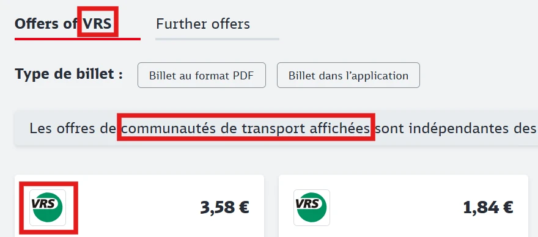

La Deutsche Bahn (DB) est la plus grande entreprise ferroviaire d’[Allemagne](/country/germany "Allemagne") et exploite la majorité du trafic longue distance ainsi que de nombreuses liaisons régionales.

## Résumé

- Les Billets FIP 50 et les Coupons FIP sont acceptés
- Pas d’obligation de réservation sur le trafic national
- Dans le trafic régional, de nombreux opérateurs privés sans FIP

## Validité des Billets FIP





Pour les trajets transfrontaliers, il faut soit un billet FIP 50 continu, soit des FIP Coupons des deux pays.

## Catégories de trains et réservations

Il n’existe pas d’obligation de réservation, sauf sur certaines liaisons transfrontalières pour le passage de frontière. Les trajets uniquement en Allemagne ne nécessitent pas de réservation.

### Longue distance

{}

L’`ICE` est un train à grande vitesse et la catégorie la plus élevée de la DB. Il relie les grandes villes allemandes à jusqu’à 300 km/h et circule aussi vers certains pays voisins. Les liaisons particulièrement rapides avec peu d’arrêts sont appelées `ICE Sprinter`.

#### Réservation

Réservation obligatoire pour les trajets transfrontaliers vers la France.
Pour les trajets transfrontaliers en été vers l’Autriche et les Pays-Bas, une obligation de réservation a existé par le passé. Cela peut changer chaque année. L’obligation de réservation est indiquée dans la [recherche d’itinéraire de la DB](https://www.bahn.de).

{}

{}

Trains à grande vitesse transfrontaliers de la SNCF en coopération avec la DB. Ils relient Francfort, Mannheim, Karlsruhe, Sarrebruck, Stuttgart et Munich à Paris.

#### Réservation

Réservation obligatoire pour les trajets transfrontaliers vers la France.

{}

{}

Trains internationaux de la catégorie la plus élevée de l’ÖBB/ČD en coopération avec la DB entre Hambourg, Berlin, Dresde et Prague ainsi que Munich, l’Autriche et l’Italie ou la Hongrie. Les Railjets avec moins d’arrêts sont commercialisés comme Railjet Xpress. Les trains disposent d’un bistro.

Il existe trois classes de voitures :

- **Economy** : Comparable à la 2ᵉ classe. En Allemagne, les billets de 2ᵉ classe sont valables dans cette classe
- **First Class** : Comparable à la 1ʳᵉ classe. Une Carte FIP pour la 1ʳᵉ classe est nécessaire. En Allemagne, les billets de 1ʳᵉ classe sont valables dans cette classe
- **Business** : 1ʳᵉ classe avec boisson de bienvenue (à partir de l’Autriche / République tchèque) et compartiments privés. Non accessible avec le FIP Coupon hors d’Allemagne, même avec le supplément correspondant. En Allemagne, ces espaces sont accessibles avec un billet de 1ʳᵉ classe.

[Aperçu détaillé des classes chez ÖBB](https://www.oebb.at/de/reiseplanung-services/im-zug/abteile-komfortklassen)

Pour les Railjets à destination de l’Italie, un supplément est requis à partir de la frontière italienne (voir [Trains vers l’Italie chez ÖBB](/operator/oebb#trains-vers-litalie "Trains vers l’Italie chez ÖBB")).

{}

{}

Les trains Intercity complètent le réseau ICE. Ils circulent à une vitesse inférieure à celle des ICE, relient de nombreuses villes et desservent aussi de nombreuses régions de vacances.

{}

{}

Train express international entre Francfort et Milan ainsi qu’entre Munich et Zurich. Depuis décembre 2025, la catégorie est aussi utilisée pour d’autres liaisons entre la Suisse et l’Allemagne ainsi que sur de trains sur la route Hambourg – Copenhague.

{}
Les trains vers l’Italie sont soumis à supplément et réservation obligatoire à partir de la frontière italienne. Il est plus avantageux de voyager vers l’Italie avec un changement à Chiasso ([voir Arrivée Italie](/country/switzerland#italien "Arrivée Italie")). Le supplément peut être acheté au guichet DB ou SBB ou à bord.

**Supplément/Réservation Italie :**

- 1ʳᵉ classe : 13€
- 2ᵉ classe : 11€

{}

#### Réservation

Réservation obligatoire pour les trajets transfrontaliers vers l’Italie et pendant la haute saison vers le Danemark.

{}

{}

Les trains Eurocity sont des trains internationaux reliant l’Allemagne à d’autres pays européens. Ils sont similaires aux Intercity, mais composés souvent de voitures de différentes compagnies, dont la Deutsche Bahn et des partenaires étrangers. Certains proposent des voitures-restaurants étrangères, par exemple sur les liaisons Berlin – Pologne.

#### Réservation

Réservation obligatoire pour les trajets transfrontaliers vers la Pologne.
Pour les trajets transfrontaliers en été vers la République tchèque, une obligation de réservation a existé par le passé. Cela peut changer chaque année. L’obligation de réservation est indiquée dans la [recherche d’itinéraire de la DB](https://www.bahn.de).

{}

{}

Trains de nuit de l’ÖBB en coopération avec la DB vers différents pays européens. Les trains proposent des voitures-lits, couchettes et places assises et sont exploités à l’étranger avec d’autres compagnies.

{}
Les trajets nationaux gratuits pour les employés de la Deutsche Bahn ne sont pas reconnus en Allemagne. Si une partie du trajet Nightjet est en Allemagne (départ, arrivée ou transit), les employés de la DB doivent acheter un billet au Tarif Global FIP pour tout le trajet. Pour les trajets hors d’Allemagne avec FIP Coupon, une réservation/supplément est nécessaire.
{}

**Tarif Global FIP :** oui \
_Astuce :_ Pour les trajets Allemagne - Italie, utiliser les trajets nationaux gratuits jusqu’à Salzbourg puis prendre le Nightjet pour éviter le Tarif Global FIP.

#### Réservation

Pour les Nightjet, des réservations/suppléments pour les voitures-lits et couchettes peuvent être réservés. Un FIP Coupon pour les pays/compagnies traversés est nécessaire. Sans FIP Coupon, un billet au Tarif Global FIP pour tout le trajet peut être acheté.

**Coût :** Selon le trajet, la fréquentation et la catégorie de voiture.

{}

### Trafic local

Les trains du trafic local sont souvent exploités par d’autres opérateurs qui n’acceptent pas le FIP. Dans la [recherche d’itinéraire de la DB](https://www.bahn.de), tous les opérateurs sont indiqués. Seuls les trains avec _DB_ dans le nom de l’opérateur dans les _informations de trajet_ peuvent être utilisés avec FIP.

{}
Une orientation est fournie par les [cartes d’aperçu](https://www.schienennahverkehr.de/veroeffentlichungen/spnv-karten/) indiquant quels opérateurs circulent sur quelles lignes. Les liaisons de la Deutsche Bahn sont en rouge et marquées _DB - DB Regio AG_.
{}

{}

Les trains Regionalexpress relient des villes avec des arrêts dans les principales gares. Certains circulent aussi sur de longues distances.

{}
Les trains de la catégorie `RE` sont souvent exploités par d’autres opérateurs.
{}

{}

{}

Les trains Regionalbahn relient des villes avec des arrêts dans presque toutes les gares.

{}
Les trains de la catégorie `RB` sont souvent exploités par d’autres opérateurs.
{}

{}

{}

Trains de proximité dans les grandes villes et régions métropolitaines avec arrêt à toutes les gares.

{}
Les trains de la catégorie `S` sont souvent exploités par d’autres opérateurs.
{}

{}

{}

Train express local entre Berlin Hauptbahnhof et l’aéroport Willy Brandt (BER).

{}

## Achat de billets et réservations

### En ligne

{}
La réservation de trains directs sans correspondance est moins chère via l’ÖBB.
{}

{}
La réservation de trains directs sans correspondance est moins chère via l’ÖBB.
{}

### Par téléphone

{}

### En gare

{}
La réservation de trains directs sans correspondance est moins chère via l’ÖBB.
{}

### À bord du train

Les billets FIP 50 ne peuvent pas être achetés à bord.

## Réductions

Pour les tarifs publics, les enfants jusqu’à 6 ans voyagent gratuitement, les enfants de 6 à 14 ans bénéficient d’une réduction de 50 % sur le tarif adulte. À partir de 14 ans, le tarif adulte s’applique.

### Enfants voyageant gratuitement

Les enfants accompagnants âgés de 6 à 14 ans peuvent voyager gratuitement avec un titulaire FIP, à condition que

- le titulaire FIP ait au moins 15 ans et
- possède un billet valide (par exemple Billet FIP 50) ou un FIP Coupon.[^1]

Les enfants voyageant gratuitement n’ont pas besoin d’être apparentés à l’adulte accompagnant.

Dans les trains locaux, jusqu’à 3 enfants peuvent être emmenés et dans les trains longue distance jusqu’à 4 enfants. Pour les billets FIP 50 comprenant une section en longue distance, jusqu’à 4 enfants peuvent aussi être emmenés dans les trains locaux indiqués.

Les enfants voyageant gratuitement n’ont pas besoin d’être inscrits sur le billet. Pour les billets FIP 50, il est toutefois recommandé de les réserver gratuitement pour éviter des problèmes lors du contrôle.

Les enfants non accompagnés par une personne de plus de 15 ans avec droit de voyage doivent acheter leur propre billet.

Les enfants de moins de 6 ans voyagent toujours gratuitement et n’ont pas besoin de billet.

## Conditions tarifaires spéciales

### Nordhessischer Verkehrsverbund (NVV)

Dans le Nordhessischer Verkehrsverbund (NVV), aucune réduction pour les employés de la DB n’est reconnue dans le trafic régional. Les réductions FIP ne sont donc pas valables.
Une [carte d’aperçu](https://www.nvv.de/fileadmin/nvv/data/2._Fahrtinfo/4._Liniennetz/Liniennetz_Nordhessen_Schematisch.pdf) des lignes régionales concernées est disponible.

### Trajets dans les réseaux de transport

L’Allemagne est divisée en _Verkehrsverbünde_ (structure tarifaire combinée). Ce sont des sociétés publiques qui organisent le trafic local dans la région pour tous les opérateurs. Elles sont aussi responsables de la fixation des prix et tarifs des billets. Les trajets avec réductions FIP dans un seul réseau ne sont généralement pas autorisés. Un voyage doit toujours couvrir au moins deux réseaux, car dans ce cas les tarifs et billets des opérateurs peuvent être proposés. Il peut y avoir des exceptions à demander au réseau ou au guichet local. [^1]

Pour les billets FIP 50, la gare de départ et d’arrivée doivent être dans des réseaux différents. Cela vaut aussi pour les trajets avec FIP Coupon.

{}
Un aperçu de tous les réseaux de transport est disponible sur [Wikipedia](https://en.wikipedia.org/wiki/List_of_German_transport_associations).

Pour s’orienter, il est aussi possible de vérifier dans DB Navigator ou sur le [site de la DB](https://bahn.de) si des billets de réseau sont vendus pour un trajet. Ceux-ci sont indiqués comme _Verbund-Angebote_, avec le logo et sous les offres du \[nom du réseau\].
{}

{}
Dans l’exemple suivant, la connexion choisie se trouve dans le réseau de transport _VRS_ :

{}

### Distinction tarifaire entre trains longue distance et trains locaux

Avec les billets FIP 50, il est possible d’utiliser différents trains sur le même trajet. Il faut cependant faire attention aux catégories de trains, car la DB distingue les billets selon différentes catégories de trains (appelées [_classes de produit_](https://de.wikipedia.org/wiki/Preissystem_der_Deutschen_Bahn#Produktklassen)). Les billets (y compris les billets FIP 50) ne sont valables que dans la même classe de produit ou une classe inférieure. La classe de produit est indiquée sur le billet (par exemple _ICE Fahrkarte_ ou _IC/EC Fahrkarte_) et dépend de la catégorie de train la plus élevée sur le trajet réservé.

Les classes de produit sont les suivantes :

- Classe de produit ICE (anciennement classe de produit A) : \
  ICE, ICE Sprinter, TGV, RJ, RJX, ECE
- Classe de produit IC/EC (anciennement classe de produit B) : \
  IC, EC, D, EN, NJ
- Classe de produit C : \
  IRE, RE, FEX, MEX, RB, S

### DB Syltshuttle

La DB exploite le train auto Syltshuttle, qui circule entre Niebüll et Westerland (Sylt). Le voyage n’est possible qu’avec un véhicule (voiture, caravane, camping-car) et nécessite un [billet séparé](https://ticket.syltshuttle.de/). Les réductions FIP ne sont pas reconnues.

### Navigation et train de l’île Wangerooge

Les Coupons FIP sont valables sur la liaison par ferry entre Harlesiel et Wangerooge ainsi que sur le train de l’île de Wangerooge. Les billets FIP 50 ne sont pas disponibles.

### Regionalverkehre Start GmbH

Regionalverkehre Start GmbH est une filiale de DB Regio AG, mais n’accepte pas les réductions FIP.

### Bus et service de remplacement

Les bus sont exclus des réductions FIP, sauf s’ils remplacent un train où le FIP aurait été reconnu (service de remplacement ferroviaire).[^1]

## Recommandations

La Deutsche Bahn exploite une multitude de liaisons très variées. Par exemple, il est possible d’emprunter le Thüringer Bergbahn entre Obstfelderschmiede et Cursdorf. Les liaisons à travers la Forêt-Noire (Schwarzwaldbahn) ou la vallée du Rhin sur la rive gauche sont aussi très recommandées. En longue distance, il est à noter qu’il y a normalement un restaurant à bord sur chaque liaison ´ICE´. Celui-ci ne propose pas de plats fraîchement cuisinés, mais l’offre est tout de même très variée.

## Sources

[^1]: [Rail Delivery Group](https://www.raildeliverygroup.com/rst/europe-and-fip.html)
