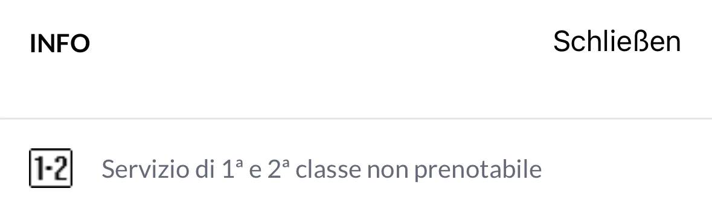
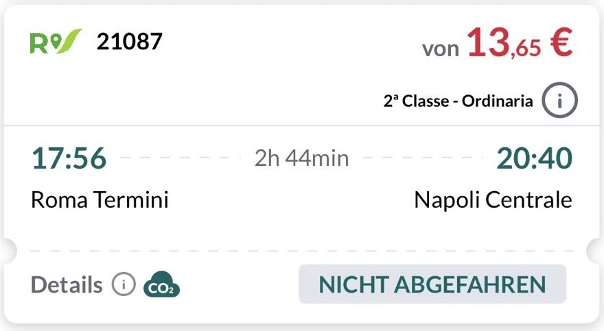
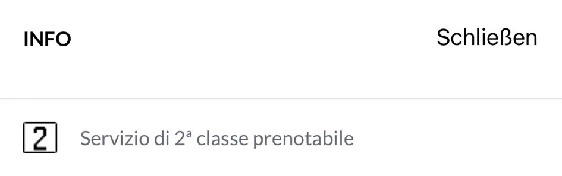
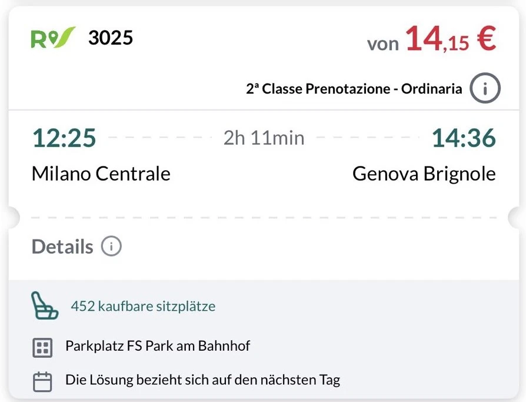

<!-- Entferne das "WIP" Snippet, wenn die Inhalte der Seite vollständig sind -->


Ferrovie dello Stato Italiane (FS) ist die italienische Staatsbahn. FIP Vergünstigungen gelten jedoch nur bei der Tochtergesellschaft Trenitalia.

## Zusammenfassung

- Reservierungspflicht inkl. Aufschlägen im Fernverkehr
- Teilweise Zugbindung bei FIP 50 Tickets im Nahverkehr
- Keine Gültigkeit bei Tochtergesellschaften der Trenitalie wie Trenord oer Ferrovie Sud Est

## Gültigkeit FIP Tickets

FIP Freifahrtsschein: ✅\
FIP Freifahrt Angehörige: ✅ \
FIP 50 Tickets: ✅

{}
In anderen Tochtergesellschaften der FS abgesehen von Trenitalia gelten keine FIP Vergünstigungen (z.B. Trenord oder Ferrovie Sud Est), selbst wenn die Züge Trenitalia Logos haben.
{}

## Zugkategorien und Reservierungen

Im Fernverkehr besteht eine Reservierungspflicht inkl. Aufschlägen.

### Le Frecce

{}
**Beschreibung:** \
Höchste italienische Zuggattung im Fernverkehr mit Hochgeschwindigkeitszügen. Zusätzlich wird der Frecciarossa 1000 als Zug mit besonders hoher Geschwindigkeit und Service im Fahrplan gekennzeichnet.

ℹ️ Züge des privaten Anbieters .italo werden auch als AV gekennzeichnet. \
**Reservierung möglich:** Ja \
**Reservierungspflicht:** ⚠️ Ja \
Der variable Reservierungspreis enthält immer einen Aufschlag bei Nutzung mit FIP Freifahrtschein.
{}

{}
**Beschreibung:** \
Hochgeschwindigkeitszüge mit Neigetechnik.

ℹ️ Züge des privaten Anbieters .italo werden auch als AV gekennzeichnet. \
**Reservierung möglich:** Ja \
**Reservierungspflicht:** ⚠️ Ja \
Der variable Reservierungspreis enthält immer einen Aufschlag bei Nutzung mit FIP Freifahrtschein.
{}

{}
**Beschreibung:** \
Schnellzug abseits von Hochgeschwindigkeitsstrecken. \
**Reservierung möglich:** Ja \
**Reservierungspflicht:** ⚠️ Ja \
Der variable Reservierungspreis enthält immer einen Aufschlag bei Nutzung mit FIP Freifahrtschein.
{}

{}
**Beschreibung:** \
Anschlussbusse für Hochgeschwindigkeitszüge.

⛔ In diesen Bussen gelten keine FIP Vergünstigungen.
{}

### Sonstiger Fernverkehr

{}
**Beschreibung:** \
Schnellzug meist abseits von Hochgeschwindigkeitsstrecken. \
**Reservierung möglich:** Ja \
**Reservierungspflicht:** ⚠️ Ja \
**Kosten für Reservierung**: 25€ (1./2. Klasse) \
Der Reservierungspreis enthält immer einen Aufschlag bei Nutzung mit FIP Freifahrtschein.
{}

{}
**Beschreibung:** \
Nationaler Nachtzug mit Schlaf-, Liege- und Sitzwagen. \
**Reservierung möglich:** Ja \
**Reservierungspflicht:** ⚠️ Ja \
**Kosten für Reservierung**: 25€ (1./2. Klasse) \
Der Reservierungspreis enthält immer einen Aufschlag bei Nutzung mit FIP Freifahrtschein.
{}

### Internationaler Fernverkehr

{}
**Beschreibung:** \
Internationale Schnellzüge nach Deutschland, Österreich und in die Schweiz. \
**Reservierung möglich:** Ja \
**Reservierungspflicht:** ⚠️ Ja \
**Kosten für Reservierung**: \
25€ (1./2. Klasse)

Brennerverkehr: \
1. Klasse: 15€
2. Klasse: 10€
Der Reservierungspreis enthält immer einen Aufschlag bei Nutzung mit FIP Freifahrtschein.
{}

{}
**Beschreibung:** \
Internationale Nachtzüge nach Deutschland, Österreich und in die Schweiz.

⚠️ Nationale Freifahrten für Mitarbeiter der Deutschen Bahn werden in Deutschland nicht anerkannt. Liegt ein Teil der Nightjet Fahrt also in Deutschland (Start, Ende oder Durchreise) müssen Mitarbeiter der Deutschen Bahn für die gesamte Strecke ein Ticket zum FIP Globalpreis erwerben. Für Fahrten außerhalb Deutschlands mit FIP Freifahrtschein ist eine Reservierung/Aufpreis erforderlich. \
_Tipp:_ Für Fahrten von Deutschland nach Italien, die nationalen Freifahrten bis Salzburg nutzen und dort in den Nightjet steigen, um den FIP Globalpreis zu vermeiden. \
**Reservierung möglich:** Ja \
**Reservierungspflicht:** ⚠️ Ja \
Der variable Reservierungspreis enthält immer einen Aufschlag bei Nutzung mit FIP Freifahrtschein.
{}

### Nahverkehr

{}
**Beschreibung:** \
Schnelle Regionalzüge mit Halt an den wichtigsten Stationen.

⚠️ Tickets für Regionalzüge sind teilweise zuggebunden. Weitere Informationen siehe [Zugbindung im Nahverkehr](#zugbindung-im-nahverkehr)
**Reservierung möglich:** Nein
{}

{}
**Beschreibung:** \
Regionalzüge mit Halt an den meisten Stationen.

⚠️ Tickets für Regionalzüge sind teilweise zuggebunden. Weitere Informationen siehe [Zugbindung im Nahverkehr](#zugbindung-im-nahverkehr)
**Reservierung möglich:** Nein
{}

{}
**Beschreibung:** \
S-Bahnsysteme im Großraum Neapel `M` und Großraum Turin `sfm`. \
**Reservierung möglich:** Nein
{}

## Klassenkategorien

In Le Frecce Fernzügen gibt es teilweise abweichende Klassenkategorien. [^1]

**Standard**: Vergleichbar mit der 2. Klasse. \
**Premium**: 1. Klasse in 2-2 Bestuhlung. Im Frecciarossa 1000 inkl. Welcome-Drink und Snacks (außer Samstag). Ein FIP-Ausweis für die 1. Klasse wird benötigt. \
**Business**: 1. Klasse in 2-1 Bestuhlung. Im Frecciarossa 1000 inkl. Welcome-Drink und Snacks (außer Samstag). Nicht mit FIP buchbar. \
**Executive**: Luxusklasse mit privatem Abteil für 10 Personen und zusätzlichem Meetingraum. Nicht mit FIP buchbar.

## Ticket- und Reservierungskauf

### Online

{}

{}
Für den `ECE` Frankfurt - Mailand können durchgehende FIP 50 Tickets bis Mailand gebucht werden.
{}

{}
Für den `ECE` Frankfurt - Mailand können durchgehende FIP 50 Tickets bis Mailand gebucht werden.
{}

### Vor Ort

{}

{}

{}

### Im Zug

Wenn Zuschläge nicht vor Reisebeginn erworben werden, wird ein zusätzlicher Bordzuschlag erhoben (außer in Fällen, in denen es am Abfahrtsbahnhof keine Verkaufsstellen oder Fahrkartenautomaten gibt).

## Ermäßigungen

Bei öffentlichen Tarifen reisen Kinder bis einschließlich 4 Jahre kostenlos. In Nahverkehrszügen erhalten Kinder bis einschließlich 12 Jahre eine Ermäßigung von 50 % auf den Erwachsenenfahrpreis. Personen ab 12 Jahren zahlen den regulären Erwachsenenpreis. In Fernverkehrszügen erhalten Kinder bis einschließlich 15 Jahre eine Ermäßigung von 50 % auf den Erwachsenenfahrpreis. Personen ab 15 Jahren zahlen den regulären Erwachsenenpreis.

## Tarifliche Besonderheiten

### Verkehr nach Österreich

Auf internationalen Fernzügen von Italien nach Österreich werden FIP Freifahrtsscheine der ÖBB zusätzlich zu den FIP Freifahrtscheinen der FS bei auch im italienischen Abschnitt anerkannt (nicht in Regionalzügen), jedoch ist bei beiden Freifahrtscheinen ein Zuschlag (wie im restlichen italienischen Fernverkehr) zu zahlen. Dieser kann im Zug oder an den Fahrkartenschaltern der FS oder ÖBB erworben werden.

#### Brenner - Bozen - Verona

FIP Freifahrtscheine der ÖBB oder FS gelten im italienischen Abschnitt in `EC` Zügen bis Verona. Für Fahrten von/nach Italien oder komplett im italienischen Abschnitt ist ein Zuschlag in Höhe von 10€ für die 2. Klasse und 15€ für die 1. Klasse zu zahlen.

#### Railjet Tarvisio Boscoverde - Venedig

FIP Freifahrtscheine der ÖBB oder FS gelten im italienischen Abschnitt in `RJ` Zügen bis Venedig. Für Fahrten von/nach Italien oder komplett im italienischen Abschnitt ist ein Zuschlag in Höhe von 10€ für die 2. Klasse und 15€ für die 1. Klasse zu zahlen.

### Regionalzüge in Emilia-Romagna

FIP Vergünstigungen gelten auch in Zügen die von Trenitalia TPER in der Region Emilia-Romagna betrieben werden.

### Fähre Straße von Messina

FIP-Vergünstigungen gelten für die Überquerung der Straße von Messina nur, wenn die Reise mit dem Zug erfolgt, der die Zugfähre von Villa San Giovanni nach Messina nutzt.

### Rom Fiumicino Flughafen Leonardo Express

Im Leonardo Express von/zum Flughafen Rom Fiumicino gelten keine FIP Vergünstigungen. Alternativ verkehren aber normale Regionalzüge.

### Palermo Flughafen Trinacria Express

Im Trinacria Express von/zum Flughafen Palermo Falcone Borsellino gelten keine FIP Vergünstigungen.

### Internationale Frecciarossa Züge nach Paris

FIP-Vergünstigungen gelten nicht in internationalen Frecciarossa zwischen Paris und Italien.

### Fahrtunterbrechnung

Eine Unterbrechung der Fahrt ist in Fernzügen nicht gestattet. In Regionalzügen ist eine Fahrtunterbrechnung ohne ANkündigung oder Formalitäten möglich, außer es handelt sich um zuggebundene FIP 50 Tickets (mit aufgedruckter Zugnummer). Siehe [Zugbindung im Nahverkehr](#zugbindung-im-nahverkehr)

### Zugbindung im Nahverkehr

In Italien gilt im Nahverkehr (`R`/`RV`) teilweise Zugbindungen bei Tickets. Dies gilt auch für FIP 50 Ticket, ist für Freifahrtscheine jedoch nicht relevant.

Bei Regionalzügen wird unterschieden in zuggebunden (_prenotabile_) und nicht zuggebunden (_non prenotabile_).

Tickets die für Züge gekauft werden die nicht zuggebunden sind, sind in dem gebuchten Zug und und allen anderen nicht zuggebundenen Zügen auf der Strecke gültig (nicht jedoch in zugebundenen Zügen). Die  nicht zuggebunden Züge sind erkennbar an:

- Der Bemerkung "non prenotabile" in den Zuginformationen:

- Der Ticketbezeichung "Ordinaria":

Tickets die fur Züge gekauft werden die zuggebunden sind, sind ausschließelich in dem aufgedruckten Zug gültig. Die zuggebundenen Züge sind erkennbar an:
- Der Bemerkung "prenotabile" in den Zuginformationen:

- Der Ticketbezeichnung "Prenotazione - Ordinaria":

### Abstempeln von Regionalzugtickets

Tickets für nicht zuggebundene Regionalzüge (_non prenotabile_) müssen am Bahnsteig entwertet/abgestempelt werden (obliteratrici).

## Empfehlungen

{}
Für Fahrten im Fernverkehr lohnt sich der FIP Freifahrtschein nur eingeschränkt, da der Preis von Fahrkarten mit FIP 50 und Freifahrtschein für die Fernzüge sich kaum unterscheidet. Nur im Nahverkehr kann der Freifahrtschein voll genutzt werden. Da gibt es jedoch kaum eine 1. Klasse, wodurch sich der Freifahrtschein der 1. Klasse eher nicht lohnt.
{}

## Quellen

[^1]: [Frecciarossa Klassen](https://www.trenitalia.com/de/frecce/frecciarossa-1000.html)
