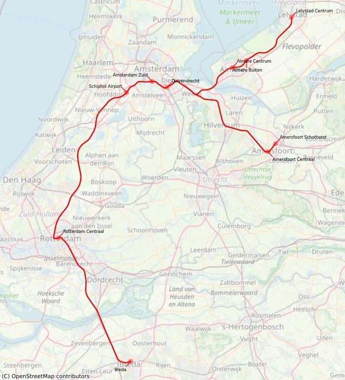

Die Nederlandse Spoorwegen (NS) ist die staatliche Eisenbahngesellschaft der [Niederlande](/country/netherlands "Niederlande") und betreibt den Großteil des Personenverkehrs auf dem niederländischen Schienennetz.

## Zusammenfassung

- NS akzeptiert FIP Freifahrt und FIP 50 Tickets.
- Reservierung ist grundsätzlich nicht erforderlich.
- Zuschlag teilweise für Eurocity Direct (`ECD`) und Intercity Direct (`ICD`) erforderlich.
- Zur FIP Freifahrt ist ein Gate-Pass-Coupon für Zugang durch die Schranken an den Stationen erforderlich.

## Gültigkeit FIP Tickets

FIP Freifahrtschein: ✅ \
FIP Freifahrt Angehörige: ✅ \
FIP 50 Tickets: ✅

FIP Freifahrtscheine und FIP 50 Tickets sind auf Verbindungen der NS gültig. Bei grenzüberschreitenden Fahrten muss entweder ein durchgängiges FIP 50 Ticket oder FIP Freifahrtscheine beider Länder vorhanden sein.

## Zugkategorien und Reservierungen

Innerhalb der Niederlande ist bei der NS keine Reservierung erforderlich und in vielen Zügen auch nicht möglich. Bei grenzüberschreitenden `ICE` und `IC` nach Deutschland ist eine Reservierung möglich und beispielsweise im Sommer 2025 auch verpflichtend (nur bei grenzüberschreitenden Reisen).

Zuschläge müssen teilweise für Eurocity Direct und Intercity Direct Züge gezahlt werden.

{}
Hochgeschwindigkeitszüge der Deutschen Bahn, die in den Niederlanden von der NS übernommen werden. Sie verkehren zwischen Amsterdam und Deutschland (Köln / Frankfurt am Main bzw. Hannover / Berlin), können jedoch auch innerhalb der Niederlande zwischen Amsterdam und Arnhem bzw. Hengelo mit FIP Freifahrtschein ohne Aufschlag genutzt werden. Bei FIP 50 Tickets ist jedoch ein Zuschlag erforderlich.

{}
Bei der Nutzung von FIP 50 Tickets im niederländischen Binnenverkehr muss ein [ICE Aufschlag](https://www.ns.nl/en/tickets/ice-supplement) in Höhe von 3 € pro Fahrt gezahlt werden. Bei Nutzung der FIP Freifahrt ist der Zuschlag nicht erforderlich.

Der Aufschlag kann [Online](https://www.ns.nl/en/tickets/ice-supplement) bzw. in der NS-App oder vor Ort am Automaten bzw. Schalter gekauft werden. Vor Ort kann der Aufschlag auf eine OV-Chipkarte geladen werden. Ohne OV-Chipkarte wird eine zusätzliche Gebühr von 1,50 € für ein Einmalticket erhoben.
{}

#### Reservierung

Bei grenzüberschreitenden Reisen zur Hochsaison ist eine Reservierung erforderlich.

{}

{}
Internationaler, zuschlagspflichtiger Zug zwischen Lelystad, Amsterdam und Brüssel mit Halt in Almere, Schiphol, Rotterdam und Antwerpen.


Beim einer ausschließlich nationale Fahrt auf dem Abschnitt zwischen Rotterdam und Schiphol ist bei FIP 50 Tickets ein [Zuschlag](https://www.ns.nl/en/season-tickets/other/intercity-direct-supplement.html) in Höhe von 3,20 € zu entrichten.

Beinhaltet das FIP 50 Ticket auch einen internationalen Abschnitt (bei Ein- oder Ausstieg in den `ECD` außerhalb der Niederlande), muss kein Zuschlag für FIP 50 Tickets erworben werden, selbst wenn man dabei den Abschnitt Rotterdam - Schiphol mit dem `ECD` befährt.

Beispieltickets mit Zuschlagspflicht:

- Rotterdam - Amsterdam
- Breda - Amsterdam

Beispieltickets ohne Zuschlagspflicht:

- Brüssel - Amsterdam
- Brüssel - Rotterdam
- Breda - Rotterdam

Der Zuschlag kann [Online](https://www.ns.nl/en/tickets/icd-supplement) bzw. in der NS-App oder vor Ort am Automaten bzw. Schalter gekauft werden. Dort kann der Aufschlag auf eine OV-Chipkarte geladen werden. Ohne OV-Chipkarte für eine zusätzliche Gebühr von 1,50 € für ein Einmalticket erhoben.

Inhaber einer OV-Chipkarte können am Zuschlagsschalter im Bahnhof zu [Off-Peak Zeiten](https://www.ns.nl/en/travel-information/off-peak-hours.html) einen vergünstigten Zuschlag für 1,92 € (40 % Rabatt) erwerben. [^2] [^3] [^4]


{}

{}
Internationaler Zug zwischen Rotterdam und Brüssel mit mehreren Unterwegshalten.

{}

{}
Teilweise zuschlagspflichtiger Schnellzug zwischen Lelystad oder Amersfoort, Amsterdam Zuid, Schiphol Airport, Rotterdam Centraal und Breda.


Bei Fahrten auf dem Abschnitt zwischen Rotterdam und Schiphol ist für FIP 50 Tickets ein [Zuschlag](https://www.ns.nl/en/season-tickets/other/intercity-direct-supplement.html) in Höhe von 3,20 € zu entrichten.

Dieser kann [Online](https://www.ns.nl/en/tickets/icd-supplement) bzw. in der NS-App oder vor Ort am Automaten bzw. Schalter gekauft werden. Dort kann der Aufschlag auf eine OV-Chipkarte geladen werden. Ohne OV-Chipkarte für eine zusätzliche Gebühr von 1,50 € für ein Einmalticket erhoben.

Inhaber einer OV-Chipkarte können am Zuschlagsschalter im Bahnhof zu [Off-Peak Zeiten](https://www.ns.nl/en/travel-information/off-peak-hours.html) einen vergünstigten Zuschlag für 1,92 € (40 % Rabatt) erwerben. [^2] [^3] [^4]


{}

{}
Anders als in anderen Ländern keine wirklichen Fernzüge, sondern eher schnelle Regionalzüge mit wenigen Halten.
{}

{}
Regionalzüge mit mehr Halten als beim Intercity, aber trotzdem nur an wichtigeren Stationen.

{}
Die Züge der Kategorie Sneltrein / Regional-Express `RE`, unter anderem die Verbindungen Venlo – Hamm (Deutschland), Maastricht – Aachen (Deutschland) und Arnhem – Düsseldorf (Deutschland) sowie andere RE-Verbindungen werden nicht von der NS betrieben und sind mit FIP nicht nutzbar.
{}
{}

{}
Regionalzüge für kurze Verbindungen mit Halt an jedem Bahnhof auf der Strecke.
{}

## Ticket- und Reservierungskauf

### Online

Nationale Verbindungen können online leider nicht erworben werden.

{}

{}

{}

{}

### Telefon

{}

### Vor Ort

{}

{}

### Im Zug

FIP 50 Tickets können nicht im Zug gekauft werden. [^1]

## Ermäßigungen

Uns sind keine Ermäßigungen bekannt.

## Tarifliche Besonderheiten

### Ticket Schranken im Bahnhof

Mit einem FIP-Coupon erhältst du einen NS-Zugangscoupon mit Barcode, um die Bahnhofsschranken zu öffnen. \
Dies ist kein Ticket, sondern ein Zugangspass, gültig für:

- Bis zu 8 einzelne Tage innerhalb eines Zeitraums von 3 Monaten.
- Pro Tag (von 00:00 bis 23:59):
  - Bis zu 6 Ein- oder Ausgänge am selben Bahnhof.
  - Insgesamt bis zu 12 Durchgänge pro Tag.

Falls benötigt, kann ein neuer Zugangscoupon am NS-Schalter angefordert werden.

## Empfehlungen

{}
Die NS überzeugt durch einen dichten Takt und guten Anschlüssen. Verspätungen und Ausfälle kommen vor, sind jedoch durch die hohe Taktrate oft nicht allzu schlimm. Trotzdem sollte nicht mit zu knappen Anschlüssen geplant werden, da Züge nur selten aufeinander warten. Die 1. Klasse in den NS-Zügen ist oft nicht viel bequemer als die 2. Klasse.
{}

## Quellen

[^1]: [Rail Delivery Group](https://www.raildeliverygroup.com/rst/europe-and-fip.html)

[^2]: [FIP Guide Community ICD / ECD Feedback](https://discord.com/channels/1250522473188032512/1433782574806728804/1470087243040428176)

[^3]: [NS Intercity Direct Supplement](https://www.ns.nl/en/tickets/icd-supplement)

[^4]: [NS Tickets: Intercity Direct Supplement](https://www.ns.nl/en/season-tickets/other/intercity-direct-supplement.html)
