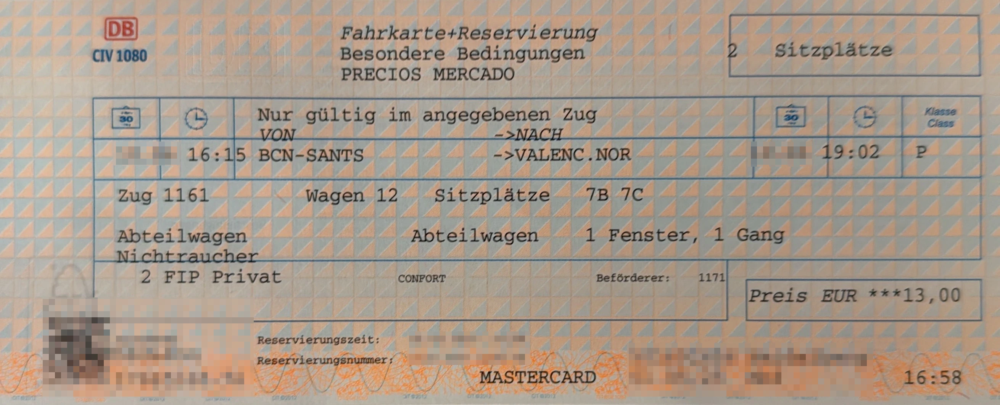

Renfe Operadora ist ein staatliches spanisches Eisenbahnunternehmen. Hierzu gehören komfortablen Hochgeschwindkeitszüge, diverse Regionalzüge und S-Bahnen.

## Zusammenfassung

- FIP Freifahrtsscheine werden in Pendlerzügen akzeptiert, jedoch nicht in reservierungspflichtigen Zügen.
- Für reservierungspflichtige Züge können Tickets zum Pauschalpreis inkl. Reservierung erworden werden, FIP Coupons werden nicht benötigt.
- In Avlo und Metrozügen wird FIP nicht akzeptiert.

## Gültigkeit FIP-Tickets

FIP Freifahrtsschein: ✅ (Ausnahmen: Reservierungspflichtige Züge, Metro) \
FIP Freifahrt Angehörige: ⛔ \
FIP 50 Tickets: ✅ (Ausnahmen: Reservierungspflichtige Züge, Metro) \
FIP Globalpreis: Reservierungspflichtige Züge außer Avlo ✅

## Zugkategorien und Reservierungen

### Langstrecke

{}
**Beschreibung:** \
Langstreckenverbindungen mit normalspurigen Hochgeschwindigkeitszügen (bis 300 km/h). \
**Reservierung möglich:** ja \
**Reservierungspflicht:** ⚠️ ja \
**FIP Globalpreis (Distanzunabhängig):**
- 10 € (Elige)
- 13 € (Elige Confort)
- 23,50€ (Premium)
{}

{}
**Beschreibung:** \
Niedrigpreis-Hochgeschwindigkeitszüge (bis 300 km/h). \
⚠️ FIP wird nicht anerkannt.
{}

{}
**Beschreibung:** \
Umspurbare Hochgeschwindigkeitszüge (Figueres <-> Alicante). \
**Reservierung möglich:** ja \
**Reservierungspflicht:** ⚠️ ja \
**FIP Globalpreis (Distanzunabhängig):**
- 6,50 € (Elige)
- 10 € (Elige Confort)
- 23,50€ (Premium)
{}

{}
**Beschreibung:** \
Umspurbare Hochgeschwindigkeitszüge (bis 250 km/h). \
**Reservierung möglich:** ja \
**Reservierungspflicht:** ⚠️ ja \
**FIP Globalpreis (Distanzunabhängig):**
- 6,50 € (Elige)
- 10 € (Elige Confort)
{}

{}
**Beschreibung:** \
Reisezüge zwischen Regional- und Hochgeschwindkeitsverkehr (bis 250 km/h). \
**Reservierung möglich:** ja \
**Reservierungspflicht:** ⚠️ ja \
**FIP Globalpreis (Distanzunabhängig):**
- 6,50 € (Elige)
- 10 € (Elige Confort)
{}

### Mittelstrecke

{}
**Beschreibung:** \
Hochgeschwindkeitszüge, Reisedauer < 90 Minuten. \
**Reservierung möglich:** ja \
**Reservierungspflicht:** ⚠️ ja \
**FIP Globalpreis (Distanzunabhängig):** 4€
{}

{}
**Beschreibung:** \
Beschleunigter Regionalverkehr. \
**Reservierung möglich:** ja \
**Reservierungspflicht:** ⚠️ ja (Außnahme: Route Barcelona(-Girona-Figueres)-Port Bou[^1]) \
**FIP Coupons**: Nur gültig auf der Route Barcelona(-Girona-Figueres)-Port Bou[^1]. \
**FIP Globalpreis (Distanzunabhängig):** 4€
{}

### Nahverkehr

{}
**Beschreibung:** \
Pendlerzüge. \
**Reservierungspflicht:** nein \
FIP Coupons sind gültig.
{}

{}
**Beschreibung:** \
⚠️ FIP wird nicht akzeptiert
{}

## Klassenkategorien

{}
Vergleichbar mit der 2. Klasse
{}

{}
1. Klasse ohne Verpflegung. Ein FIP-Card 1. Klasse wird benötigt.
{}

{}
1. Klasse inkl. Mahlzeit. Ein FIP-Card 1. Klasse wird benötigt.
{}

## Internationale Verbindungen

{}
**FIP Globalpreis (Distanzunabhängig):** 4 €
{}

## Ticket- und Reservierungskauf

### Online

- Die Buchung von Reservierungen, FIP Globalpreis oder FIP 50 ist online nicht möglich.

### Telefonisch

- Eine telefonische Buchung bei renfe ist möglich, jedoch muss das Ticket innerhalb weniger Tage an einem spanischen Schalter abgeholt werden. Daher nur begrenzt empfehlenswert.

### Vor Ort

- DB Reisezentrum:
  In den DB Reisezentren können Tickets für reservierungspflichtige Züge verkauft werden. Hier ist darauf zu achten, dass als Klasse entweder T (für Turista) oder P (für Preferente) angegeben wird. Wenn als Klasse die 1. Klasse oder 2. Klasse ausgewählt wird, dann schlägt das Ausstellen der Tickets mit einer Fehlermeldung fehl.
  Es wurde zudem berichtet, dass die Buchung der Klasse P teilweise fehlschlägt, in diesem Fall funktioniert eine Buchung der Klasse T oftmals. Eine Buchungsgebühr wird nicht erhoben. \
  

  {}
  Es wurde berichtet, dass im DB Reisezentrum bei Tickets der Klasse P nur der Preis der Klasse T berechnet wird, siehe auch auf dem folgenden Ticket: \
  
  {}

- Verkaufsstellen der renfe in Spanien:
  In den Verkaufsstellen der renfe können alle reservierungspflichtigen Tickets zum Globalpreis sowie Tickets ohne Reservierung (FIP 50) gebucht werden. Für reservierungspflichtige Tickets fällt zusätzlich eine Gebühr von 0,55€ an.

### Im Zug

- Wenn keine Verkaufsstelle der renfe am Startbahnhof besetzt ist, können Tickets im Zug gekauft werden.

## Ermäßigungen

Kinder bis zu 4 Jahren reisen kostenlos, sofern sie keinen eigenen Sitzplatz benötigen. Kinder bis zu 12 Jahren erhalten eine Ermäßigung von 40 % auf den Tarif für Erwachsene. Personen ab 12 Jahren zahlen den Erwachsenentarif.

## Anreise und Grenzpunkte

### Grenzpunkte

{}
| Bahngesellschaft | Grenzpunkte                                                         |
| ---------------- | ------------------------------------------------------------------- |
| CP               | Ayamonte, Badajoz (fr), Barca de Alva (fr), Fuentes de Onoro (fr), Valença (fr), Valencia de Alcántara (fr) |
| SNCF             | Canfranc (fr),  Hendaye (fr),  Port-Bou (fr), La Tour-de-Carol-Enveitg |

{}

## Quellen

[^1]: [ShowMeTheJourney](https://showmethejourney.com/travel-on/train/129-md-media-distancia-spain/)
