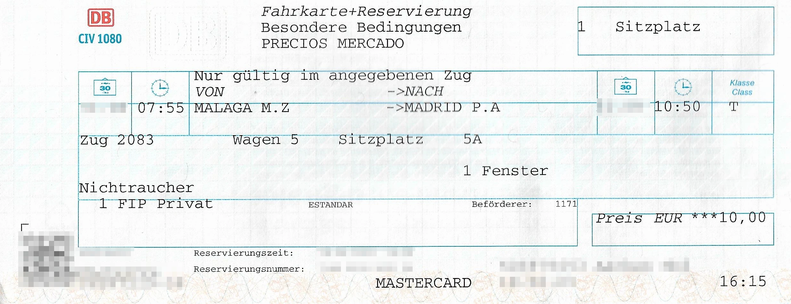

Renfe Operadora ist das staatliche Eisenbahnunternehmen in [Spanien](/country/spain "Spanien"). Hierzu gehören komfortable Hochgeschwindkeitszüge, diverse Regionalzüge und S-Bahnen.

## Zusammenfassung

- FIP Freifahrtscheine werden in Pendlerzügen (hauptsächlich S-Bahnen) akzeptiert, jedoch nicht in reservierungspflichtigen Zügen.
- Für reservierungspflichtige Züge können Tickets zum FIP Globalpreis (Distanzunabhängig) inkl. Reservierung erworden werden, FIP Freifahrtscheine werden nicht benötigt.
- In Avlo-Zügen wird FIP nicht akzeptiert.
- Für die grenzüberschreitenden AVE zwischen Madrid und Marseille sowie Lyon und Barcelona gibt es abweichende FIP-Globalpreise für den internationalen Streckenabschnitt.

## Gültigkeit FIP Tickets





## Zugkategorien und Reservierungen

{}
Nur S-Bahnen sind mit FIP Freifahrtscheinen uneingeschränkt nutzbar. In anderen Zügen muss in der Regel ein Ticket zum FIP Globalpreis erworben werden.
{}

### Langstrecke

{}

Langstreckenverbindungen mit normalspurigen Hochgeschwindigkeitszügen (bis 300 km/h). FIP Freifahrtscheine werden nicht anerkannt.

Die internationalen AVE von / nach Frankreich haben je nach Streckenabschnitt unterschiedliche FIP Globalpreise. Die Buchung von internationalen Verbindungen ist ausschließlich über Renfe direkt möglich, weshalb Tickets bei Einstieg in Spanien an einem Ticketschalter in Spanien erworben werden müssen. Bei Zustieg in Frankreich können FIP Tickets im Zug erworben werden, Kartenzahlung ist möglich. [^3]

**FIP Globalpreis (Distanzunabhängig):**[^5]

| Strecke                                                       | Elige | Elige Confort | Prémium |
| ------------------------------------------------------------- | ----- | ------------- | ------- |
| Innerspanisch                                                 | 10 €  | 13 €          | 23,50 € |
| Innerfranzösisch                                              | 10 €  | 13 €          | –       |
| International (Spanien  Frankreich) | 25 €  | 28 €          | –       |

{}

{}

Niedrigpreis-Hochgeschwindigkeitszüge (bis 300 km/h).

{}

{}

Umspurbare Hochgeschwindigkeitszüge (Figueres  Alicante). FIP Freifahrtscheine werden nicht anerkannt.

**FIP Globalpreis (Distanzunabhängig):**[^5]

- Elige: 6,50 €
- Elige Confort: 10 €
- Prémium: 23,50 €

{}

{}

Umspurbare Hochgeschwindigkeitszüge (bis 250 km/h). FIP Freifahrtscheine werden nicht anerkannt.

**FIP Globalpreis (Distanzunabhängig):**[^5]

- Elige: 6,50 €
- Elige Confort: 10 €
- Prémium: 23,50 €

{}

{}

Reisezüge zwischen Regional- und Hochgeschwindkeitsverkehr (bis 250 km/h). FIP Freifahrtscheine werden nicht anerkannt.

**FIP Globalpreis (Distanzunabhängig):**[^5]

- Elige: 6,50 €
- Elige Confort: 10 €
- Prémium: 23,50 €

{}

{}

Der Celta ist ein internationaler Kooperationszug zwischen der Renfe und der portugiesischen CP von Porto nach Vigo. FIP Freifahrtscheine werden nicht anerkannt.

**FIP Globalpreis (Distanzunabhängig):** 4 €

{}

### Mittelstrecke

{}

Hochgeschwindkeitszüge, Reisedauer < 90 Minuten. FIP Freifahrtscheine werden nicht anerkannt.

**FIP Globalpreis (Distanzunabhängig):** 4 € [^5]

{}

{}

Beschleunigter Regionalverkehr. FIP Freifahrtscheine werden nur auf nicht reservierungspflichtigen Zügen dieser Kategorie anerkannt. Aktuell ist das nur auf der Route Barcelona(-Girona-Figueres)-Port Bou der Fall.

**FIP Globalpreis (Distanzunabhängig):** 4 € [^5]

#### Reservierungen

Es besteht Reservierungspflicht, außer auf der Route Barcelona(-Girona-Figueres)-Port Bou[^1].

{}

### Nahverkehr

{}

Pendlerzüge, vergleichbar mit einer S-Bahn. FIP Freifahrtscheine sind hier uneingeschränkt gültig.

In Barcelona sind die Cercanías (auch zum Flughafen) nur über Zugangsschranken erreichbar. An einem personenbesetzten Ticketschalter kann ein „Bono Gratuit" (für den FIP Freifahrtschein) angefordert werden – ein kostenloses Ticket, das die Schranken öffnet. Es ist nur für eine einzelne Fahrt gültig.[^4]

- Cercanías Asturias
- Cercanías Bilbao – Bilboko Aldiriak
- Cercanías Cádiz
- Cercanías Madrid
- Cercanías Málaga
- Cercanías Murcia/Alicante – Rodalia de Múrcia/Alacant
- Cercanías Sevilla
- Cercanías Santander
- Cercanías San Sebastián – Renfe Aldiriak/Donostia
- Cercanías Valencia – Rodalia de València
- Cercanías Zaragoza
- Rodalies de Catalunya

{}

## Klassenkategorien

**Elige Standard / Turista**: Vergleichbar mit der 2. Klasse. \
**Elige Confort**: 1. Klasse ohne Verpflegung. Ein FIP-Ausweis für die 1. Klasse wird benötigt. \
**Premium**: 1. Klasse inkl. Verpflegung. Ein FIP-Ausweis für die 1. Klasse wird benötigt.

## Ticket- und Reservierungskauf

### Online

Die Buchung von Reservierungen, FIP Globalpreis oder FIP 50 ist online nicht möglich.

### Telefon

Eine telefonische Buchung bei Renfe scheint nicht möglich zu sein. Bei der Hotline wird man lediglich an Ticketschalter verwiesen, wenn man nach FIP-Tickets fragt.

### Vor Ort

{}

#### FIP Globalpreis

In den DB Reisezentren können Tickets für reservierungspflichtige Züge verkauft werden. Hier ist darauf zu achten, dass als Klasse entweder "T" (für Turista) oder "P" (für Preferente) angegeben wird. Wenn als Klasse die 1. Klasse oder 2. Klasse ausgewählt wird, schlägt das Ausstellen der Tickets mit einer Fehlermeldung fehl. Es wurde zudem berichtet, dass die Buchung der Klasse "P" teilweise fehlschlägt, in diesem Fall funktioniert eine Buchung der Klasse "T" oftmals. Eine Buchungsgebühr wird nicht erhoben.

{}

{}

### Im Zug

Wenn keine Verkaufsstelle der Renfe am Startbahnhof besetzt ist, können Tickets im Zug gekauft werden.

Tickets für internationale `AVE` Züge können bei Zustieg in Frankreich im Zug erworben werden. [^3]

## Ermäßigungen

Kinder unter 4 Jahren reisen kostenlos ohne eigenen Sitzplatz. Für Kinder unter 12 Jahren gilt eine Ermäßigung von 40 %. Ab 12 Jahren wird der volle Preis berechnet.

## Tarifliche Besonderheiten

### Fahrtunterberchungen

Bei FIP 50 und FIP Globalpreis Tickets darf die Reise zwischenzeitlich nicht unterbrochen werden.[^2]

### Renfe Feve

FIP Fahrvergünstigungen gelten auch auch auf dem Meterspurnetz der Renfe Feve (Ferrocarriles de Vía Estrecha) zwischen Ferrol und Bilbao in Nordspanien.

## Empfehlungen

Auf der Seite der Zugpost findet sich ein [lesenswerter Reisebericht zum FEVE-Netz](https://zugpost.org/feve-schmalspurbahn/).

{}
Die Renfe ist in vielen Fällen mehr mit einer Fluggesellschaft als mit anderen Bahngesellschaften zu vergleichen. So sind Gepäckkontrollen bei Fernreisen genauso üblich wie wenige Züge, bei denen spontan mitgefahren werden kann. Ein FIP Freifahrtschein lohnt sich daher nur sehr bedingt, da er nur in wenigen Fällen Anwendung findet. Durch die Ticketbarrieren in vielen Bahnhöfen muss zudem das Personal jedes Mal aufgesucht werden, um mit dem Freifahrtschein diese öffnen zu können. Die eigene Erfahrung zeigt hier, dass gerade im Großraum Madrid die Freifahrt hin und wieder nicht bekannt ist und somit der Zugang verweigert wird.
{}

## Quellen

[^1]: [ShowMeTheJourney](https://showmethejourney.com/travel-on/train/129-md-media-distancia-spain/)

[^2]: [Rail Delivery Group](https://www.raildeliverygroup.com/rst/europe-and-fip/countries/469782293-spain.html)

[^3]: [Nutzerfeedback: Ticketkauf im Zug](https://github.com/fipguide/fipguide.github.io/issues/449)

[^4]: [Nutzerfeedback: Zugangsschranken Barcelona](https://github.com/fipguide/fipguide.github.io/issues/796)

[^5]: [Renfe FIP-Preise (PKP, April 2026)](https://pkp.pl/images/fip/2026/Renfe%20dopaty%2001.04.2026.pdf)
