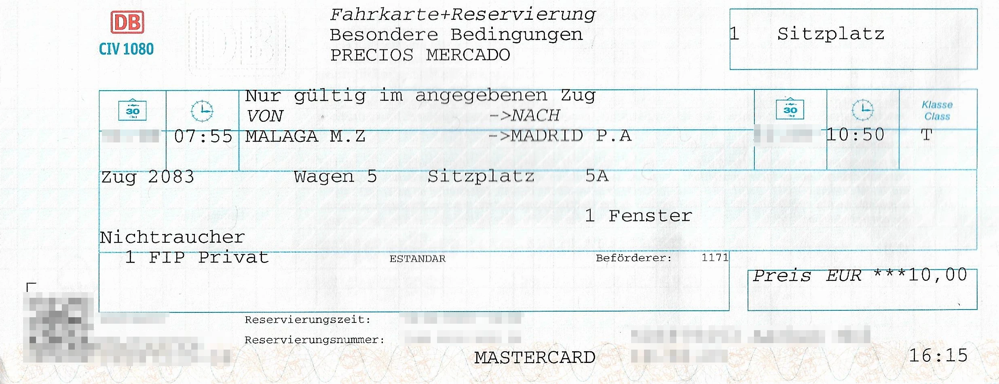

Renfe Operadora ist ein staatliches spanisches Eisenbahnunternehmen. Hierzu gehören komfortable Hochgeschwindkeitszüge, diverse Regionalzüge und S-Bahnen.

## Zusammenfassung

- FIP Freifahrtsscheine werden in Pendlerzügen (hauptsächlich S-Bahnen) akzeptiert, jedoch nicht in reservierungspflichtigen Zügen.
- Für reservierungspflichtige Züge können Tickets zum FIP Globalpreis (Distanzunabhängig) inkl. Reservierung erworden werden, FIP Freifahrtsscheine werden nicht benötigt.
- In Avlo-Zügen wird FIP nicht akzeptiert.

## Gültigkeit FIP-Tickets

FIP Freifahrtsschein: ✅ (Ausnahmen: Reservierungspflichtige Züge) \
FIP Freifahrt Angehörige: ⛔ \
FIP 50 Tickets: ✅ (Ausnahmen: Reservierungspflichtige Züge) \
FIP Globalpreis: ✅ für reservierungspflichtige Züge außer Avlo

## Zugkategorien und Reservierungen

{}
Nur S-Bahnen sind mit FIP Freifahrtsscheinen uneingeschränkt nutzbar. In anderen Zügen muss in der Regel ein Ticket zum FIP Globalpreis erworben werden.
{}

### Langstrecke

{}
**Beschreibung:** \
Langstreckenverbindungen mit normalspurigen Hochgeschwindigkeitszügen (bis 300 km/h). FIP Freifahrtsscheine werden nicht anerkannt. \
**Reservierung möglich:** ja \
**Reservierungspflicht:** ⚠️ ja \
**FIP Globalpreis (Distanzunabhängig):**

- 10 € (Elige)
- 13 € (Elige Confort)
- 23,50€ (Premium)
  {}

{}
**Beschreibung:** \
Niedrigpreis-Hochgeschwindigkeitszüge (bis 300 km/h). \
**Reservierung möglich:** ja \
**Reservierungspflicht:** ⚠️ ja \
**FIP:** ⛔ FIP wird nicht anerkannt
{}

{}
**Beschreibung:** \
Umspurbare Hochgeschwindigkeitszüge (Figueres <-> Alicante). FIP Freifahrtsscheine werden nicht anerkannt. \
**Reservierung möglich:** ja \
**Reservierungspflicht:** ⚠️ ja \
**FIP Globalpreis (Distanzunabhängig):**

- 6,50 € (Elige)
- 10 € (Elige Confort)
- 23,50€ (Premium)
  {}

{}
**Beschreibung:** \
Umspurbare Hochgeschwindigkeitszüge (bis 250 km/h). FIP Freifahrtsscheine werden nicht anerkannt. \
**Reservierung möglich:** ja \
**Reservierungspflicht:** ⚠️ ja \
**FIP Globalpreis (Distanzunabhängig):**

- 6,50 € (Elige)
- 10 € (Elige Confort)
  {}

{}
**Beschreibung:** \
Reisezüge zwischen Regional- und Hochgeschwindkeitsverkehr (bis 250 km/h). FIP Freifahrtsscheine werden nicht anerkannt. \
**Reservierung möglich:** ja \
**Reservierungspflicht:** ⚠️ ja \
**FIP Globalpreis (Distanzunabhängig):**

- 6,50 € (Elige)
- 10 € (Elige Confort)
  {}

### Mittelstrecke

{}
**Beschreibung:** \
Hochgeschwindkeitszüge, Reisedauer < 90 Minuten. FIP Freifahrtsscheine werden nicht anerkannt. \
**Reservierung möglich:** ja \
**Reservierungspflicht:** ⚠️ ja \
**FIP Globalpreis (Distanzunabhängig):** 4€
{}

{}
**Beschreibung:** \
Beschleunigter Regionalverkehr. FIP Freifahrtsscheine werden nur auf nicht reservierungspflichtigen Zügen dieser Kategorie anerkannt. Aktuell ist das nur auf der Route Barcelona(-Girona-Figueres)-Port Bou der Fall. \
**Reservierung möglich:** ja \
**Reservierungspflicht:** ⚠️ ja (Außnahme: Route Barcelona(-Girona-Figueres)-Port Bou[^1]) \
**FIP Globalpreis (Distanzunabhängig):** 4€
{}

### Nahverkehr

{}
**Beschreibung:** \
Pendlerzüge, vergleichbar mit einer S-Bahn. FIP Freifahrtsscheine sind hier uneingeschränkt gültig.

- Cercanías Asturias
- Cercanías Bilbao – Bilboko Aldiriak
- Cercanías Cádiz
- Cercanías Madrid
- Cercanías Málaga
- Cercanías Murcia/Alicante – Rodalia de Múrcia/Alacant
- Cercanías Sevilla
- Cercanías Santander
- Cercanías San Sebastián – Renfe Aldiriak/Donostia
- Cercanías Valencia – Rodalia de València
- Cercanías Zaragoza
- Rodalies de Catalunya

**Reservierung möglich:** nein \
**Reservierungspflicht:** nein
{}

## Klassenkategorien

**Elige Standard / Turista**: Vergleichbar mit der 2. Klasse. \
**Elige Confort**: 1. Klasse ohne Verpflegung. Ein FIP-Ausweis für die 1. Klasse wird benötigt. \
**Premium**: 1. Klasse inkl. Verpflegung. Ein FIP-Ausweis für die 1. Klasse wird benötigt.

## Ticket- und Reservierungskauf

### Online

- Die Buchung von Reservierungen, FIP Globalpreis oder FIP 50 ist online nicht möglich.

### Telefonisch

- Eine telefonische Buchung bei Renfe ist möglich, jedoch muss das Ticket innerhalb weniger Tage an einem spanischen Schalter abgeholt werden.

### Vor Ort

- DB Reisezentrum:
  In den DB Reisezentren können Tickets für reservierungspflichtige Züge verkauft werden. Hier ist darauf zu achten, dass als Klasse entweder "T" (für Turista) oder "P" (für Preferente) angegeben wird. Wenn als Klasse die 1. Klasse oder 2. Klasse ausgewählt wird, schlägt das Ausstellen der Tickets mit einer Fehlermeldung fehl.
  Es wurde zudem berichtet, dass die Buchung der Klasse "P" teilweise fehlschlägt, in diesem Fall funktioniert eine Buchung der Klasse "T" oftmals. Eine Buchungsgebühr wird nicht erhoben. \
  

- Verkaufsstellen der Renfe in Spanien:
  In den Verkaufsstellen der Renfe können alle reservierungspflichtigen Tickets zum Globalpreis sowie Tickets ohne Reservierung (FIP 50) gebucht werden. Für reservierungspflichtige Tickets fällt zusätzlich eine Gebühr von 0,55 € an.

### Im Zug

- Wenn keine Verkaufsstelle der Renfe am Startbahnhof besetzt ist, können Tickets im Zug gekauft werden.

## Ermäßigungen

Kinder bis zu 4 Jahren reisen kostenlos, sofern sie keinen eigenen Sitzplatz benötigen. Kinder bis zu 12 Jahren erhalten eine Ermäßigung von 40 % auf den Tarif für Erwachsene. Personen ab 12 Jahren zahlen den Erwachsenentarif.

## Anreise

Tarifliche Grenzpunkte zu Nachbarländern sind auf der [Landesseite Spanien]( "Spanien") aufgeführt.

### Frankreich

Von Paris aus verkehren direkte TGV-Züge der französischen SNCF nach Barcelona. Auch die Renfe verkehrt grenzüberschreitend zwischen Lyon und Barcelona. Bei beiden sind FIP-Globalpreise möglich, die jedoch sehr teuer werden können. Insgesamt gibt es nur sehr wenige grenzüberschreitende Verbindungen, diese waren vor wenigen Jahren schon einmal deutlich besser ausgebaut.

### Portugal

Die Verbindungen zwischen Spanien und Portugal sind aktuell nur sehr spärlich vorhanden. Um beispielsweise von Lissabon nach Madrid zu kommen muss bis mit Umstieg und langer Zeit in einem Regionalzug an die spanische Grenze nach Badajoz gefahren werden, um dort dann einen der wenigen Züge nach Madrid zu erwischen. Dafür werden FIP-Tickets / Freifahrtsscheine der portugiesischen CP benötigt sowie ein Renfe-Ticket für den spanischen Abschnitt. Ansonsten gibt es noch die Celta-Verbindung von Porto nach Vigo, auch diese führt jedoch nicht tiefer nach Spanien hinein. Hier gilt ein FIP-Globalpreis auf der gesamten Route. An einer durchgängigen Hochgeschwindigkeitsstrecke zwischen Lissabon und Madrid wird gearbeitet. \

## Tarifliche Besonderheiten

### Celta: Porto - Vigo

Der Celta ist ein internationaler Kooperationszug zwischen der Renfe und der portugiesischen CP. \
**FIP Globalpreis (Distanzunabhängig):** 4 €

### Reiseunterbrechung

Bei FIP 50 und FIP Globalpreis Tickets darf die Reise zwischenzeitlich nicht unterbrochen werden.[^2]

## Erfahrungen

{}
Die Renfe ist in vielen Fällen mehr mit einer Fluggesellschaft als mit anderen Bahngesellschaften zu vergleichen. So sind Gepäckkontrollen bei Fernreisen genauso üblich wie wenige Züge, bei denen spontan mitgefahren werden kann. Ein FIP Freifahrtsschein lohnt sich daher nur sehr bedingt, da er nur in wenigen Fällen Anwendung findet. Durch die Ticketbarrieren in vielen Bahnhöfen muss zudem das Personal jedes Mal aufgesucht werden, um mit dem Freifahrtsschein diese öffnen zu können. Die eigene Erfahrung zeigt hier, dass gerade im Großraum Madrid die Freifahrt hin und wieder nicht bekannt ist und somit der Zugang verweigert wird.
{}

## Quellen

[^1]: [ShowMeTheJourney](https://showmethejourney.com/travel-on/train/129-md-media-distancia-spain/)

[^2]: [Rail Delivery Group](https://www.raildeliverygroup.com/rst/europe-and-fip.html#Tips)
