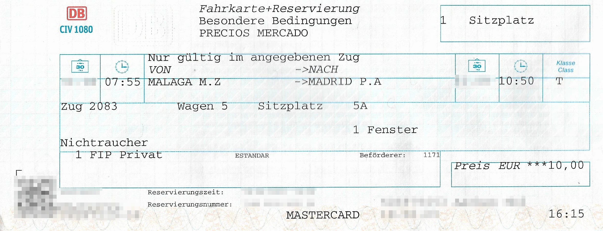

Renfe Operadora is a Spanish state-owned railroad company. It operates comfortable high-speed trains, various regional trains and suburban trains.

## Summary

- FIP free tickets are accepted on commuter trains (mainly suburban trains), but not on trains requiring reservations.
- For trains requiring reservations, tickets can be purchased at the FIP Global Fare (regardless of distance), including the reservation; FIP Coupons are not needed.
- FIP is not accepted on Avlo trains.

## Validity of FIP tickets

FIP free ticket: ✅ (exceptions: trains requiring reservations) \
FIP Coupons for relatives: ⛔ \
FIP 50 tickets: ✅ (exceptions: trains requiring reservations) \
FIP Global Fare: ✅ for trains subject to reservation except Avlo

## Train categories and reservations
{}
Only commuter trains can be used without restrictions with FIP Coupons. For other trains, a ticket at the FIP Global Fare usually needs to be purchased.
{}

### Long distance

{}
**Description:** \
Long-distance connections with high-speed trains (up to 300 km/h). FIP Coupons are not accepted. \
**Reservation possible:** yes \
**Reservation required:** ⚠️ yes \
**FIP Global Fare (regardless of distance):**
- 10 € (Elige Estándar)
- 13 € (Elige Confort)
- 23,50€ (Premium)
{}

{}
**Description:** \
Low-cost high-speed trains (up to 300 km/h). \
**Reservation possible:** yes \
**Reservation required:** ⚠️ yes \
**FIP:** ⛔ FIP is not accepted
{}

{}
**Description:** \
High-speed trains that can be re-gauged (Figueres <-> Alicante). FIP Coupons are not accepted. \
**Reservation possible:** yes \
**Reservation required:** ⚠️ yes \
**FIP Global Fare (regardless of distance):**
- 6,50 € (Elige Estándar)
- 10 € (Elige Confort)
- 23,50€ (Premium)
{}

{}
**Description:** \
High-speed trains that can be re-gauged (up to 250 km/h). FIP Coupons are not accepted. \
**Reservation possible:** yes \
**Reservation required:** ⚠️ yes \
**FIP Global Fare (regardless of distance):**
- 6,50 € (Elige Estándar)
- 10 € (Elige Confort)
{}

{}
**Description:** \
Passenger trains between regional and high-speed services (up to 250 km/h). FIP Coupons are not accepted. \
**Reservation possible:** yes \
**Reservation required:** ⚠️ yes \
**FIP Global Fare (regardless of distance):**
- 6,50 € (Elige Estándar)
- 10 € (Elige Confort)
{}

### Middle distance

{}
**Description:** \
High-speed trains, travel time < 90 minutes. FIP Coupons are not accepted. \
**Reservation possible:** yes \
**Reservation required:** ⚠️ yes \
**FIP Global Fare (regardless of distance):** 4€
{}

{}
**Description:** \
Accelerated regional transport. FIP Coupons are only accepted on trains that do not require reservations. Currently, this is only the case on the Barcelona (Girona-Figueres)-Port Bou route. \
**Reservation possible:** yes \
**Reservation required:** ⚠️ yes (exception: Barcelona(-Girona-Figueres)-Port Bou route[^1]) \
**FIP Global Fare (regardless of distance):** 4€
{}

### Local transportation

{}
**Description:** \
Commuter trains, comparable to suburban trains. FIP Coupons are valid without restrictions.
- Cercanías Asturias
- Cercanías Bilbao – Bilboko Aldiriak
- Cercanías Cádiz
- Cercanías Madrid
- Cercanías Málaga
- Cercanías Murcia/Alicante – Rodalia de Múrcia/Alacant
- Cercanías Sevilla
- Cercanías Santander
- Cercanías San Sebastián – Renfe Aldiriak/Donostia
- Cercanías Valencia – Rodalia de València
- Cercanías Zaragoza
- Rodalies de Catalunya

**Reservation possible:** no \
**Reservation required:** no
{}

### International
{}
**Description:** \
The Celta is an international cooperation train between Renfe and the Portuguese CP from Porto to Vigo. FIP Coupons are not accepted. \
**Reservation possible:** yes \
**Reservation required:** ⚠️ yes \
**FIP Global Fare (regardless of distance):** 4€
{}

## Class Categories

**Elige Estándar / Turista**: Comparable to 2nd class. [More Information](https://www.renfe.com/es/en/travel/prepare-your-trip/billetes-ave-y-largadistancia/elige) \
**Elige Confort**: An XL Comfort seat without catering. Is comparable to 1st class. A 1st class FIP Card is required. [More Information](https://www.renfe.com/es/en/travel/prepare-your-trip/billetes-ave-y-largadistancia/elige) \
**Premium**: An XL Comfort seat including catering. Comparable to 1st class. A FIP-Card 1st class is required. [More Information](https://www.renfe.com/es/en/travel/prepare-your-trip/billetes-ave-y-largadistancia/premium)

## Ticket and reservation purchase

### Online

- It is not possible to book reservations, FIP Global Fare or FIP 50 online.

### By telephone

- It is possible to book by telephone with Renfe, but the ticket must be collected from a Spanish counter within a few days.

### On-site

- DB Travel Center:
  Tickets for trains requiring reservations can be sold at DB Travel Centers. Please ensure that either "T" (for Elige Estándar / Turista) or "P" (for Elige Confort) is specified as the class. If 1st class or 2nd class is selected as the class, tickets will not be issued with an error message. A booking of Premium class tickets is not possible through Deutsche Bahn's sales channels.
  It has also been reported that the booking of class "P" sometimes fails, in which case a booking of class "T" often works. There is no booking fee. \
  

- Sales points of Renfe in Spain:
  All tickets subject to reservation and tickets without reservation (FIP 50) can be booked at Renfe points of sale. An additional fee of €0.55 is charged for tickets requiring a reservation.

### On the train

- If there is no Renfe sales outlet at the departure station, tickets can be purchased on the train.

## Discounts

Children up to the age of 4 travel free of charge, provided they do not require their own seat. Children up to the age of 12 receive a 40% discount on the adult fare. Persons aged 12 and over pay the adult fare.

## Special Tariff Conditions

### Interruption of Travel

With FIP 50 and FIP Global Fare tickets, the journey may not be interrupted along the way.[^2]

## Recommendations

{}
Renfe can often be compared more to an airline than to other railway companies. Luggage checks are common on long-distance routes, and there are few trains that allow spontaneous boarding. Therefore, an FIP Coupon is only marginally worthwhile, as it can be used in only a few cases. Due to ticket barriers at many stations, staff must be contacted each time in order to open them with the free travel pass. Personal experience shows that especially in the greater Madrid area, the free travel option is sometimes not recognized, and access is consequently denied.
{}

## Sources

[^1]: [ShowMeTheJourney](https://showmethejourney.com/travel-on/train/129-md-media-distancia-spain/)
[^2]: [Rail Delivery Group](https://www.raildeliverygroup.com/rst/europe-and-fip.html#Tips)
