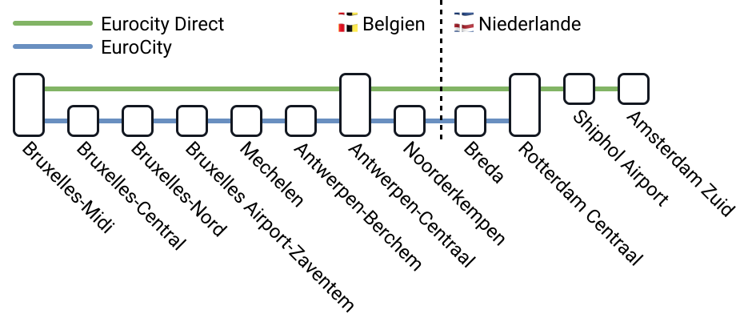

Die SNCB (Société nationale des chemins de fer belges) bzw. NMBS (Nationale Maatschappij der Belgische Spoorwegen) ist die belgische Staatsbahn und die wichtigste Bahngesellschaft in [Belgien](/country/belgium "Belgien").

## Zusammenfassung

- SNCB akzeptiert FIP Freifahrt und FIP 50 / FIP 75 Tickets.
- Keine Reservierungspflicht innerhalb Belgiens.
- Aufschlag für Fahrten von/zum Flughafen Brüssel Zaventem.

## Gültigkeit FIP Tickets




FIP Freifahrtscheine und FIP 50 / FIP 75 Tickets sind auf Verbindungen der SNCB gültig. Bei grenzüberschreitenden Fahrten muss entweder ein durchgängiges FIP 50 / FIP 75 Ticket oder FIP Freifahrtscheine beider Länder vorhanden sein.

## Zugkategorien und Reservierungen

Innerhalb Belgiens ist bei der SNCB keine Reservierung erforderlich und in vielen Zügen auch nicht möglich. Beim grenzüberschreitenden `ICE` nach Deutschland ist eine Reservierung möglich und beispielsweise im Sommer 2026 auch verpflichtend (nur bei grenzüberschreitenden Reisen).

{}

Hochgeschwindigkeitszüge der Deutschen Bahn, die in Belgien von der SNCB übernommen werden. Sie verkehren zwischen Brüssel (Midi) und Deutschland (Köln / Frankfurt am Main). Einzelne Züge verkehren auch zwischen Deutschland und Antwerpen über den Flughafen Brüssel Zaventem und im Sommer zwischen Deutschland und der belgischen Küste. Alle ICE-Züge können auch innerhalb Belgiens mit FIP Fahrscheinen ohne Aufschlag genutzt werden.

#### Reservierung

Bei grenzüberschreitenden Fahrten ist eine Reservierung vom 26.06. bis 16.08.2026 verpflichtend.

{}

{}

Anders als in anderen Ländern keine wirklichen Fernzüge, sondern eher schnelle Regionalzüge mit wenigen Halten.

{}

{}
Internationaler Zug zwischen Lelystad, Amsterdam und Brüssel mit Halt in Almere, Schiphol, Rotterdam und Antwerpen.


Für Fahrten innerhalb der Niederlande gelten besondere Regelungen, siehe [NS ECD](/operator/ns#ecd)


{}

{}

Internationaler Zug zwischen Rotterdam und Brüssel mit mehreren Unterwegshalten.

{}

{}

Regionalbahnen mit Halt an meist allen Stationen, in den Verbindungsauskünften oft auch einfach als `R` für Regionalzug zu finden.

{}

{}

Eine S-Bahn in den Großräumen Antwerpen, Brüssel, Charleroi, Gent oder Lüttich. Sie verbinden die großen Städte mit den Vororten und halten meist überall. Anders als in anderen Ländern zeichnen sich die S-Bahnen hier nicht durch dichtere Takte als bei anderen Zugkategorien aus. In der Verbindungsauskunft werden auch diese manchmal als `R` für Regionalzug zusammengefasst.

{}

{}

Zusätzliche Züge zu den Hauptverkehrszeiten montags bis freitags morgens sowie am späten Nachmittag, in den Verbindungsauskünften oft auch einfach als `R` für Regionalzug zu finden.

{}

{}

Zusätzliche Züge bei hohem Verkehrsaufkommen, vor allem in den Sommermonaten zur belgischen Küste.

{}

{}

Zusätzliche Züge zu bestimmten touristischen Zielen, oft auch einfach als `R` für Regionalzug zu finden.

{}

## Ticket- und Reservierungskauf

### Online

Nationale Verbindungen können online leider nicht erworben werden.

{}

{}

{}

### Telefon

{}

### Vor Ort

{}

{}

### Im Zug

{}
Ab dem 1. Juli 2026 werden bei der SNCB keine Tickets mehr im Zug verkauft. Das betrifft auch FIP reduzierte Tickets. Alle Reisenden müssen vor dem Einsteigen ein gültiges Ticket besitzen. [^5], [^6]
{}

FIP reduzierte Tickets können grundsätzlich an Bord der Züge gekauft werden. Der übliche Aufschlag der SNCB für den Bordverkauf wird hierbei nicht berechnet, da die Tickets nicht an Ticketautomaten verfügbar sind. [^2], [^4]

## Ermäßigungen

Bis zu vier Kinder unter 12 Jahren reisen in Begleitung eines Erwachsenen (Person ab 12 Jahren mit gültigem Ticket) kostenlos und benötigen kein Ticket. Gehören alle Kinder demselben Haushalt an, dürfen auch mehr als vier Kinder kostenlos mitreisen. Für die Reise ist ein gültiges amtliches Dokument (Personalausweis oder Reisepass) erforderlich, das das Alter des Kindes nachweist. Reist ein Kind alleine oder wird die Grenze von vier kostenlosen Kindern pro Erwachsenem überschritten, muss ein Ticket zum Youth-Tarif erworben werden, der 40% günstiger als der Standardtarif ist. Sind die Kinder FIP-berechtigt, erhalten sie mit dem FIP 50 / FIP 75 Ticket eine Ermäßigung von 50% auf den Standardtarif. [^3]

## Tarifliche Besonderheiten

### Flughafen Brüssel Zaventem

Auf Verbindungen von und zum Flughafen Brüssel Zaventem muss für den FIP Freifahrtschein ein Zuschlag gezahlt werden. Dieser beträgt aktuell 6,90 Euro (vgl. [Info der SNCB](https://www.belgiantrain.be/de/tickets-and-railcards/airports/brussels-airport)) und muss auch gezahlt werden, wenn der Hinweise _No Supplement Necessary_ angegeben ist. Bei FIP 50 / FIP 75 Tickets ist dieser bereits im Preis inbegriffen. [^1]

## Empfehlungen

{}
Die 1. Klasse in den Zügen der SNCB / NMBS wird oft auch mit 2. Klasse Tickets benutzt. Auch ist die 1. Klasse meist nicht viel komfortabler als die 2. Klasse. Anders als in anderen Ländern lohnt sich daher ein Kauf von 1. Klasse Tickets, um hier mehr Platz und Ruhe zu haben, nur bedingt.
{}

## Quellen

[^1]: [Rail Delivery Group](https://www.raildeliverygroup.com/rst/europe-and-fip.html)

[^2]: [SNCB Nutzer Feedback](https://github.com/fipguide/fipguide.github.io/issues/275)

[^3]: [SNCB Kinderregelung](https://www.belgiantrain.be/de/products/child)

[^4]: [SNCB Website](https://www.belgiantrain.be/en/products/supplements/onboard)

[^5]: [SNCB -- Ende des Ticketverkaufs in den Zügen](https://www.belgiantrain.be/de/news/end-of-on-board-fare)

[^6]: [Rail Delivery Group -- Changes to buying tickets on SNCB trains in Belgium](https://www.raildeliverygroup.com/rst/stop-press/469782370-changes-to-buying-tickets-on-sncb-trains-in-belgium.html)
