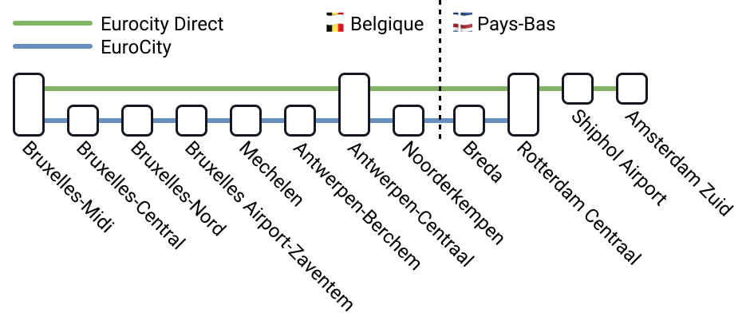

La SNCB (Société nationale des chemins de fer belges) ou NMBS (Nationale Maatschappij der Belgische Spoorwegen) est l’opérateur ferroviaire national belge et le plus important de [Belgique](/country/belgium "Belgique").

## Résumé

- La SNCB accepte les Coupons FIP et les Billets FIP 50 / FIP 75.
- Aucune réservation nécessaire en Belgique.
- Supplément obligatoire pour les trajets à destination ou en provenance de l’aéroport de Bruxelles-Zaventem.

## Validité des Billets FIP




Les Coupons FIP et les Billets FIP 50 / FIP 75 sont valables sur les trains de la SNCB. Pour les trajets transfrontaliers, un Billet FIP 50 / FIP 75 continu ou des Coupons FIP des deux pays concernés sont nécessaires.

## Catégories de trains et réservations

En Belgique, aucune réservation n’est requise dans les trains de la SNCB, et elle n’est souvent pas possible. Pour les trains internationaux `ICE` vers l'Allemagne, la réservation est possible et sera obligatoire en été 2026 (uniquement pour les trajets transfrontaliers).

{}

Trains à grande vitesse de la Deutsche Bahn, exploités par la SNCB en Belgique. Ils circulent entre Bruxelles (Midi) et l’Allemagne (Cologne / Francfort-sur-le-Main). Certains trains circulent également entre l’Allemagne et Anvers via l’aéroport de Bruxelles-Zaventem ou en été entre l’Allemagne et la côte belge. Tous les trains ICE peuvent également être utilisés en Belgique avec des Billets FIP sans supplément.

#### Réservation

Une réservation est obligatoire pour les trajets transfrontaliers du 26.06 au 16.08.2026.

{}

{}

Contrairement à d’autres pays, il ne s’agit pas de véritables trains longue distance, mais plutôt de trains régionaux rapides avec peu d’arrêts.

{}

{}

Train international entre Lelystad, Amsterdam et Bruxelles avec arrêts à Almere, Schiphol, Rotterdam et Anvers.

{}
Pour les trajets aux Pays-Bas, des règles spéciales s'appliquent, voir [NS ECD](/operator/ns#ecd)
{}

{}

{}

Train international entre Rotterdam et Bruxelles avec plusieurs arrêts intermédiaires.

{}

{}

Trains régionaux s’arrêtant dans la plupart des gares, souvent simplement appelés `R` pour train régional dans les informations de correspondance.

{}

{}

Train suburbain dans les agglomérations d’Anvers, Bruxelles, Charleroi, Gand ou Liège. Ils relient les grandes villes aux banlieues et s’arrêtent généralement partout. Contrairement à d’autres pays, les trains S n’ont pas d’horaires plus denses que les autres catégories. Dans les informations de correspondance, ils sont parfois aussi regroupés sous `R` pour train régional.

{}

{}

Trains supplémentaires aux heures de pointe du lundi au vendredi matin et en fin d’après-midi, souvent simplement appelés `R` pour train régional dans les informations de correspondance.

{}

{}

Trains supplémentaires lors des périodes de forte affluence, notamment pendant l’été vers la côte belge.

{}

{}

Trains supplémentaires vers certaines destinations touristiques, souvent simplement appelés `R` pour train régional.

{}

## Achat de billets et réservations

### En ligne

Les trajets nationaux ne peuvent malheureusement pas être achetés en ligne.

{}

{}

{}

### Par téléphone

{}

### En gare

{}

{}

### À bord du train

{}
À partir du 1er juillet 2026, la SNCB ne vendra plus de billets à bord de ses trains. Cela concerne également les billets FIP à tarif réduit. Tous les voyageurs devront être en possession d'un billet valable avant de monter à bord. [^5], [^6]
{}

Les billets FIP à tarif réduit peuvent en principe être achetés à bord des trains. Le supplément SNCB habituel pour les ventes à bord n'est pas facturé, car ces billets ne sont pas disponibles aux distributeurs automatiques. [^2], [^4]

## Réductions

Jusqu’à quatre enfants de moins de 12 ans voyagent gratuitement lorsqu’ils sont accompagnés d’un adulte (une personne de 12 ans ou plus en possession d’un titre de transport valable) et n’ont pas besoin de billet. Si tous les enfants appartiennent au même ménage, plus de quatre enfants peuvent voyager gratuitement. Un document officiel valide (carte d’identité ou passeport) attestant l’âge de l’enfant est requis pour le voyage. Si un enfant voyage seul ou si la limite de quatre enfants gratuits par adulte est dépassée, un billet au tarif Youth doit être acheté, celui-ci étant 40 % moins cher que le tarif standard. Si les enfants sont éligibles FIP, ils bénéficient d’une réduction de 50 % sur le tarif standard avec le Billet FIP 50 / FIP 75. [^3]

## Conditions tarifaires spéciales

### Aéroport de Bruxelles-Zaventem

Un supplément de 6,70 € est requis pour les trajets à destination ou en provenance de l’aéroport, même avec un Coupon FIP, même si le message _"Pas de supplément requis"_ figure sur le billet. Ce supplément est inclus dans le prix d’un Billet FIP 50 / FIP 75. [^1] [Plus d’infos sur le supplément SNCB](https://www.belgiantrain.be/fr/tickets-and-railcards/airports/brussels-airport)

## Recommandation

{}
La 1ère classe dans les trains de la SNCB est souvent utilisée par des passagers sans billet valide, et son confort est rarement supérieur à la 2ᵉ classe. Il n’est donc pas toujours rentable d’y voyager avec un coupon de 1ʳᵉ classe.
{}

## Sources

[^1]: [Rail Delivery Group](https://www.raildeliverygroup.com/rst/europe-and-fip.html)

[^2]: [Retours d’expérience SNCB](https://github.com/fipguide/fipguide.github.io/issues/275)

[^3]: [Politique enfants SNCB](https://www.belgiantrain.be/fr/products/child)

[^4]: [Site Web SNCB](https://www.belgiantrain.be/en/products/supplements/onboard)

[^5]: [SNCB -- Fin de la vente de billets dans les trains](https://www.belgiantrain.be/fr/news/end-of-on-board-fare)

[^6]: [Rail Delivery Group -- Changes to buying tickets on SNCB trains in Belgium](https://www.raildeliverygroup.com/rst/stop-press/469782370-changes-to-buying-tickets-on-sncb-trains-in-belgium.html)
