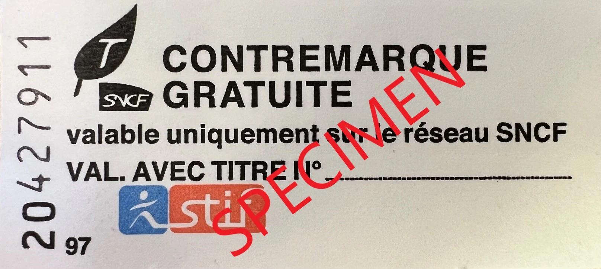

<!-- Entferne das "WIP" Snippet, wenn die Inhalte der Seite vollständig sind -->



Die SNCF (Société Nationale des Chemins de fer Français) ist die französische Staatsbahn und die wichtigste Bahngesellschaft in Frankreich. Sie ist betreibt fast alle Fern- und Regionalzüge in Frankreich.

## Zusammenfassung

<!--
  Stichpunktartige Zusammenfassung der wichtigsten Besonderheiten/FIP-Reglungen der Bahngesellschaft.
  Z.B.
  - Werden FIP 50 und FIP Freifahrtsscheine akzeptiert?
  - Gibt es eine Reservierungspflicht?
  - Gibt es sonstige tarifliche Sonderregelungen oder Abweichungen zu anderen FIP Bahngesellschaften?
-->
- alles mit OuiGo Schlecht
- FIP Vergünstigungen gelten auch in SNCF Bussen (außer Fernbusse)

## Gültigkeit FIP Tickets

FIP Freifahrtsschein: ✅ \
FIP Freifahrt Angehörige: ⛔ \
FIP 50 Tickets: ✅ \
FIP Globalpreis: ✅ (Für internationale TGV Züge, siehe [Grenzüberschreitende TGV inOui / ICE Züge](#grenzüberschreitende-tgv-inoui--ice-züge))

FIP Freifahrtscheine und FIP 50 Tickets sind auf Verbindungen der SNCF gültig. Bei grenzüberschreitenden Fahrten im Nahverkehr muss entweder ein durchgängiges FIP 50 Ticket oder FIP Freifahrtscheine beider Länder vorhanden sein. Auf internationalen Fernverkehsverbindungen mittels `TGV` oder `ICE` gelten jedoch Globalpreise, siehe siehe [Grenzüberschreitende TGV inOui / ICE Züge](#grenzüberschreitende-tgv-inoui--ice-züge).

## Zugkategorien und Reservierungen

Reservierungspflicht in allen `TGV`, fast allen `IC` Zügen sowie einigen Regionalzügen (`TER`). Keine Gültigkeit von FIP in OuiGo-Zügen.

### Fernverkehr

{}
**Beschreibung:**
Der TGV inOui ist der Hochgeschwindigkeitszug der SNCF und verbindet zahlreiche Städte in Frankreich sowie internationale Ziele (z.B. München, Frankfurt am Main, Barcelone, Luxembourg, Brüssel, Zürich, Mailand). Eine Übersicht der Strecken [hier](https://www.sncf-connect.com/assets/media/2021-05/2014_axes-tgv_0.pdf) verfügbar. Im Wagen stehen alle Platznummern an zwei verschiedenen Sitzen (nahezu spiegelverkehrt) und der beleuchtete ist gültig.

ℹ️ Die SNCF betreibt auch Low-Cost TGV Züge unter dem Namen OuiGo, diese sind jedoch nicht mit FIP nutzbar.

⚠️ Es gelten Besonderheiten für grenzüberschreitende Verbindungen, siehe [Grenzüberschreitende TGV inOui / ICE Züge](#grenzüberschreitende-tgv-inoui--ice-züge). \
**Reservierung möglich:** Ja \
**Reservierungspflicht:** Ja ⚠️ \
**Kosten für Reservierung:** Abhängig von Strecke und Auslastung
{}

{}
**Beschreibung:**
Der TGV OuiGo ist der Low-Cost-Hochgeschwindigkeitszug der SNCF und verbindet zahlreiche Städte in Frankreich sowie internationale Ziele.

ℹ️ Die SNCF betreibt auch TGV Züge unter dem Namen inOui, welche mit FIP nutzbar sind. \
**Reservierung möglich:** Ja \
**Reservierungspflicht:** Ja ⚠️ \
**FIP:** ⛔ FIP wird nicht anerkannt
{}

{}
**Beschreibung:**
Internationale Hochgeschwindigkeitszüge der SNCF in Kooperation mit der Deutschen Bahn, die zwischen Frankreich (Paris Est, Strasbourg) und Deutschland (Karlsruhe, Mannheim und Frankfurt am Main bzw. Stuttgart und München) verkehren.

⚠️ Es gelten Besonderheiten für grenzüberschreitende Verbindungen, siehe [Grenzüberschreitende TGV inOui / ICE Züge](#grenzüberschreitende-tgv-inoui--ice-züge). \
**Reservierung möglich:** Ja \
**Reservierungspflicht:** Ja ⚠️ \
**Kosten für Reservierung:** \
Für die Reservierungspreise unterscheiden sich zwischen Zügen zur Hauptverkehrszeit (Peak) und außerhalb der Hauptverkehrszeit (Off-Peak). Außerhalb der Hauptverkehrszeit beträgt der Reservierungspreis 1,70 € (1./2. Klasse) und während der Hauptverkehrszeit 15 € (1. Klasse) bzw. 10 € (2. Klasse). Die Einordung der Züge ist öffentlich leider nicht einsehbar.
{}

{}
**Beschreibung:**
Intercity-Züge der SNCF, die verschiedene Städte in Frankreich verbinden und meistens reservierungspflichtig sind. \
**Reservierung möglich:** Ja \
**Reservierungspflicht:** Meistens ⚠️ \
**Kosten für Reservierung:** \
Für die Reservierungspreise unterscheiden sich zwischen Zügen zur Hauptverkehrszeit (Peak) und außerhalb der Hauptverkehrszeit (Off-Peak). Außerhalb der Hauptverkehrszeit beträgt der Reservierungspreis 1,70 € (1./2. Klasse) und während der Hauptverkehrszeit 15 € (1. Klasse) bzw. 10 € (2. Klasse). Die Einordung der Züge ist öffentlich leider nicht einsehbar.
{}

{}
**Beschreibung:**
Nachtzüge der SNCF im französischen Inland. Internationale Nachtzugverbindungen per Nightjet sind seit Dezember 2025 eingestellt. \
**Reservierung möglich:** Ja \
**Reservierungspflicht:** Ja ⚠️ \
**Kosten für Reservierung:** Abhängig von Strecke und Auslastung
{}

### Nahverkehr

{}
**Beschreibung:**
Der TER ist ein Regionalzug der SNCF, der verschiedene Städte in Frankreich verbindet.

ℹ️ Auf der Strecke Marseille – Toulon – Nice gilt keine FIP, da dort die `TER` Züge von Transdev betrieben werden. \
**Reservierung möglich:** Teilweise \
**Reservierungspflicht:** Teilweise ⚠️ \
Auf einigen Linien von Paris aus gibt es eine Reservierungspflicht, siehe [Reservierungspflicht im Regionalverkehr](#reservierungspflicht-im-regionalverkehr)
{}

{}
**Beschreibung:**
Der RER ist ein S-Bahn ähnlicher Zug der SNCF, der in Île de France (Großraum Paris) und umliegenden Städten verkehrt.

⚠️ FIP gilt nur eingeschränkt in `RER` Zügen, siehe [Züge im Großraum Paris](#züge-im-großraum-paris) \
**Reservierung möglich:** Ja \
**Reservierungspflicht:** Ja ⚠️
{}

## Ticket- und Reservierungskauf

### Online

{}

### Telefon

{}

### Vor Ort

{}
An SNCF Ticketschaltern können Upgrades von der 2. Klasse in die 1. Klasse gekauft werden. Dabei muss die Differenz gezahlt werden.
{}

{}

### Im Zug

FIP Tickets können nicht im Zug erworben werden.

## Ermäßigungen

Bei normalen Ticket reisen Kinder bis einschließlich 4 Jahre kostenlos. Kinder bis einschließlich 12 Jahre erhalten eine Ermäßigung von 50 % auf den Erwachsenentarif. Personen ab 12 Jahren zahlen den vollen Erwachsenentarif.

## Tarifliche Besonderheiten

### Reservierungspflicht im Regionalverkehr

Auf einigen Regionalzug `TER` Linien gibt es eine Reservierungspflicht. Diese betrifft:

#### Normandie TER NOMAD _Krono +_ Züge:

- Paris – Rouen – Le Havre
- Paris – Caen – Cherbourg
- Paris – Caen
- Paris – Trouville-Deauville

#### Normandie TER NOMAD _Krono_ Züge:

- Paris – Argentan – Granville
- Paris – Dieppe

#### TER Grand Est

- Line 1: Paris – Troyes – Chaumont – Mulhouse
- Line 4: Paris – Épernay – Châlons – Strasbourg

Auf den `TER` Grand Est Strecken besteht eine Reservierungspflicht nur dann, wenn die Fahrt in Paris beginnt oder endet. Auf allen anderen Streckenabschnitten besteht keine Reservierungspflicht.

### Ticketentwerter im Nahverkehr

Auf den folgenden NOMAD-Strecken müssen alle Fahrkarten vor Antritt jeder Hin- oder Rückfahrt sowie nach einer Fahrtunterbrechung vor der Weiterfahrt an den dafür vorgesehenen Entwertern (compositeurs oder compostage de billets) in den Bahnhöfen entwertet werden:

- Paris – Caen – Cherbourg / Trouville-Deauville
- Paris – Rouen – Le Havre
- Paris – Granville
- Paris – Évreux – Serquigny
- Caen – Le Mans – Tours

Diese Entwertungspflicht gilt nicht für die Nutzung von FIP Freifahrtscheinen.

### Grenzüberschreitende TGV inOui / ICE Züge

{}
Grenzüberschreitende `TGV` und `ICE` Züge sind im französischen Abschnitt reservierungspflichtig. Innerhalb von Deutschland sind die Züge nicht reservierungspflichtig und mit FIP Freifahrtscheinen nutzbar.
{}

{}
Grenzüberschreitenden `TGV` Verbindungen von Frankreich nach Italien, Spanien oder Belgien sind im gesamten Abschnitt reservierungspflichtig und es gelten keine FIP Freifahrtscheine. Stattdessen können FIP Globalpreise erworben werden. Diese können jedoch teilweise sehr teuer sein (bis zu 130€). [^1]
{}

{}
Grenzüberschreitenden `TGV` Lyria Verbindungen von Frankreich in die Schweiz sind im französischen Abschnitt reservierungspflichtig und es gelten keine FIP Freifahrtscheine. Stattdessen können FIP Globalpreise erworben werden. Im schweizer Abschnitt sind die Züge nicht reservierungspflichtig und mit FIP Freifahrtscheinen nutzbar.
{}

### Züge im Großraum Paris

Île-de-France Mobilités (ÎDF Mobilités) ist die Behörde, die verschiedene Verkehrsunternehmen im Großraum Paris koordiniert und überwacht, darunter RATP (Régie Autonome des Transports Parisiens) und SNCF.

Die RATP betreibt die Pariser Métro (Métro de Paris), Buslinien sowie einen Teil der Tramlinien und des RER (Réseau Express Régional) Netzes. Die SNCF betreibt den übrigen Teil des RER-Netzes und einige Tramlinien. In RATP Verkehren gelten keine FIP Vergünstigungen.

{}
Ein Teil des RER-Netzes wird von der SNCF betrieben. FIP Vergünstigungen gelten in folgenden Abschnitten:

- RER Linie A – nur die Äste A3 & A5 westlich von Nanterre Préfecture bis Poissy oder Cergy-le-Haut
- RER Linie B – nur die Äste B3 & B5 nördlich von Gare du Nord bis Aéroport Charles de Gaulle oder Mitry-Claye
- RER Linie C – gesamter Abschnitt
- RER Linie D – gesamter Abschnitt
- RER Linie E – gesamter Abschnitt

Achtung: Für Fahrten zwischen Gare du Nord und Châtelet – Les Halles kann nur die von der SNCF betriebene RER Linie D genutzt werden. FIP Vergünstigungen sind auf der von der RATP betriebenen RER Linie B auf derselben Strecke nicht gültig.

Vergünstigte FIP Tickets für die RER Züge kann in Transilien Ticketschaltern gekauft werden. Bei Nutzung der RER Züge mit einem SNCF FIP Freifahrtschein muss pro Fahrt am Transilien Ticketschalter ein kostenloser _Contremarque de Passage_ (Temporäre Zugangskarte) abgeholt werden. Üblicherweise werden davon leider nur wenige auf einmal ausgegeben.

{}

{}
FIP Vergünstigungen gelten auf allen Transilien Linien H, J, K, L, N, P, R, U, und V.

Vergünstigte FIP Tickets für die Transilien Züge kann in Transilien Ticketschaltern gekauft werden. Bei Nutzung der Transilien Züge mit einem SNCF FIP Freifahrtschein muss pro Fahrt am Transilien Ticketschalter ein kostenloser _Contremarque de Passage_ (Temporäre Zugangskarte) abgeholt werden. Üblicherweise werden davon leider nur wenige auf einmal ausgegeben.

{}

{}
Die Straßenbahnlinien T4 und T11 werden von der SNCF betrieben und können mit FIP Vergünstigungen genutzt werden. Die Straßenbahnlinien T9 und T13 werden von einer Kooperation aus SNCF und Keolis betrieben. Zur Gültigkeit von FIP vergünstigungen auf diesen Linien gibt es wiedersprüchliche Aussagen. Auf den restelichen Straßenbahnlinien gelten keine FIP Vergünstigungen.

Vergünstigte FIP Tickets für die Straßenbahn kann an Transilien Ticketschaltern gekauft werden. Bei Nutzung der Straßenbahn mit einem SNCF FIP Freifahrtschein muss pro Fahrt am Transilien Ticketschalter ein kostenloser _Contremarque de Passage_ (Temporäre Zugangskarte) abgeholt werden. Üblicherweise werden davon leider nur wenige auf einmal ausgegeben.

{}

### Léman Express

Zwischen Frankreich und Genf in der Schweiz verkehren internationale `TER` Züge die als Léman Express gebranded sind. Die Züge werden aus einer Kooperation zwischen der SNCF und der SBB betrieben. FIP Vergünstigungen im gesamten Léman Express Netzwerk. SNCF FIP Freifahrtscheine gelten auch im Schweizer Teil des Léman Expresses.

### Busverkehr

FIP Vergünstigungen gelten auch in Bussen die von der SNCF betrieben werden. Ausgenommen davon sind reine Fernbusverbindungen (z.B. OuiGo Bus). [^1]

## Empfehlungen

<!--
  Persönliche Empfehlungen und besondere persönliche Hinweise für die Fahrt
-->

## Quellen

[^1]: [Rail Delivery Group](https://www.raildeliverygroup.com/rst/europe-and-fip.html)

[^2]: [<Quellenname 2](Link)
